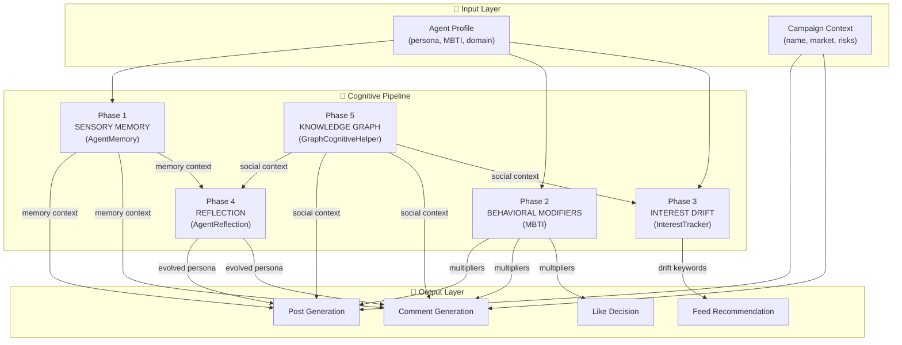
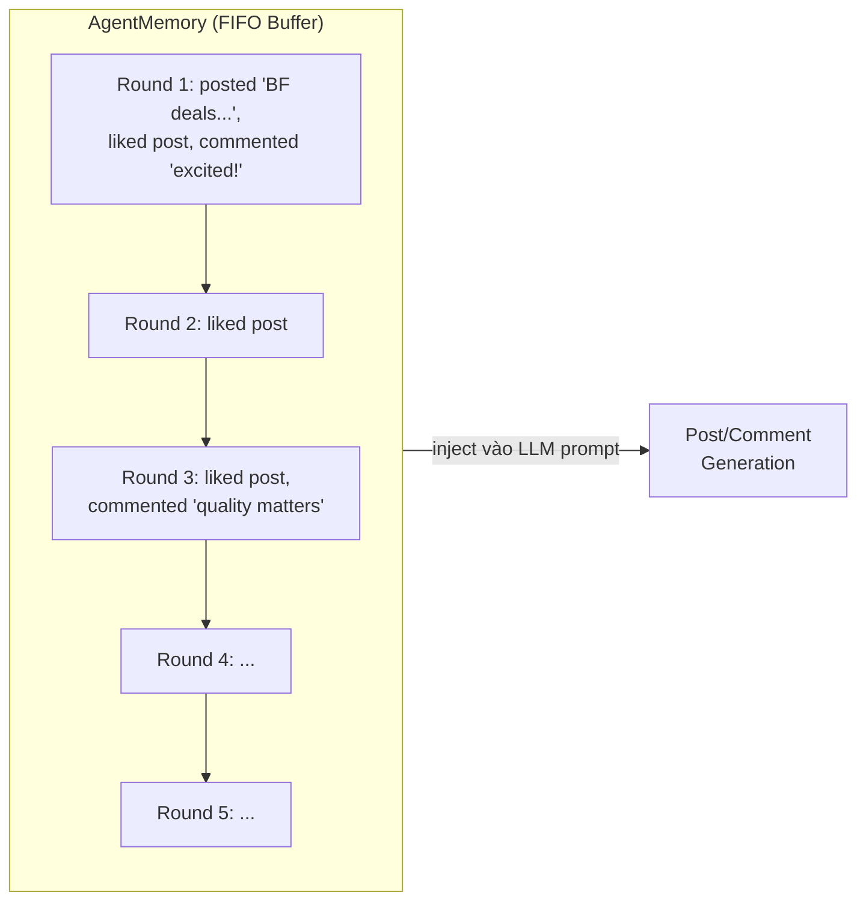
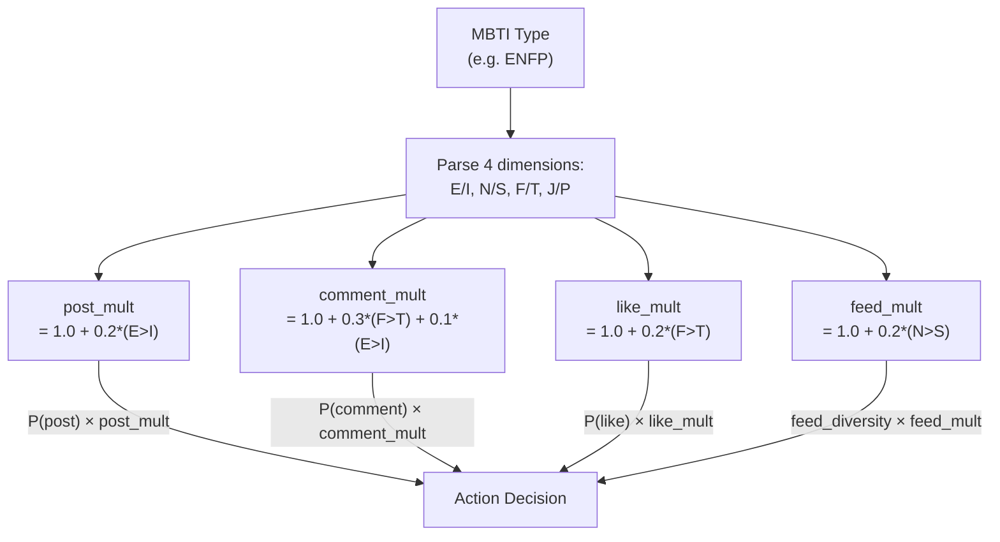
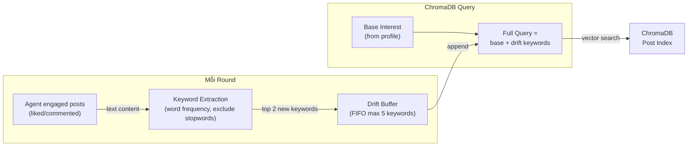
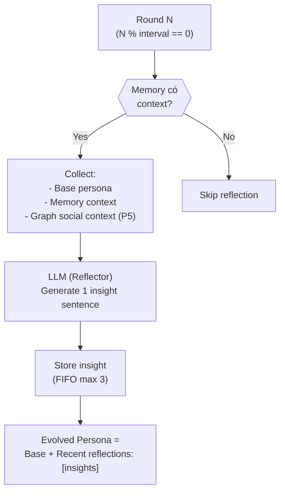
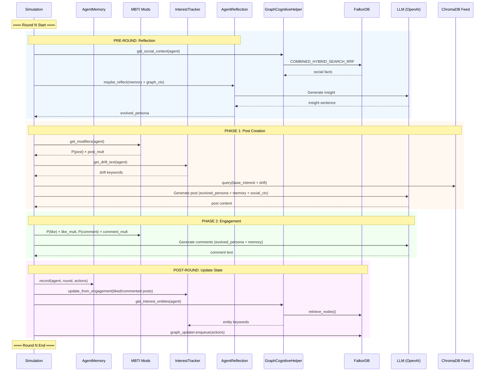

# EcoSim — Cognitive Pipeline Architecture

## Tổng quan

EcoSim Cognitive Pipeline là kiến trúc 5 phase biến đổi agent tĩnh thành thực thể có tâm lý, bộ nhớ, và khả năng tiến hóa persona qua thời gian.



## Toggle System

Mỗi phase có thể bật/tắt độc lập qua `simulation_config.json`:

| Toggle | Phase | Default | Ảnh hưởng khi tắt |
|--------|-------|---------|-------------------|
| `enable_agent_memory` | Phase 1 | `true` | Không có memory → LLM gen không biết agent đã làm gì |
| `enable_mbti_modifiers` | Phase 2 | `true` | Mọi agent hành xử giống nhau (uniform probability) |
| `enable_interest_drift` | Phase 3 | `true` | Feed recommendation cố định, không evolve theo engagement |
| `enable_reflection` | Phase 4 | `true` | Persona không bao giờ thay đổi → agent tĩnh |
| `enable_graph_cognition` | Phase 5 | `false` | Không có social context → reflection/gen thiếu relationship awareness |

---

## Phase 1: Sensory Memory (AgentMemory)

### Bài toán

Agent trong mô phỏng không nhớ gì giữa các round. Mỗi round LLM gen post/comment dựa trên persona gốc → **hành vi lặp lại**, không có tính liên tục (continuity).

**Ví dụ vấn đề:** Agent A post về "Black Friday deals" ở Round 1, nhưng Round 2 lại post y hệt nội dung vì không biết mình đã nói gì.

### Giải pháp



| Thuộc tính | Giá trị |
|-----------|---------|
| Kiểu dữ liệu | FIFO buffer (deque) |
| Kích thước tối đa | 5 rounds/agent |
| Input | Actions từ round vừa kết thúc |
| Output | Context string: `"Your recent activity: Round 1: posted...; Round 2: liked..."` |
| Inject vào | LLM prompt cho post/comment generation |

### Node Detail

```python
class AgentMemory:
    MAX_ROUNDS = 5  # FIFO buffer size

    def record(agent_id, round_num, actions: list):
        """Ghi nhận hành động của agent trong round."""
        # Tóm tắt actions thành 1 dòng: "posted 'X'; liked; commented 'Y'"
        # Lưu vào deque, tự động xóa entry cũ nhất nếu vượt MAX

    def get_context(agent_id) -> str:
        """Trả về memory context cho LLM prompt."""
        # "Your recent activity:\nRound 1: ...\nRound 2: ..."
```

---

## Phase 2: MBTI Behavioral Modifiers

### Bài toán

Mọi agent có cùng xác suất post, comment, like → **hành vi đồng nhất**. Trong thực tế, người hướng ngoại (E) post nhiều hơn người hướng nội (I).

### Giải pháp

Áp dụng multipliers dựa trên MBTI type vào xác suất action:



### Bảng Multiplier

| MBTI | post_mult | comment_mult | like_mult | feed_mult |
|------|-----------|-------------|-----------|-----------|
| **ENTJ** | 1.2 | 1.1 | 1.0 | 1.2 |
| **ENFP** | 1.2 | **1.3** | 1.2 | 1.2 |
| **ISTJ** | 0.8 | 0.7 | 0.8 | 0.8 |
| INFP | 0.8 | 1.3 | 1.2 | 1.2 |

> ENFP (blogger) comment nhiều hơn 30%, ISTJ (logistics) post ít hơn 20%

---

## Phase 3: Interest Drift (InterestTracker)

### Bài toán

Feed recommendation sử dụng ChromaDB vector search dựa trên **interest cố định** từ profile → agent luôn thấy cùng loại content. Không phản ánh sự thay đổi sở thích qua tương tác thực tế.

### Giải pháp



### Ví dụ Evolution

```
Round 0: Query = "fashion lifestyle content creation"
                  ^^^^^^^^^^^^^^^^^^^^^^^^^^^^^^^^
                  base interest (from profile, KHÔNG ĐỔI)

Round 1: Query = "fashion lifestyle content creation shopee black"
                                                     ^^^^^^^^^^^^
                                                     drift (2 keywords)

Round 3: Query = "fashion lifestyle content creation black super excited feeling buzz"
                                                     ^^^^^^^^^^^^^^^^^^^^^^^^^^^^^^^^^^^^
                                                     drift (5 keywords — MAX, FIFO rotates)

Round 5: Query = "fashion lifestyle content creation buzz going everyone wrapped analysis"
                                                     ^^^^^^^^^^^^^^^^^^^^^^^^^^^^^^^^^^^^^^^^
                                                     drift rotated: old keywords pushed out
```

> **Key insight**: Base interest từ profile **luôn giữ nguyên**. Drift keywords **bổ sung** chứ không thay thế. FIFO buffer đảm bảo agent hướng về content gần đây nhất.

---

## Phase 4: Reflection (AgentReflection)

### Bài toán

Agent có memory (Phase 1) nhưng persona **không bao giờ thay đổi**. Trong thực tế, con người thay đổi quan điểm, sở thích qua trải nghiệm. Agent cần "tự nhận thức" về sự thay đổi của mình.

### Giải pháp



### Cơ chế quan trọng

| Thuộc tính | Giá trị |
|-----------|---------|
| Trigger | Mỗi `reflection_interval` rounds (default: 2) |
| Input | Base persona + Memory context + Graph social context |
| Model | ChatAgent với system prompt "You are analyzing a social media user..." |
| Output | Exactly 1 insight sentence per reflection |
| Storage | FIFO max 3 insights/agent |
| Base persona | **KHÔNG BAO GIỜ thay đổi** |
| Evolved persona | Base + "\n\nRecent reflections: insight1; insight2; insight3" |

### Ví dụ Persona Evolution

```
Base Persona (Round 0, cố định):
"Nguyen Thi Lan Anh is a 35-year-old female fashion blogger..."

Round 2 (Reflection #1):
"Nguyen Thi Lan Anh is a 35-year-old female fashion blogger...

Recent reflections: Nguyen Thi Lan Anh's enthusiastic engagement with 
Shopee Black Friday suggests a growing interest in leveraging major 
sales events to enhance her fashion-related content."

Round 4 (Reflection #2):
"Nguyen Thi Lan Anh is a 35-year-old female fashion blogger...

Recent reflections: [insight #1]; Nguyen Thi Lan Anh's enthusiastic 
engagement indicates a growing focus on promotional events, suggesting 
she may be prioritizing budget-friendly fashion finds for her audience."
```

---

## Phase 5: Knowledge Graph Integration (GraphCognitiveHelper)

### Bài toán

Các module cognitive (Memory, Drift, Reflection) chỉ dùng **in-memory data** — không biết agent khác đã nói gì, mối quan hệ giữa các agent. FalkorDB knowledge graph đã tồn tại nhưng **chỉ được ghi vào, không bao giờ được đọc** bởi cognitive layer.

### Giải pháp

```mermaid
graph TB
    subgraph WRITE["Write-Side (đã có)"]
        SIM["Simulation\n(run_simulation.py)"]
        UPD["FalkorGraphMemoryUpdater"]
        EPI["Episodes\n(add_episode)"]
    end

    subgraph GRAPH["FalkorDB"]
        NODES["Entity Nodes\n(agents, topics, products)"]
        EDGES["Relationship Edges\n(interacted_with, discussed)"]
    end

    subgraph READ["Read-Side (Phase 5 MỚI)"]
        GCH["GraphCognitiveHelper"]
        SC["get_social_context()\n→ text summary"]
        IE["get_interest_entities()\n→ entity keywords"]
    end

    SIM -->|actions| UPD
    UPD -->|async batch write| EPI
    EPI --> GRAPH

    GRAPH -->|COMBINED_HYBRID_SEARCH_RRF| SC
    GRAPH -->|retrieve_nodes()| IE

    SC -->|inject| P4R["Reflection\n(richer insights)"]
    SC -->|inject| POST["Post/Comment Gen\n(relationship-aware)"]
    IE -->|inject| P3D["Interest Drift\n(graph entities)"]
```

### 3 Integration Points

| Point | Method | Inject vào | Tác dụng |
|-------|--------|-----------|---------|
| Reflection | `get_social_context()` | `maybe_reflect(graph_context=...)` | Insight mention mối quan hệ cụ thể |
| Post/Comment | `get_social_context()` | Agent persona string | Agent viết post biết context xã hội |
| Interest Drift | `get_interest_entities()` | `InterestTracker._drift` | Drift enriched bởi graph entities |

---

## Data Flow — Full Round Lifecycle



---

## File Map

| File | Phase | Chức năng |
|------|-------|----------|
| `oasis/agent_cognition.py` | 1-5 | Core cognitive classes |
| `oasis/interest_feed.py` | 2,3 | Feed recommendation + MBTI |
| `oasis/falkor_graph_memory.py` | 5 | Graph write/search |
| `oasis/run_simulation.py` | All | Orchestration + wiring |
| `simulation_config.json` | All | Toggle configuration |

---

## Tham khảo học thuật

| Paper | Concepts áp dụng |
|-------|------------------|
| **RecAgent** (ACL 2024) | Sensory → Short-term → Long-term memory |
| **Generative Agents** (Stanford 2023) | Importance-triggered reflection |
| **S3** (Tsinghua 2023) | Perception → Attitude drift → Interest evolution |
| **Agent4Rec** | Factual + emotional memory, emotion-driven reflection |
