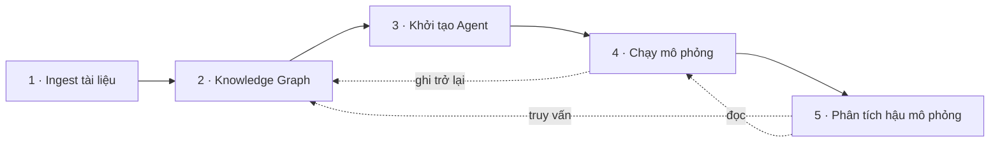
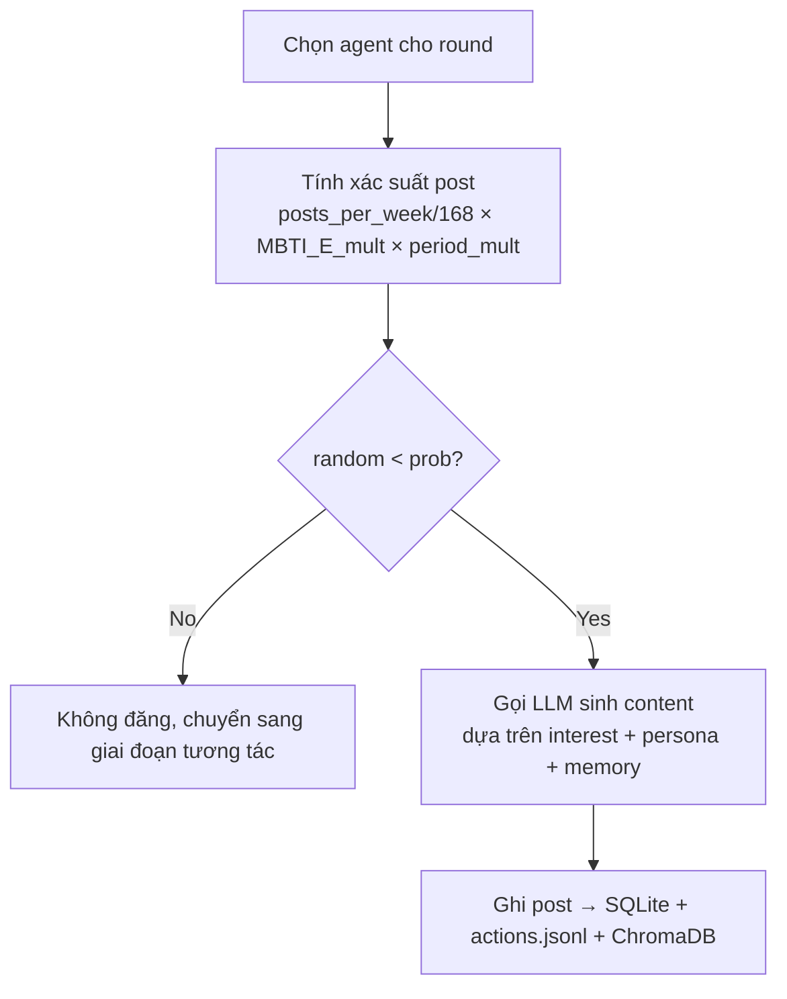
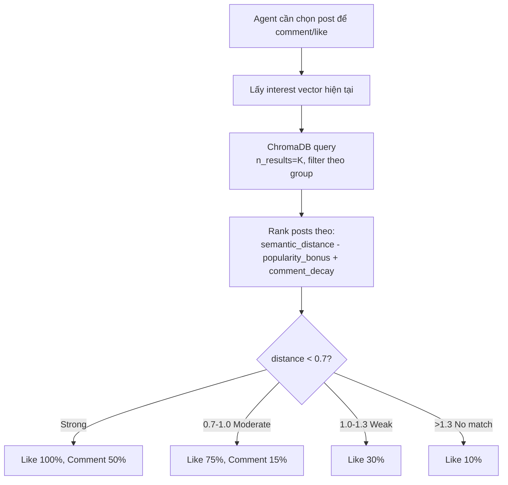

# 01 — Tổng quan dự án

## EcoSim là gì

**EcoSim** mô phỏng động lực học của một mạng xã hội trong phản ứng với các sự kiện xã hội (chiến dịch marketing, khủng hoảng truyền thông, thay đổi chính sách, ra mắt sản phẩm, v.v.). Đầu vào là tài liệu mô tả bối cảnh; đầu ra là log hành vi của hàng chục/trăm agent cá nhân hoá, báo cáo phân tích, và khả năng phỏng vấn agent sau khi mô phỏng.

EcoSim **không** phải là một thay thế chung cho [OASIS (camel-ai)](https://github.com/camel-ai/oasis). Nó vay mượn OASIS làm platform nền và thay thế toàn bộ cơ chế ra quyết định của agent bằng một pipeline nhận thức (cognitive pipeline) tinh vi hơn.

## Pipeline 5 giai đoạn

| Giai đoạn | Mục tiêu | Tài liệu chi tiết |
|-----------|----------|-------------------|
| **1. Ingest** | Parse file (PDF/MD/TXT) → chunking → LLM trích xuất campaign spec | [03_ingestion_kg.md](03_ingestion_kg.md) |
| **2. Knowledge Graph** | LLM sinh ontology động theo loại campaign → Graphiti ingest chunks → FalkorDB | [03_ingestion_kg.md](03_ingestion_kg.md) |
| **3. Khởi tạo Agent** | Sample persona từ parquet 20M (DuckDB) → LLM enrich + gán MBTI → sim config | [04_agent_generation.md](04_agent_generation.md) |
| **4. Mô phỏng** | Round loop: conditional post → semantic feed → comment/like → memory → drift → crisis | [05_simulation_loop.md](05_simulation_loop.md) |
| **5. Hậu mô phỏng** | ReACT report + survey + interview per-agent + sentiment analysis | [06_post_simulation.md](06_post_simulation.md) |

## Điểm khác biệt so với OASIS

OASIS gốc nhồi toàn bộ ngữ cảnh (posts + actions + persona) vào một prompt duy nhất và để LLM quyết định tất cả. EcoSim tách cơ chế ra quyết định thành nhiều tầng, dùng LLM chỉ khi thật sự cần content generation.

| Khía cạnh | OASIS | EcoSim |
|-----------|-------|--------|
| **Có đăng bài hay không** | LLM quyết định | Rule-based: `posts_per_week × MBTI multiplier × period_multiplier` |
| **Chọn bài để tương tác** | Toàn bộ feed nhồi vào prompt | Semantic search (ChromaDB) theo interest vector |
| **Nội dung post/comment** | LLM | LLM (điểm duy nhất LLM được gọi cho actions) |
| **Sở thích agent** | Static trong persona | **Adaptive** — KeyBERT extract từ post engagement, drift theo `impressionability/forgetfulness/curiosity/conviction` |
| **Bộ nhớ** | Không | FIFO buffer + FalkorDB graph riêng (`ecosim_agent_memory`) |
| **MBTI** | Không dùng | Modifiers trên post/comment/like/feed exploration |
| **Sự kiện đột biến** | Không có | Crisis engine 7 loại (price_change, scandal, regulation, ...) scheduled hoặc injected runtime |
| **Hậu phân tích** | Xem log | Report ReACT (4 graph/data tools) + per-agent interview + survey + sentiment analysis |

### Conditional posting — ví dụ

Trong OASIS, agent được chọn → LLM được hỏi "agent này có đăng gì không, nội dung gì". Trong EcoSim:

Kết quả: LLM call ít hơn 3-5 lần, hành vi phân phối thực tế hơn (không phải agent nào cũng đăng mỗi round), và cấu hình tham số hoá được.

### Semantic interest matching — ví dụ

### Adaptive interest drift

Sau mỗi round, sở thích agent được cập nhật động:

1. **Extract keywords** từ post agent đã engage bằng KeyBERT (`all-MiniLM-L6-v2`, ngram 1-3, MMR diversity 0.5).
2. **Boost** interest đã engage += `impressionability`.
3. **Decay** interest không engage × `(1 - forgetfulness)`.
4. **New keywords** += `curiosity` weight.
5. **Floor** các profile interests tại mức `conviction` (bảo vệ core identity).
6. **Prune** interests có weight < 0.03 (trừ profile interests).

Xem [05_simulation_loop.md](05_simulation_loop.md) cho công thức chi tiết.

## Kỹ thuật stack tóm tắt

| Layer | Công nghệ |
|-------|-----------|
| Gateway | Python reverse proxy (port 5000) |
| Core Service | Flask 3 + Pydantic 2 (port 5001) — campaign + report |
| Simulation Service | FastAPI + uvicorn (port 5002) — graph + sim + survey + interview + analysis |
| Simulation runner | OASIS framework + extensions (subprocess) |
| Frontend | Vue 3 + Pinia + Vite (port 3000 trong Docker, 5173 dev) |
| Graph DB | FalkorDB (Redis-based) qua `graphiti-core` |
| Vector DB | ChromaDB với `all-MiniLM-L6-v2` (local) |
| Profile pool | Parquet 20M rows scan bằng DuckDB |
| LLM | OpenAI-compatible SDK (OpenAI / Groq / Together / Ollama qua `base_url`) |
| Keyword extraction | KeyBERT + sentence-transformers |
| Document parsing | PyMuPDF + LangChain text splitters |

## Khi nào dùng EcoSim

- Test trước một chiến dịch truyền thông/giá/chính sách trước khi tung thật — dự báo phản ứng.
- Nghiên cứu lan truyền thông tin/khủng hoảng với cohort tham số hoá.
- Thử nghiệm hiệu ứng injection crisis (scandal, regulation) lên một community đã "sống".

## Khi nào KHÔNG nên dùng

- Cần kết quả chính xác thống kê — đây là công cụ định tính, agent base thuần LLM có bias.
- Ngân sách LLM eo hẹp — dù đã giảm call, một simulation 100 agents × 24 rounds vẫn ~2-5k LLM call.
- Không có dữ liệu persona thật — parquet 20M profiles là xương sống; không có thì agent giả quá.

## Đi tiếp

- Cài đặt: [../README.md](../README.md)
- Hiểu services mapping → port → endpoint: [02_architecture.md](02_architecture.md)
- Làm việc cùng Claude Code agent: [../CLAUDE.md](../CLAUDE.md)
