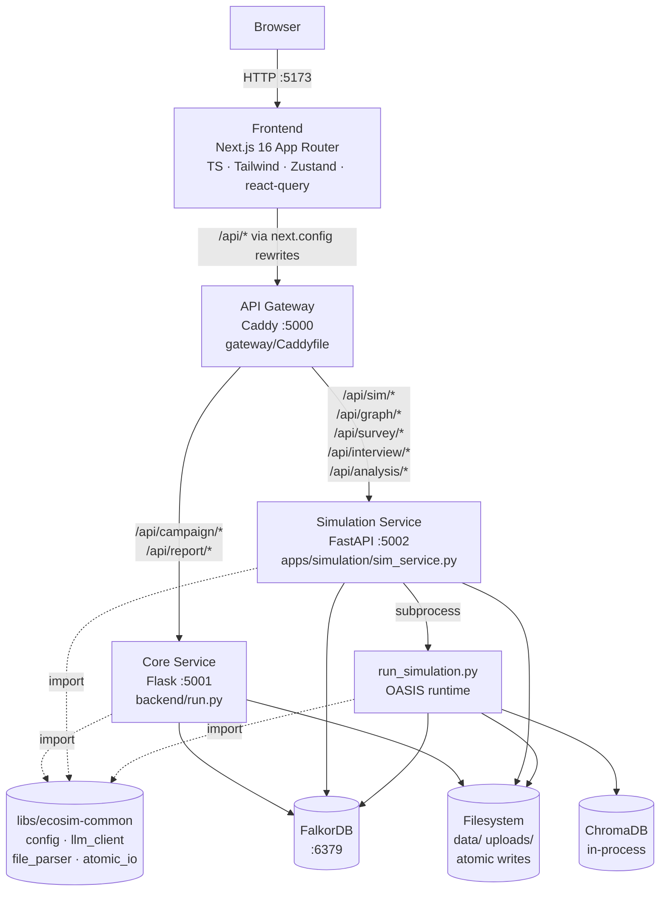
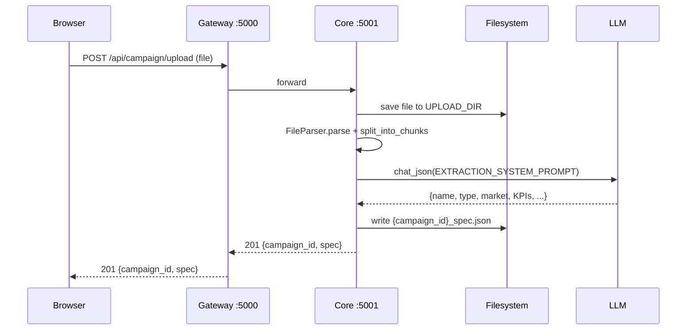
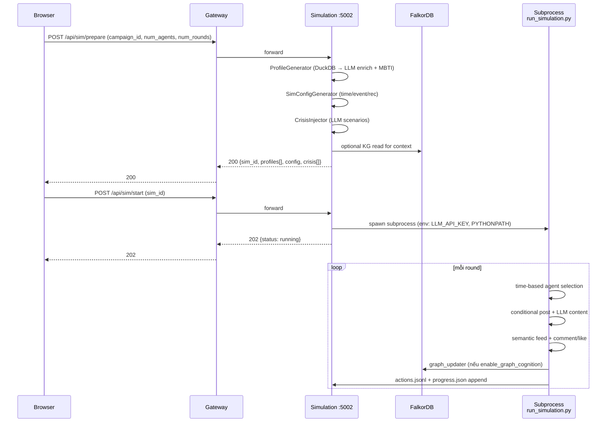

# 02 — Kiến trúc Microservice

EcoSim triển khai kiểu microservice với **API Gateway làm reverse proxy duy nhất** và **stateless service** đằng sau. Cơ sở dữ liệu (FalkorDB) + filesystem (`data/`, `uploads/`) là nơi share state giữa services.

## Sơ đồ tổng thể



## Liệt kê service

| Service | Framework | Port | Entry point | Vai trò |
|---------|-----------|------|-------------|---------|
| **Gateway** | **Caddy 2** | 5000 | [apps/gateway/Caddyfile](../apps/gateway/Caddyfile) | Reverse proxy, route tới Core/Simulation, SSE streaming |
| **Core Service** | Flask 3 | 5001 | [apps/core/run.py](../apps/core/run.py) | Campaign upload/parse, Report generation (ReACT) |
| **Simulation Service** | FastAPI + uvicorn | 5002 | [apps/simulation/sim_service.py](../apps/simulation/sim_service.py) | Graph build, Sim lifecycle, Survey, Interview, Analysis |
| **Frontend** | **Next.js 16 + React 19 + TS + Tailwind 3** | 5173 | [apps/frontend/](../apps/frontend/) | UI — campaign-centric IA, Linear-style aesthetic |
| **FalkorDB** | Redis fork | 6379 | Docker image `falkordb/falkordb` | Graph + Hybrid search (BM25 + Vector + RRF) |

### Shared library `ecosim_common`

[libs/ecosim-common/src/ecosim_common/](../libs/ecosim-common/src/ecosim_common/) — dùng chung bởi Core + Simulation + run_simulation subprocess:

| Module | Vai trò |
|--------|---------|
| `config.EcoSimConfig` | Unified env loader, auto-locate repo root, remap `LLM_API_KEY`→`OPENAI_API_KEY` cho Graphiti |
| `llm_client.LLMClient` | OpenAI-compatible sync (`chat`, `chat_json`) + async (`chat_async`, `chat_json_async`) với retry |
| `file_parser.FileParser` + `CampaignDocumentParser` | Document parsing: 3-tier chunking + section-based |
| `atomic_io.atomic_write_json` / `atomic_write_text` / `atomic_append_jsonl` | Tmp+rename pattern → tránh race condition khi nhiều service ghi cùng `data/simulations/{sim_id}/` |

Bootstrap: `apps/core/run.py`, `apps/simulation/sim_service.py`, `apps/simulation/run_simulation.py` walk up folder tree tìm `libs/ecosim-common/src` và insert vào `sys.path`. Docker set `PYTHONPATH=/app/libs/ecosim-common/src:/app/vendored/oasis` qua docker-compose. `run_simulation.py` cũng bootstrap `vendored/oasis/` lên sys.path để `import oasis` (upstream camel-ai package) hoạt động.

## Bảng routing gateway

Gateway ánh xạ prefix path → upstream via Caddy `handle` blocks ([apps/gateway/Caddyfile](../apps/gateway/Caddyfile)):

| Prefix | Upstream |
|--------|----------|
| `/api/campaign/*` | `core:5001` |
| `/api/report/*` | `core:5001` |
| `/api/sim/*` | `simulation:5002` |
| `/api/graph/*` | `simulation:5002` |
| `/api/survey/*` | `simulation:5002` |
| `/api/interview/*` | `simulation:5002` |
| `/api/analysis/*` | `simulation:5002` |

SSE streaming: `reverse_proxy` với `flush_interval -1` để forward event kịp thời, `transport http { read_timeout 600s }` cho long-running LLM chains (report ReACT, graph build).

Upstream host có thể override qua env: `CORE_UPSTREAM=localhost:5001 SIM_UPSTREAM=localhost:5002` (local dev ngoài Docker).

Gateway health: `GET /api/health/gateway` → `{"status":"ok"}` (liveness). `GET /api/health` forward tới Core (aggregate).

## Frontend (Next.js)

Frontend ([apps/frontend/](../apps/frontend/)) — Next.js 16 App Router. Stack tóm tắt:

| Concern | Library |
|---------|---------|
| Routing | Next.js 16 App Router (file-based, dynamic `[campaignId]/sims/[simId]`) |
| Styling | Tailwind 3 với theme tokens (zinc + brand violet 600), không dùng CSS-in-JS |
| State | Zustand `app-store.ts` (persist via `localStorage` key `ecosim.app`: recent campaigns + debug flag) + `ui-store.ts` (transient: sidebar collapse, command palette open, toast queue) |
| Data fetching | `@tanstack/react-query` v5 — single QueryClient ở `app/providers.tsx`, query keys ở `lib/queries/index.ts` factory `qk` |
| HTTP | Native `fetch` qua `lib/api/client.ts` (`apiFetch<T>`) — bỏ axios |
| SSE | `EventSource` wrapped trong `hooks/use-sse.ts` — dùng cho live action feed của Sim Run + Report progress |
| Charts | `recharts` (Sentiment + Survey aggregations) |
| Markdown | `react-markdown + remark-gfm` cho Report sections |
| Icons | `lucide-react` (tree-shakable) |
| Forms | `react-hook-form + zod` (Settings, Survey composer) |

**Information architecture — campaign-centric** (không có pipeline lock):

```
/                                              ← Dashboard (overview + recent campaigns + active sims)
/campaigns                                     ← All campaigns list
/campaigns/new                                 ← Upload
/campaigns/[campaignId]                        ← Workspace (tabs)
  ├─ ./                                        ← Overview (status, KPIs, stakeholders, risks)
  ├─ ./spec                                    ← Full spec
  ├─ ./graph                                   ← KG entities/edges browser
  └─ ./sims
      ├─ ./                                    ← Sims list (per campaign)
      └─ ./[simId]                             ← Sim workspace (tabs)
          ├─ ./                                ← Run (SSE feed + progress + crisis log)
          ├─ ./analysis                        ← Sentiment charts + top excerpts
          ├─ ./report                          ← ReACT outline + section markdown
          ├─ ./survey                          ← Composer / aggregated results
          └─ ./interview                       ← Agent chat with intent badge
/settings                                      ← Local prefs (debug toggle, reset state)
```

**Backend integration**: Next `next.config.ts` rewrites `/api/*` → `${GATEWAY_UPSTREAM || NEXT_PUBLIC_GATEWAY_URL || 'http://localhost:5000'}/api/*`. Browser luôn same-origin → no CORS. SSE chạy qua rewrite chain (Next → Caddy → FastAPI), Caddy đã set `flush_interval -1` nên không block. Trong Docker, compose set `GATEWAY_UPSTREAM=http://gateway:5000` (service hostname).

**Shell layout** (Slack-style split): collapsible sidebar 256↔56px (recent campaigns + nav + Cmd+K trigger) · TopBar (breadcrumbs derived from URL) · main pane · floating Toast host · Cmd+K Command Palette overlay (fuzzy match commands + campaigns).

**Production build** ([apps/frontend/Dockerfile](../apps/frontend/Dockerfile)): multi-stage Node 20-alpine → `next.config.ts` `output: 'standalone'` → minimal runtime image (~150 MB). Container runs `node server.js` as non-root user `nextjs:1001` on port 5173. Compose service `frontend` (xem [docker-compose.yml](../docker-compose.yml)) builds from this Dockerfile + sets `GATEWAY_UPSTREAM=http://gateway:5000`.

Fallback: nếu Caddy không có PATH, `start.ps1` tự động fallback sang `apps/gateway/gateway.py.bak` (Flask + httpx legacy).

## Core Service (Flask :5001)

Application factory: [apps/core/app/__init__.py](../apps/core/app/__init__.py).

**Blueprints đã register:**
- `campaign_bp` từ [apps/core/app/api/campaign.py](../apps/core/app/api/campaign.py)
- `report_bp` từ [apps/core/app/api/report.py](../apps/core/app/api/report.py)

**Blueprints legacy (còn file nhưng KHÔNG register — đã chuyển sang Simulation Service):**
- `apps/core/app/api/graph.py`, `apps/core/app/api/simulation.py`, `apps/core/app/api/survey.py` — giữ làm tham chiếu hoặc sẽ xoá khi cleanup.

**Services quan trọng:**
- [apps/core/app/services/campaign_parser.py](../apps/core/app/services/campaign_parser.py) — LLM extract campaign spec
- [apps/core/app/services/report_agent.py](../apps/core/app/services/report_agent.py) — ReACT report (2 phase: outline → per-section)
- [apps/core/app/services/kg_retriever.py](../apps/core/app/services/kg_retriever.py) — truy vấn FalkorDB cho report tools
- [apps/core/app/utils/llm_client.py](../apps/core/app/utils/llm_client.py) — **SINGLE LLM ENTRY POINT**
- [apps/core/app/utils/file_parser.py](../apps/core/app/utils/file_parser.py) — PDF/MD/TXT → chunks

## Simulation Service (FastAPI :5002)

Entry: `apps/simulation/sim_service.py` (uvicorn app). Routers trong [apps/simulation/api/](../apps/simulation/api/):

| Router | Prefix | File |
|--------|--------|------|
| Graph | `/api/graph` | [apps/simulation/api/graph.py](../apps/simulation/api/graph.py) |
| Simulation | `/api/sim` | [apps/simulation/api/simulation.py](../apps/simulation/api/simulation.py) |
| Survey | `/api/survey` | [apps/simulation/api/survey.py](../apps/simulation/api/survey.py) |
| Interview | `/api/interview` | [apps/simulation/api/interview.py](../apps/simulation/api/interview.py) |
| Report (analysis) | `/api/analysis`, `/api/report` | [apps/simulation/api/report.py](../apps/simulation/api/report.py) |

Simulation Service chia sẻ thư mục với OASIS runtime — khi cần chạy simulation, nó **spawn subprocess** `run_simulation.py` qua `subprocess.Popen` (không import trực tiếp, tránh conflict Python env).

## Flow một request điển hình

### Upload + parse campaign



### Prepare + start simulation



## Filesystem layout

```
EcoSim/
├── uploads/                        ← legacy upload dir (Core)
├── data/
│   ├── samples/                    ← parquet profile pool (20M rows)
│   ├── uploads/                    ← campaign files + {id}_spec.json
│   └── simulations/{sim_id}/
│       ├── simulation_config.json  ← toàn bộ config sinh ở prepare
│       ├── profiles.json           ← N agent profiles
│       ├── crisis_scenarios.json   ← scheduled crisis events
│       ├── oasis_simulation.db     ← SQLite: trace/post/comment
│       ├── actions.jsonl           ← export incremental mỗi round
│       ├── progress.json           ← {current_round, total_rounds, status}
│       ├── pending_crisis.json     ← runtime-injected crisis buffer
│       ├── agent_tracking.txt      ← cognitive state của tracked agents
│       ├── memory_stats.json       ← thống kê memory buffer
│       └── report/
│           ├── meta.json           ← report_id, status, sections_count, duration_s
│           ├── outline.json        ← Phase 1 output
│           ├── section_NN.md       ← Phase 2 per-section
│           ├── full_report.md      ← assembled final
│           └── agent_log.jsonl     ← ReACT iteration log
```

Runtime artifacts nằm trong `data/` đã được gitignore.

## Share state giữa services

- **FalkorDB** là store duy nhất giữa Core và Simulation: campaign KG, agent memory, graph-based context trong simulation.
- **Filesystem** (`data/simulations/{sim_id}/`) là hợp đồng giữa Simulation Service, subprocess runner, và Core Service (report đọc actions.jsonl + truy vấn FalkorDB).
- **Không có message queue** — không có nhu cầu pub/sub giữa services; tất cả truy cập qua file + DB.

## Lý do microservice

- **Isolation Python env**: OASIS dùng `camel-ai`, poetry, `.venv` riêng ở `apps/simulation/.venv/`. Core dùng `pip + requirements.txt`. Giữ 2 env giúp không conflict dependency.
- **Scaling Simulation độc lập**: simulation heavy (LLM + ChromaDB + graph updater). Core Service nhẹ.
- **Tách deployment**: cần scale lên cloud thì Simulation deploy lên GPU node, Core lên web node.

## Khi nào chạy thế nào

| Scenario | Cách chạy |
|----------|-----------|
| **Docker all-in-one** | `docker compose up -d` — 5 container |
| **Local dev (Windows)** | `.\start.ps1` — spawn 5 terminal cho gateway/core/simulation/frontend + docker FalkorDB |
| **Chỉ backend phát triển** | `cd backend && python run.py` + `cd oasis && uvicorn sim_service:app --port 5002` |
| **Test endpoint trực tiếp** | Gọi thẳng `localhost:5001` (Core) hoặc `localhost:5002` (Sim) bỏ qua gateway |

Chi tiết ports + env vars: [reference.md](reference.md).
