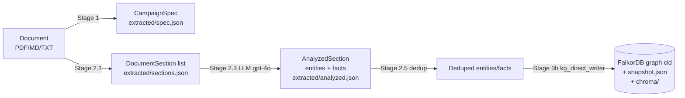
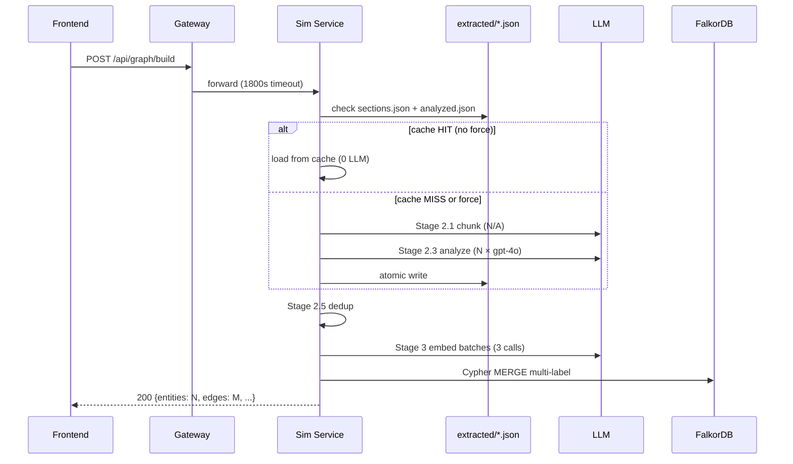

# 03 — Stage 1–3: Ingestion & Knowledge Graph

Ba giai đoạn đầu biến **một tài liệu văn bản** thành:
- (a) **CampaignSpec** có cấu trúc — Pydantic model.
- (b) **Sections + Entities + Facts** — qua 2 stage LLM extraction.
- (c) **Knowledge Graph persistent** — FalkorDB graph `<cid>` + JSON snapshot + ChromaDB embeddings.

Các stage sau (agent generation, simulation, report) truy vấn qua KG này.

## Pipeline



| Stage | Trigger | Code | Model | Cost |
|-------|---------|------|-------|------|
| 1 — Parse spec | `POST /api/campaign/upload` | [campaign_parser.py](../apps/core/app/services/campaign_parser.py) | `LLM_EXTRACTION_MODEL` (gpt-4o) | 1 LLM call |
| 2.1 — Chunk into sections | (cùng request, sau Stage 1) | [file_parser.py:CampaignDocumentParser](../libs/ecosim-common/src/ecosim_common/file_parser.py) | None (PyMuPDF + LangChain splitter) | 0 |
| 2.3 — Analyze sections | `POST /api/graph/build` (Stage 2) | [campaign_knowledge.py:CampaignSectionAnalyzer](../apps/simulation/campaign_knowledge.py) | `LLM_EXTRACTION_MODEL` | N sections × 1 call |
| 2.5 — Post-process dedup | (cùng Stage 2) | [campaign_knowledge.py:postprocess_entities](../apps/simulation/campaign_knowledge.py) | None | 0 |
| 3 — Write KG | (cùng Stage 2, terminal stage) | [kg_direct_writer.py:write_kg_direct](../apps/simulation/kg_direct_writer.py) | Embeddings (3 batches) | 3 embed API calls + Cypher MERGE |

## Stage 1 — CampaignSpec extraction

**Trigger**: `POST /api/campaign/upload` (multipart file).

**Handler**: [campaign.py:upload_campaign()](../apps/core/app/api/campaign.py).

**Flow**:
1. Save file gốc `data/campaigns/<cid>/source/<filename>` (immutable).
2. Parse text via `FileParser.parse()` — PDF (PyMuPDF), MD/TXT trực tiếp.
3. LLM extract `CampaignSpec` (Pydantic) — fields: `name`, `campaign_type` (enum), `market`, `budget`, `timeline`, `stakeholders`, `kpis`, `identified_risks`, `raw_text`, `chunks`.
4. Atomic write `extracted/spec.json`.

**Campaign types** (enum, [models/campaign.py](../apps/core/app/models/campaign.py)):
- `MARKETING`, `PRICING`, `EXPANSION`, `POLICY`, `PRODUCT_LAUNCH`, `OTHER`

**Cache**: `extracted/spec.json` không bị invalidate tự động — xoá file để force re-extract.

## Stage 2.1 — Document chunking (3-tier)

[`CampaignDocumentParser.parse`](../libs/ecosim-common/src/ecosim_common/file_parser.py) chia document thành `DocumentSection[]` — mỗi section có `title`, `text`, `level`. Algorithm:

1. **Tier 1**: Markdown heading-based split (H1/H2/H3 boundaries).
2. **Tier 2**: Semantic similarity threshold (langchain semantic chunker).
3. **Tier 3**: Size-based fallback (max chars per chunk).

Output → `extracted/sections.json` (chứa `_version: 1` để invalidate cache khi schema đổi).

**Idempotent**: file tồn tại → skip Stage 2.1 + 2.3, chỉ chạy Stage 3 (cypher MERGE).

## Stage 2.3 — Section analysis (entities + facts)

[`CampaignSectionAnalyzer.analyze`](../apps/simulation/campaign_knowledge.py) — gọi `LLM_EXTRACTION_MODEL` (default gpt-4o, đắt hơn ~5× main model) cho mỗi section:

- **Input**: section text + ontology hint (entity types + edge types từ campaign_type).
- **Output**: `AnalyzedSection` với:
  - `entities`: list `{name, type, description, attributes}`
  - `facts`: list `{source_name, edge_type, target_name, fact_text, valid_at?}`
- **Cache**: `extracted/analyzed.json` (`_version: 1`).

> Vì sao gpt-4o (đắt) cho Stage 2 mà không phải main model? **Vietnamese business docs precision**. Main model (gpt-4o-mini) thường nhầm "Brand" → "Company", miss implicit relationships. gpt-4o tăng ~30-40% precision cho extract Vietnamese (verify: Highlands Coffee sample → 80-120 entities với 4o vs 40-50 với 4o-mini). Cost giảm bằng cache — chỉ chạy 1 lần per campaign.

## Stage 2.5 — Post-process dedup

[`postprocess_entities`](../apps/simulation/campaign_knowledge.py) merge entities/facts trùng lặp:
- Normalize names (lowercase, strip whitespace, remove accents cho compare).
- Merge alias chains: `"Shopee"` ≡ `"Shopee Vietnam"` ≡ `"Shopee Việt Nam"`.
- Rename `source_name`/`target_name` trong facts theo canonical entity name.
- Log: `entities 17 → 11, facts 22 → 11, 2 renames`.

## Stage 3 — Write KG (3 variants)

`KG_BUILDER` env có 3 lựa chọn — chọn variant write KG:

| Variant | File | Cách hoạt động | Khi nào dùng |
|---------|------|-----------------|--------------|
| `direct` (default) | [kg_direct_writer.py](../apps/simulation/kg_direct_writer.py) | Bypass Graphiti. 3 embedding batches (entities, facts, episodes) → Cypher MERGE multi-label vào FalkorDB. ~10-30s. | Production — Stage 2 extract đã đủ |
| `zep_hybrid` | [zep_kg_writer.py](../apps/simulation/zep_kg_writer.py) | Master KG dual-write: Zep server-side extract → fetch nodes/edges → re-embed local → Cypher MERGE. | Khi muốn temporal validity từ Zep |
| `graphiti` (legacy) | [campaign_knowledge.py:CampaignGraphLoader](../apps/simulation/campaign_knowledge.py) | `Graphiti.add_episode` mỗi section — LLM re-extract 4-5 calls/section. 60+ phút trên doc lớn. | Keep cho future incremental updates |

### Vì sao bypass Graphiti?

Graphiti `add_episode()` gọi LLM extract entities/edges **lần nữa** (sau khi Stage 2 đã extract bằng gpt-4o). Tổng cost:

```
Doc 50 sections × Graphiti 4 LLM calls/section = 200 LLM calls extra
vs
Stage 2 (50 calls) + kg_direct_writer (3 embed batches) = 53 calls
```

→ ~4× tiết kiệm + 60+ phút giảm thời gian.

Trade-off **acceptable**: bỏ Graphiti edge invalidation (master KG static, không có temporal updates) + bỏ smart entity dedup (Stage 2.5 `postprocess_entities` đã dedup).

### Cypher schema (sau write)

Multi-label nodes:
- `:Entity` + `:<canonical_type>` (Company, Product, Campaign, Market, Person, ...)
- Properties: `uuid`, `name`, `description`, `attributes` (JSON), `embedding` (vector 384-dim), `group_id` (= cid).

Edges:
- `<:RELATION_TYPE>` (Discusses, MentionsBrand, Promotes, Critiques, AgreesWith, DisagreesWith, InfluencedBy, ...)
- Properties: `fact_text`, `embedding`, `valid_at?`, `invalid_at?`, `group_id`.

`:Episodic` nodes (source provenance):
- 1 node per section chunk processed → properties `content`, `episode_type`, `created_at`.
- Linked qua `[:MENTIONS]` đến entities được trích từ episode đó.

## Stage 2 + 3 trigger flow

`POST /api/graph/build` body: `{ campaign_id, kg_builder?, force? }`.



**Idempotent**: gọi `/build` 2 lần với `force=false` → lần 2 chỉ chạy Stage 3 (Cypher MERGE existing entities).

## Per-campaign storage layout (Phase 5)

```
data/campaigns/<cid>/
├── source/
│   └── <original_filename>          ← immutable file gốc
├── extracted/
│   ├── spec.json                    ← Stage 1 output (CampaignSpec)
│   ├── sections.json                ← Stage 2.1 output (3-tier chunks)
│   └── analyzed.json                ← Stage 2.3 + 2.5 output (entities + facts, deduped)
├── kg/
│   ├── snapshot.json                ← Stage 3 output (Cypher MERGE record)
│   ├── chroma/                      ← 3 ChromaDB collections (master KG)
│   └── build_meta.json              ← model_id, dim, builder variant, timestamp
└── sims/
    └── sim_<sid>/                   ← per-sim runtime (xem 04, 05)
```

**Force re-extract**: `rm -rf data/campaigns/<cid>/extracted/` → rerun `/build`.

**Atomic invariant**: `snapshot.json` present ⇒ chroma đầy đủ. Order ghi: chroma upsert + fsync trước, JSON ghi last.

## Read path — KG queries

Sau khi KG built, các consumer truy vấn qua:

| Endpoint | Use case | Path qua |
|----------|----------|----------|
| `GET /api/graph/entities?cid=X` | List entities (UI graph viz) | Sim service, raw Cypher |
| `GET /api/graph/edges?cid=X` | List edges | Sim service, raw Cypher |
| `GET /api/graph/stats?group_id=X` | Node + edge count | Sim service |
| `GET /api/graph/search?q=...` | Hybrid search (semantic) | Sim service, **Graphiti broken → fallback raw Cypher LIKE pattern matching** |
| Internal: Report tool `kg_retriever` | Report ReACT context | Core service, [kg_retriever.py](../apps/core/app/services/kg_retriever.py) |

> ⛔ **Graphiti hybrid search broken**: `graphiti_core.driver.falkordb_driver.FalkorDriver` không tồn tại trên PyPI (đã probe). `KGRetriever` + `GraphQuery` đã có fallback `_basic_search()` dùng raw Cypher `WHERE n.name CONTAINS $q OR n.description CONTAINS $q`. Vector similarity search degrade — Report agent KPI extraction vẫn work qua direct entity lookup nhưng không có semantic ranking.

## Cache + invalidation

| File | Invalidate khi |
|------|----------------|
| `extracted/spec.json` | User xoá file thủ công (không auto) |
| `extracted/sections.json` | `_version` field mismatch hoặc xoá |
| `extracted/analyzed.json` | `_version` field mismatch hoặc xoá |
| `kg/snapshot.json` + `chroma/` | `POST /api/graph/build?force=true` hoặc `DELETE /api/graph/clear?campaign_id=X` |
| FalkorDB graph `<cid>` | Docker volume `falkordb_data` mất → `POST /api/graph/restore?campaign_id=X` reload từ snapshot.json |

`force` flag trên `/build` chỉ invalidate Stage 3 (Cypher MERGE). Để force Stage 2 LLM re-extract → xoá `extracted/` trước.

## Đọc tiếp

- [04_agent_generation.md](04_agent_generation.md) — sinh profiles + sim config
- [05_simulation_loop.md](05_simulation_loop.md) — round loop runtime
- [07_storage_and_paths.md](07_storage_and_paths.md) — full storage map
