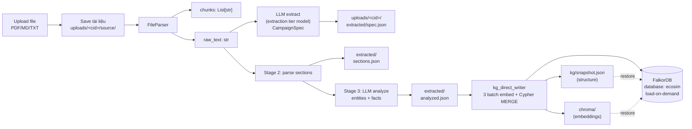
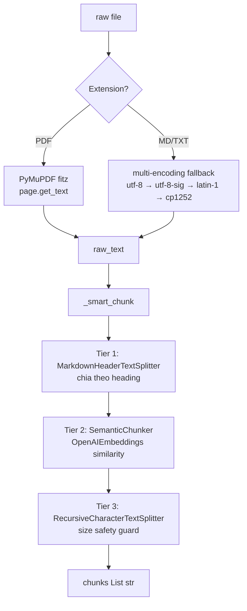

# 03 — Stage 1-2: Ingestion & Knowledge Graph

Hai giai đoạn đầu biến một tài liệu văn bản thành (a) **campaign spec** có cấu trúc và (b) **knowledge graph** persistent trên disk (JSON snapshot + ChromaDB) với FalkorDB là cache load-on-demand. Các giai đoạn sau (agent generation, simulation, report) truy vấn qua KG.



## 1. Upload

### Endpoint

`POST /api/campaign/upload` ([apps/core/app/api/campaign.py:24-78](../apps/core/app/api/campaign.py#L24-L78))

- `multipart/form-data` field `file`
- Extensions hỗ trợ: `.pdf`, `.md`, `.markdown`, `.txt`
- Validation: file size ≤ `MAX_UPLOAD_SIZE_MB` (mặc định 50)
- Save vào **per-campaign storage** `data/uploads/{campaign_id}/source/{filename}` (immutable sau upload). Helpers ở `EcoSimConfig.campaign_dir/source_dir/extracted_dir/kg_dir`.

### Parsing: FileParser 3-tier

File: [apps/core/app/utils/file_parser.py](../apps/core/app/utils/file_parser.py)



**Tại sao 3-tier?**
- **Tier 1** giữ cấu trúc logic của văn bản có Markdown headers (`# Intro`, `## Budget`, ...).
- **Tier 2** bắt ngắt theo semantic cho prose dài không có heading (ví dụ PDF scan).
- **Tier 3** cắt cứng theo ký tự nếu chunk Tier 2 vượt size limit (tránh LLM context overflow khi extract).

Fallback cuối là `_basic_chunk()` — character-level khi không có dependency cho `SemanticChunker`.

### LLM extract CampaignSpec

[apps/core/app/services/campaign_parser.py:83-114](../apps/core/app/services/campaign_parser.py#L83-L114)

- System prompt: `EXTRACTION_SYSTEM_PROMPT` ([apps/core/app/services/campaign_parser.py:16-38](../apps/core/app/services/campaign_parser.py#L16-L38))
- Model: **`LLM_EXTRACTION_MODEL`** (mặc định `gpt-4o`, đắt hơn ~5× main model nhưng precision cao cho Vietnamese business docs). `temperature=0.2`, `max_tokens=1500`
- Output schema (Pydantic `CampaignSpec` — [apps/core/app/models/campaign.py:22-46](../apps/core/app/models/campaign.py#L22-L46)):

```json
{
  "campaign_id": "uuid8",
  "name": "...",
  "campaign_type": "marketing | pricing | expansion | policy | product_launch | other",
  "market": "...",
  "budget": "...",
  "timeline": "...",
  "stakeholders": ["..."],
  "kpis": ["..."],
  "identified_risks": ["..."],
  "summary": "...",
  "raw_text": "<loại khỏi API response>",
  "chunks": ["<loại khỏi API response>"],
  "created_at": "2026-04-22T..."
}
```

Spec JSON được lưu `data/uploads/{campaign_id}/extracted/spec.json` (per-campaign layout) và cache in-memory `_campaigns[campaign_id]`. Layout flat cũ (`{id}_spec.json`) đã deprecated.

### Ví dụ response

```json
POST /api/campaign/upload
{
  "campaign_id": "a3f1b29c",
  "name": "Shopee Black Friday 2026",
  "campaign_type": "marketing",
  "market": "Việt Nam",
  "budget": "50 tỷ VND",
  "timeline": "1 tuần, tháng 11/2026",
  "stakeholders": ["Shopee", "Merchants VN", "ShopeePay"],
  "kpis": ["GMV tăng 300%", "DAU tăng 50%"],
  "identified_risks": ["phản ứng tiêu cực về giá", "server quá tải"],
  "summary": "..."
}
```

## 2. Knowledge Graph Pipeline

**Architecture (post-Phase A): bypass Graphiti extraction.** Pipeline thực tế là [apps/simulation/campaign_knowledge.py](../apps/simulation/campaign_knowledge.py) (Stage 1+2) → [apps/simulation/kg_direct_writer.py](../apps/simulation/kg_direct_writer.py) (Stage 3b direct Cypher) — **không** gọi `Graphiti.add_episode` (which re-extract LLM 4-5 calls/section = 60+ phút duplicate work).

### Endpoints

| Endpoint | Method | Pipeline | Mô tả |
|----------|--------|----------|-------|
| `/api/graph/build` | POST | Stage 1+2 + `kg_direct_writer.write_kg_direct` | Build KG từ text / campaign_id (load spec) — idempotent với cache reuse |
| `/api/graph/ingest` | POST | (legacy) `CampaignGraphLoader.load` | Reserved cho future incremental updates qua Graphiti |
| `/api/graph/snapshot` | POST | `kg_snapshot.write_snapshot` | Dump from FalkorDB (one-time migration) |
| `/api/graph/restore` | POST | `kg_snapshot.restore_to_falkordb` | Reload snapshot.json + chroma → FalkorDB (~5s, no API calls) |
| `/api/graph/cache-status` | GET | — | `{state: "fresh"\|"snapshot_only"\|"active", ...}` |

### Flow (build)

```mermaid
flowchart TB
    Start[POST /api/graph/build<br/>campaign_id] --> Cache{extracted/<br/>analyzed.json<br/>tồn tại?}
    Cache -->|Yes| Reuse[Skip Stage 2+3<br/>chỉ chạy MERGE]
    Cache -->|No| S1[Stage 1: Parse<br/>CampaignDocumentParser<br/>Markdown hoặc plaintext]
    S1 --> Guard[Size guard:<br/>cắt section > 1500 chars]
    Guard --> SecW[Write extracted/<br/>sections.json]
    SecW --> S2[Stage 2 LLM analyze<br/>LLM_EXTRACTION_MODEL<br/>per-section prompt VN]
    S2 --> Extract[Extract entities + facts<br/>với edge_type canonical]
    Extract --> S25[Stage 2.5: Post-process<br/>dedup + fragment filter<br/>sub-service → parent]
    S25 --> AnalW[Write extracted/<br/>analyzed.json]
    AnalW --> Direct
    Reuse --> Direct[Stage 3b: kg_direct_writer<br/>3 batch embed + Cypher MERGE]
    Direct --> DB[(FalkorDB :6379<br/>group_id=campaign_id)]
    Direct --> SnapW[Write kg/snapshot.json<br/>+ chroma/ (atomic, fsync)]
```

Trade-off (Phase A bypass): bỏ Graphiti edge invalidation (master KG static, không có temporal updates) + bỏ smart entity dedup (Stage 2.5 đã dedup). Tổng thời gian: ~10-30s (so với 60+ phút trước). Zero info loss vì Stage 2 extract bằng `LLM_EXTRACTION_MODEL` (gpt-4o tier).

Kết quả: mỗi campaign có 1 lớp node canonical trong `group_id`:
- Nodes label canonical (`:Company`, `:Consumer`, `:Product`, ...) + edges canonical (`:COMPETES_WITH`, ...) — dùng cho cả `/api/graph/entities|edges|stats` và hybrid search (3 ChromaDB collections embed name + description + facts).

### Stage 1: Parse

[apps/simulation/campaign_knowledge.py `CampaignDocumentParser`](../apps/simulation/campaign_knowledge.py)

- Markdown: split theo heading `#`, `##`, `###`, `####`
- Plaintext: split theo double-newline blocks + heuristic uppercase/short lines = header
- JSON: 1 section per top-level key
- **Size guard** (`MAX_SECTION_CHARS = 1500`): section dài hơn → cắt theo paragraph boundary, giữ title `<original> (part N/M)`.

### Stage 2: LLM Analyze

[apps/simulation/campaign_knowledge.py `CampaignSectionAnalyzer`](../apps/simulation/campaign_knowledge.py)

Prompt domain-specific Vietnamese business (port từ logic gốc ở `graph_builder.py:36-79`):

- **Valid entity types**: 14 canonical (Company / Consumer / Investor / Regulator / Competitor / Supplier / MediaOutlet / EconomicIndicator / Product / Market / Person / Organization / Campaign / Policy).
- **Valid edge types**: 12 canonical (COMPETES_WITH / SUPPLIES_TO / REGULATES / ...).
- Alias normalization: LLM đôi lúc trả "Brand" / "Audience" / "Event" → map về canonical (`Brand → Company`, `Audience → Consumer`, `Event → Campaign`) qua `ENTITY_TYPE_ALIASES`. Type rác như "Unknown" bị reject.

Output JSON per-section:

```json
{
  "summary": "...",
  "entities": [
    {"name": "Shopee", "type": "Company", "description": "..."}
  ],
  "facts": [
    {"subject": "Shopee", "predicate": "cạnh tranh với", "object": "Lazada", "edge_type": "COMPETES_WITH"}
  ]
}
```

### Stage 2.5: Post-processing

Module-level `postprocess_entities(entities, facts)` — 4 bước:

1. **Fragment filter**: name < 2 ký tự, hoặc lowercase bắt đầu không có space → loại.
2. **Canonical dedup**: "Shopee Việt Nam" chứa "Shopee" → merge xuống tên ngắn hơn.
3. **Sub-service filter**: tokens `Live | Feed | Pay | Mall | NOW | Express` → nếu parent (tên gốc bỏ token) đã có trong graph → gộp vào parent.
4. **Fix fact references**: cập nhật subject/object theo `name_map`, drop fact nếu mất reference.

### Stage 3b: Direct Cypher write (Phase A — bypass Graphiti)

[apps/simulation/kg_direct_writer.py `write_kg_direct`](../apps/simulation/kg_direct_writer.py)

**3 batch embedding API calls + Cypher MERGE** thay vì gọi `Graphiti.add_episode` (which re-extract LLM 4-5 calls/section duplicate Stage 2 work). Tổng ~10-30s.

```cypher
// Entity MERGE với multi-label
MERGE (n:Entity:Company {name: $name})
SET n.description = ..., n.entity_type = $etype, n.group_id = $gid,
    n.name_embedding = $name_vec, n.summary_embedding = $sum_vec

// Edge MERGE
MATCH (a {name: $src, group_id: $gid}), (b {name: $tgt, group_id: $gid})
MERGE (a)-[r:COMPETES_WITH]->(b)
SET r.description = ..., r.fact_embedding = $fact_vec
```

Idempotent — có thể gọi `/build` nhiều lần, node/edge không duplicate.

**Persistence atomic** ([apps/simulation/kg_snapshot.py](../apps/simulation/kg_snapshot.py)): sau khi MERGE thành công vào FalkorDB → `write_snapshot(campaign_id)` ghi `kg/snapshot.json` (structure ~300KB) + 3 ChromaDB collections (`name`/`summary`/`facts`, ~2.4MB). Invariant: chroma upsert + fsync trước, JSON ghi last → snapshot.json present ⇒ chroma đầy đủ.

**Legacy**: `CampaignGraphLoader.load()` (Graphiti hybrid path) còn ở [apps/simulation/campaign_knowledge.py](../apps/simulation/campaign_knowledge.py) — keep cho future incremental updates nếu cần (vd add doc bổ sung). Production build path KHÔNG dùng.

### Rules extraction quan trọng

Từ prompt `ANALYSIS_PROMPT` ([apps/simulation/campaign_knowledge.py](../apps/simulation/campaign_knowledge.py)):

| Rule | Giải thích |
|------|-----------|
| Entity = proper nouns only | Không extract generic words ("consumer", "market" chung chung) |
| Implicit relations | "đối thủ của Shopee là Lazada" → tự suy `COMPETES_WITH` |
| Sub-service = parent | "ShopeePay", "Shopee Live" → **không** entity riêng, gộp vào "Shopee" |
| Product != Campaign | "iPhone 16" → `Product`, không phải `Campaign` |
| Specific influencer → Person | "Sơn Tùng" → `Person`; "các influencer" → không extract |
| Canonical name | Dùng tên ngắn: "Shopee" không phải "Shopee Việt Nam" |
| Preserve diacritics | "Giao Hàng Nhanh" không phải "Giao Hang Nhanh" |
| Target density | 5-10 entities + 3-8 facts per section |

## 3. Truy vấn KG

### Endpoints (Simulation Service)

| Endpoint | Method | Dùng |
|----------|--------|------|
| `/api/graph/entities?group_id=&limit=` | GET | Liệt kê entities theo campaign |
| `/api/graph/edges?group_id=&limit=` | GET | Liệt kê edges |
| `/api/graph/stats?group_id=` | GET | Thống kê: số entity mỗi type, số edge mỗi type |
| `/api/graph/search?q=&group_id=&num_results=` | GET | Hybrid search qua Graphiti |
| `/api/graph/ingest` | POST | Thêm tài liệu bổ sung vào group hiện có |
| `/api/graph/list` | GET | Liệt kê tất cả group_id |
| `/api/graph/clear?group_id=` | DELETE | Xoá graph của một campaign |

### kg_retriever cho report

[apps/core/app/services/kg_retriever.py](../apps/core/app/services/kg_retriever.py) được `report_agent.py` dùng làm tool:

- `deep_analysis(query)` — decompose query → multi-entity search → aggregate
- `graph_overview()` — entities + edges + type distribution
- `quick_search(keyword)` — fast match

Chi tiết report tool: [06_post_simulation.md](06_post_simulation.md).

## 4. Persistence (Phase A-D)

### Source of truth = disk

```
data/uploads/<campaign_id>/
├── source/<filename>           ← tài liệu gốc (immutable)
├── extracted/                  ← LLM cache (gpt-4o tier — đắt nhất)
│   ├── spec.json
│   ├── sections.json
│   └── analyzed.json
├── kg/
│   ├── snapshot.json           ← structure (~300KB) — restore-from
│   └── build_meta.json
├── chroma/                     ← 3 ChromaDB collections (~2.4MB)
└── sims.json                   ← manifest list sims
```

**Atomic invariant**: chroma upsert + fsync trước, JSON ghi last → snapshot.json present ⇒ chroma đầy đủ.

**Cache reuse**: build idempotent. Reuse `extracted/sections.json` + `analyzed.json` nếu tồn tại → skip Stage 2+3 LLM, chỉ chạy MERGE. User force re-extract bằng `rm -rf data/uploads/<campaign_id>/extracted/`. Cache có `_version=1` field; bump khi schema đổi → load fail → re-extract auto.

### FalkorDB = ephemeral cache

| Param | Value | Nguồn |
|-------|-------|-------|
| Host | `FALKORDB_HOST` (mặc định `localhost`) | [.env](../.env.example) |
| Port | `FALKORDB_PORT` (mặc định `6379`) | [.env](../.env.example) |
| Database `ecosim` | Campaign KG (graph per `group_id=campaign_id`) | [apps/core/app/services/graphiti_service.py](../apps/core/app/services/graphiti_service.py) |
| Database `ecosim_agent_memory` | Sim agent memory (optional, xem [05_simulation_loop.md](05_simulation_loop.md)) | [libs/ecosim-common/src/ecosim_common/graphiti_factory.py](../libs/ecosim-common/src/ecosim_common/graphiti_factory.py) |

**Recovery flow**: nếu FalkorDB volume lost → `POST /api/graph/restore?campaign_id=X` reload từ disk (~5s, no LLM/embedding API calls). Frontend hiện status qua `GET /api/graph/cache-status?campaign_id=X` (tri-state `fresh` | `snapshot_only` | `active`).

**FalkorDB volume mount**: phải mount `falkordb_data:/var/lib/falkordb/data` (không phải `/data`) — đó là thư mục mặc định FalkorDB image dùng.

### Group ID = Campaign isolation

`group_id` cô lập nodes/edges theo campaign. Khi query phải pass `group_id=campaign_id` để không lẫn. Default group là `"default"`.

## 5. Config liên quan

```bash
# .env
LLM_API_KEY=sk-...
LLM_BASE_URL=https://api.openai.com/v1
LLM_MODEL_NAME=gpt-4o-mini       # main reasoning
LLM_FAST_MODEL_NAME=gpt-4o-mini  # high-frequency in-character (interview/survey/intent)
LLM_EXTRACTION_MODEL=gpt-4o      # Stage 1 + Stage 3 KG extraction (đắt hơn 5×)

FALKORDB_HOST=localhost
FALKORDB_PORT=6379
FALKORDB_USERNAME=               # optional
FALKORDB_PASSWORD=               # optional

UPLOAD_DIR=data/uploads
MAX_UPLOAD_SIZE_MB=50

# Sim runtime hybrid (Phase E/13/15) — optional
ZEP_API_KEY=                     # nếu dùng Zep cho sim content extraction
ZEP_SIM_RUNTIME=true             # bật section-per-action pipeline
```

## 6. Trace code end-to-end

```
POST /api/campaign/upload
  └─ apps/core/app/api/campaign.py:24 upload_campaign()
     ├─ FileParser.parse(file_path)                [apps/core/utils/file_parser.py:39]
     │  ├─ PDF: _parse_pdf()                        fitz.open → page.get_text()
     │  └─ Text: _parse_text()                      multi-encoding
     ├─ FileParser.split_into_chunks()              [apps/core/utils/file_parser.py:66]
     │  └─ _smart_chunk() Tier 1/2/3
     ├─ CampaignParser._extract_campaign_spec()    [apps/core/services/campaign_parser.py:83]
     │  └─ LLMClient.chat_json(EXTRACTION_SYSTEM_PROMPT, temp=0.2)
     └─ write {campaign_id}_spec.json → UPLOAD_DIR

POST /api/graph/build (campaign_id)
  └─ apps/simulation/api/graph.py build_graph()
     ├─ Load extracted/spec.json → raw_text (or chunks)
     ├─ Check cache: extracted/sections.json + analyzed.json exist?
     │  └─ Yes: skip to Stage 3b
     ├─ Stage 1: CampaignDocumentParser._parse_markdown/_plaintext  [campaign_knowledge.py]
     │  └─ _split_oversized (section > 1500 chars → paragraph buckets)
     │  └─ Write extracted/sections.json
     ├─ Stage 2: CampaignSectionAnalyzer.analyze_all  [campaign_knowledge.py]
     │  └─ per section: LLM chat (ANALYSIS_PROMPT, model=LLM_EXTRACTION_MODEL, temp=0.1, max_tokens=2000)
     ├─ Stage 2.5: postprocess_entities(all_entities, all_facts)
     │  ├─ fragment filter
     │  ├─ canonical dedup
     │  ├─ sub-service filter
     │  └─ fix fact references
     │  └─ Write extracted/analyzed.json
     ├─ Stage 3b: kg_direct_writer.write_kg_direct  [apps/simulation/kg_direct_writer.py]
     │  ├─ 3 batch embedding API calls (name + summary + facts)
     │  └─ Cypher MERGE multi-label (:Entity:Company / :Entity:Consumer / ...)
     └─ kg_snapshot.write_snapshot  [apps/simulation/kg_snapshot.py]
        ├─ Persist 3 ChromaDB collections (atomic upsert + fsync)
        └─ Write kg/snapshot.json (structure)
```

## Gotchas

- **FalkorDB phải chạy** trước khi gọi `/api/graph/build`. Nếu thấy `ConnectionError`: `docker compose up -d falkordb`.
- **FalkorDB volume mount path**: phải là `/var/lib/falkordb/data`, không phải `/data`. Nếu mount sai → mỗi lần restart container = wipe KG. (Recovery available qua `/api/graph/restore`.)
- **LLM cost**: Stage 2 dùng `LLM_EXTRACTION_MODEL` (gpt-4o tier, ~5× đắt). Document 10 sections × 1 call ≈ 10-15 LLM calls + 3 batch embedding calls. Cache reuse `extracted/analyzed.json` cho subsequent build → 0 LLM calls.
- **Group isolation bị vi phạm** nếu quên pass `group_id` khi ingest thêm — entities sẽ gộp nhầm. Luôn dùng `campaign_id` làm group.
- **Sub-service matching** tham chiếu token `Live/Feed/Pay/Mall/NOW/Express` — nếu muốn giữ entity riêng (ví dụ "Shopee Live" là sản phẩm độc lập) cần sửa `_SUB_SERVICE_TOKENS` trong [apps/simulation/campaign_knowledge.py](../apps/simulation/campaign_knowledge.py).
- **Cache version drift**: `extracted/sections.json` + `analyzed.json` có `_version=1`. Khi schema `DocumentSection`/`AnalyzedSection` đổi → bump version → load fail → re-extract auto.
- **Disk = source of truth**: nếu xóa `data/uploads/<cid>/` mất hoàn toàn campaign (kể cả khi FalkorDB còn). Backup `kg/snapshot.json` + `chroma/` để safe.
- **Graphiti hybrid path là legacy**: `CampaignGraphLoader.load()` (Graphiti `add_episode`) còn giữ làm reference, không gọi từ build endpoint. Production = `kg_direct_writer.write_kg_direct`.
- **Orphan code**: `apps/core/app/services/graph_builder.py` với prompt 71 dòng + `_postprocess_entities` **không được gọi** ở production. Logic domain đã port sang `campaign_knowledge.py`. Sẽ dọn ở iteration sau.

Đi tiếp → [04_agent_generation.md](04_agent_generation.md)
