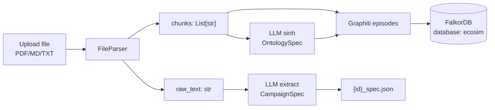
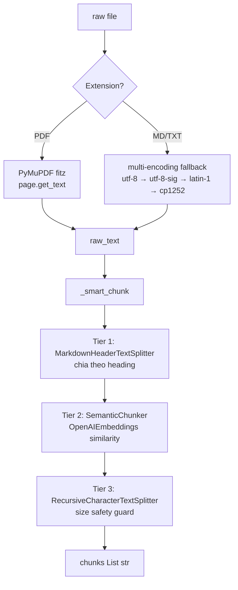
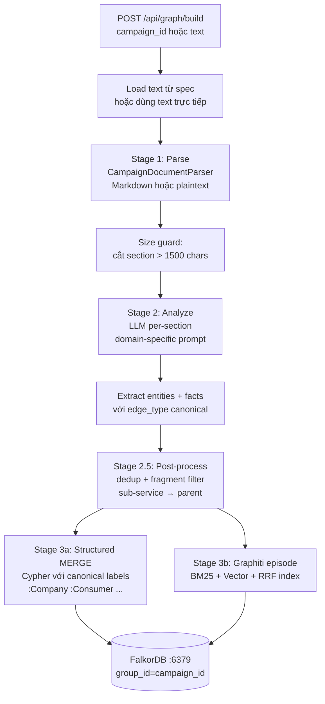

# 03 — Stage 1-2: Ingestion & Knowledge Graph

Hai giai đoạn đầu biến một tài liệu văn bản thành (a) **campaign spec** có cấu trúc và (b) **knowledge graph** trên FalkorDB, để các giai đoạn sau (agent generation, simulation, report) truy vấn.



## 1. Upload

### Endpoint

`POST /api/campaign/upload` ([apps/core/app/api/campaign.py:24-78](../apps/core/app/api/campaign.py#L24-L78))

- `multipart/form-data` field `file`
- Extensions hỗ trợ: `.pdf`, `.md`, `.markdown`, `.txt`
- Validation: file size ≤ `MAX_UPLOAD_SIZE_MB` (mặc định 50)
- Save vào `Config.UPLOAD_DIR` (mặc định `data/uploads/`)

### Parsing: FileParser 3-tier

File: [apps/core/app/utils/file_parser.py](../apps/core/app/utils/file_parser.py)



**Tại sao 3-tier?**
- **Tier 1** giữ cấu trúc logic của văn bản có Markdown headers (`# Intro`, `## Budget`, ...).
- **Tier 2** bắt ngắt theo semantic cho prose dài không có heading (ví dụ PDF scan).
- **Tier 3** cắt cứng theo ký tự nếu chunk Tier 2 vượt size limit (tránh LLM context overflow khi extract).

Fallback cuối là `_basic_chunk()` — character-level khi không có dependency cho `SemanticChunker`.

### LLM extract CampaignSpec

[apps/core/app/services/campaign_parser.py:83-114](../apps/core/app/services/campaign_parser.py#L83-L114)

- System prompt: `EXTRACTION_SYSTEM_PROMPT` ([apps/core/app/services/campaign_parser.py:16-38](../apps/core/app/services/campaign_parser.py#L16-L38))
- Model: config mặc định (`gpt-4o-mini`), `temperature=0.2`, `max_tokens=1500`
- Output schema (Pydantic `CampaignSpec` — [apps/core/app/models/campaign.py:22-46](../apps/core/app/models/campaign.py#L22-L46)):

```json
{
  "campaign_id": "uuid8",
  "name": "...",
  "campaign_type": "marketing | pricing | expansion | policy | product_launch | other",
  "market": "...",
  "budget": "...",
  "timeline": "...",
  "stakeholders": ["..."],
  "kpis": ["..."],
  "identified_risks": ["..."],
  "summary": "...",
  "raw_text": "<loại khỏi API response>",
  "chunks": ["<loại khỏi API response>"],
  "created_at": "2026-04-22T..."
}
```

Spec JSON được lưu `{UPLOAD_DIR}/{campaign_id}_spec.json` và cache in-memory `_campaigns[campaign_id]`.

### Ví dụ response

```json
POST /api/campaign/upload
{
  "campaign_id": "a3f1b29c",
  "name": "Shopee Black Friday 2026",
  "campaign_type": "marketing",
  "market": "Việt Nam",
  "budget": "50 tỷ VND",
  "timeline": "1 tuần, tháng 11/2026",
  "stakeholders": ["Shopee", "Merchants VN", "ShopeePay"],
  "kpis": ["GMV tăng 300%", "DAU tăng 50%"],
  "identified_risks": ["phản ứng tiêu cực về giá", "server quá tải"],
  "summary": "..."
}
```

## 2. Knowledge Graph Pipeline

**Architecture (Option A — manual primary + Graphiti auxiliary):** Pipeline thực tế là [apps/simulation/campaign_knowledge.py](../apps/simulation/campaign_knowledge.py), **không phải** `apps/core/app/services/graph_builder.py` (orphan, không ai gọi).

### Endpoints

| Endpoint | Method | Pipeline | Mô tả |
|----------|--------|----------|-------|
| `/api/graph/build` | POST | `CampaignKnowledgePipeline.run_from_text` | Build KG từ text / campaign_id (load spec) |
| `/api/graph/ingest` | POST | `CampaignKnowledgePipeline.run` | Ingest từ file path (dùng cho thêm doc bổ sung) |

Cả 2 đi cùng pipeline — chỉ khác cách load text.

### Flow



Kết quả: mỗi campaign có 2 lớp node cùng trong `group_id`:
- **Structured layer** — nodes label canonical (`:Company`, `:Consumer`, ...) + edges canonical (`:COMPETES_WITH`, ...) — dùng cho `/api/graph/entities|edges|stats`.
- **Graphiti layer** — nodes `:Entity` + edges `:RELATES_TO` do Graphiti tự extract — dùng cho `/api/graph/search` (hybrid search).

### Stage 1: Parse

[apps/simulation/campaign_knowledge.py `CampaignDocumentParser`](../apps/simulation/campaign_knowledge.py)

- Markdown: split theo heading `#`, `##`, `###`, `####`
- Plaintext: split theo double-newline blocks + heuristic uppercase/short lines = header
- JSON: 1 section per top-level key
- **Size guard** (`MAX_SECTION_CHARS = 1500`): section dài hơn → cắt theo paragraph boundary, giữ title `<original> (part N/M)`.

### Stage 2: LLM Analyze

[apps/simulation/campaign_knowledge.py `CampaignSectionAnalyzer`](../apps/simulation/campaign_knowledge.py)

Prompt domain-specific Vietnamese business (port từ logic gốc ở `graph_builder.py:36-79`):

- **Valid entity types**: 14 canonical (Company / Consumer / Investor / Regulator / Competitor / Supplier / MediaOutlet / EconomicIndicator / Product / Market / Person / Organization / Campaign / Policy).
- **Valid edge types**: 12 canonical (COMPETES_WITH / SUPPLIES_TO / REGULATES / ...).
- Alias normalization: LLM đôi lúc trả "Brand" / "Audience" / "Event" → map về canonical (`Brand → Company`, `Audience → Consumer`, `Event → Campaign`) qua `ENTITY_TYPE_ALIASES`. Type rác như "Unknown" bị reject.

Output JSON per-section:

```json
{
  "summary": "...",
  "entities": [
    {"name": "Shopee", "type": "Company", "description": "..."}
  ],
  "facts": [
    {"subject": "Shopee", "predicate": "cạnh tranh với", "object": "Lazada", "edge_type": "COMPETES_WITH"}
  ]
}
```

### Stage 2.5: Post-processing

Module-level `postprocess_entities(entities, facts)` — 4 bước:

1. **Fragment filter**: name < 2 ký tự, hoặc lowercase bắt đầu không có space → loại.
2. **Canonical dedup**: "Shopee Việt Nam" chứa "Shopee" → merge xuống tên ngắn hơn.
3. **Sub-service filter**: tokens `Live | Feed | Pay | Mall | NOW | Express` → nếu parent (tên gốc bỏ token) đã có trong graph → gộp vào parent.
4. **Fix fact references**: cập nhật subject/object theo `name_map`, drop fact nếu mất reference.

### Stage 3: Load (dual-write)

[apps/simulation/campaign_knowledge.py `CampaignGraphLoader`](../apps/simulation/campaign_knowledge.py)

**3a. Structured MERGE** (`merge_structured`):

```cypher
MERGE (n:Company {name: $name})
SET n.description = ..., n.entity_type = $etype, n.group_id = $gid

MATCH (a {name: $src}), (b {name: $tgt})
WHERE a.group_id = $gid AND b.group_id = $gid
MERGE (a)-[r:COMPETES_WITH]->(b)
SET r.description = ..., r.predicate = ...
```

Mỗi entity là 1 node với label canonical. Edge với type canonical. Idempotent — có thể gọi `/build` nhiều lần, node/edge không duplicate.

**3b. Graphiti episode** (`load`): vẫn chạy `graphiti.add_episode(episode_body)` cho từng analyzed section. Graphiti tự tạo `:Entity` + `:RELATES_TO` nodes/edges riêng để có hybrid search (BM25 + Vector + RRF reranking).

### Rules extraction quan trọng

Từ prompt `ANALYSIS_PROMPT` ([apps/simulation/campaign_knowledge.py](../apps/simulation/campaign_knowledge.py)):

| Rule | Giải thích |
|------|-----------|
| Entity = proper nouns only | Không extract generic words ("consumer", "market" chung chung) |
| Implicit relations | "đối thủ của Shopee là Lazada" → tự suy `COMPETES_WITH` |
| Sub-service = parent | "ShopeePay", "Shopee Live" → **không** entity riêng, gộp vào "Shopee" |
| Product != Campaign | "iPhone 16" → `Product`, không phải `Campaign` |
| Specific influencer → Person | "Sơn Tùng" → `Person`; "các influencer" → không extract |
| Canonical name | Dùng tên ngắn: "Shopee" không phải "Shopee Việt Nam" |
| Preserve diacritics | "Giao Hàng Nhanh" không phải "Giao Hang Nhanh" |
| Target density | 5-10 entities + 3-8 facts per section |

## 3. Truy vấn KG

### Endpoints (Simulation Service)

| Endpoint | Method | Dùng |
|----------|--------|------|
| `/api/graph/entities?group_id=&limit=` | GET | Liệt kê entities theo campaign |
| `/api/graph/edges?group_id=&limit=` | GET | Liệt kê edges |
| `/api/graph/stats?group_id=` | GET | Thống kê: số entity mỗi type, số edge mỗi type |
| `/api/graph/search?q=&group_id=&num_results=` | GET | Hybrid search qua Graphiti |
| `/api/graph/ingest` | POST | Thêm tài liệu bổ sung vào group hiện có |
| `/api/graph/list` | GET | Liệt kê tất cả group_id |
| `/api/graph/clear?group_id=` | DELETE | Xoá graph của một campaign |

### kg_retriever cho report

[apps/core/app/services/kg_retriever.py](../apps/core/app/services/kg_retriever.py) được `report_agent.py` dùng làm tool:

- `deep_analysis(query)` — decompose query → multi-entity search → aggregate
- `graph_overview()` — entities + edges + type distribution
- `quick_search(keyword)` — fast match

Chi tiết report tool: [06_post_simulation.md](06_post_simulation.md).

## 4. Persistence

### FalkorDB connection

| Param | Value | Nguồn |
|-------|-------|-------|
| Host | `FALKORDB_HOST` (mặc định `localhost`) | [.env](../.env.example) |
| Port | `FALKORDB_PORT` (mặc định `6379`) | [.env](../.env.example) |
| Database | `ecosim` (hardcoded) | [apps/core/app/services/graphiti_service.py:39](../apps/core/app/services/graphiti_service.py#L39) |
| Driver | `FalkorDriver(host, port, database="ecosim")` | `graphiti-core[falkordb]` |

**Lưu ý:** Agent memory dùng một FalkorDB database KHÁC (`ecosim_agent_memory`) — xem [05_simulation_loop.md](05_simulation_loop.md) phần Memory.

### Group ID = Campaign isolation

Graphiti hỗ trợ `group_id` — cô lập nodes/edges theo campaign. Khi query phải pass `group_id=campaign_id` để không lẫn. Default group là `"default"`.

## 5. Config liên quan

```bash
# .env
LLM_API_KEY=sk-...
LLM_BASE_URL=https://api.openai.com/v1
LLM_MODEL_NAME=gpt-4o-mini

FALKORDB_HOST=localhost
FALKORDB_PORT=6379

UPLOAD_DIR=uploads   # thực tế prefer data/uploads
MAX_UPLOAD_SIZE_MB=50
```

## 6. Trace code end-to-end

```
POST /api/campaign/upload
  └─ apps/core/app/api/campaign.py:24 upload_campaign()
     ├─ FileParser.parse(file_path)                [apps/core/utils/file_parser.py:39]
     │  ├─ PDF: _parse_pdf()                        fitz.open → page.get_text()
     │  └─ Text: _parse_text()                      multi-encoding
     ├─ FileParser.split_into_chunks()              [apps/core/utils/file_parser.py:66]
     │  └─ _smart_chunk() Tier 1/2/3
     ├─ CampaignParser._extract_campaign_spec()    [apps/core/services/campaign_parser.py:83]
     │  └─ LLMClient.chat_json(EXTRACTION_SYSTEM_PROMPT, temp=0.2)
     └─ write {campaign_id}_spec.json → UPLOAD_DIR

POST /api/graph/build (campaign_id)
  └─ apps/simulation/api/graph.py build_graph()
     ├─ Load spec.json → raw_text (or chunks)
     └─ CampaignKnowledgePipeline.run_from_text(text)    [apps/simulation/campaign_knowledge.py]
        ├─ Stage 1: CampaignDocumentParser._parse_markdown/_plaintext
        │  └─ _split_oversized (section > 1500 chars → paragraph buckets)
        ├─ Stage 2: CampaignSectionAnalyzer.analyze_all
        │  └─ per section: LLM chat (ANALYSIS_PROMPT, temp=0.1, max_tokens=2000)
        ├─ Stage 2.5: postprocess_entities(all_entities, all_facts)
        │  ├─ fragment filter
        │  ├─ canonical dedup
        │  ├─ sub-service filter
        │  └─ fix fact references
        └─ Stage 3: CampaignGraphLoader
           ├─ 3a: merge_structured → Cypher MERGE (:Company / :Consumer / ...)
           └─ 3b: load → graphiti.add_episode (hybrid search index)
```

## Gotchas

- **FalkorDB phải chạy** trước khi gọi `/api/graph/build`. Nếu thấy `ConnectionError`: `docker compose up -d falkordb`.
- **LLM cost**: mỗi section là 1 LLM call ở Stage 2 + Graphiti tự gọi LLM ở Stage 3b (internal extraction). Tổng ~2x LLM/section so với Graphiti-only cũ. Document 10 sections → ~20-30 LLM call.
- **Group isolation bị vi phạm** nếu quên pass `group_id` khi ingest thêm — entities sẽ gộp nhầm. Luôn dùng `campaign_id` làm group.
- **Sub-service matching** tham chiếu token `Live/Feed/Pay/Mall/NOW/Express` — nếu muốn giữ entity riêng (ví dụ "Shopee Live" là sản phẩm độc lập) cần sửa `_SUB_SERVICE_TOKENS` trong [apps/simulation/campaign_knowledge.py](../apps/simulation/campaign_knowledge.py).
- **Graphiti layer duplicate với Structured layer**: `/api/graph/entities` query `MATCH (n:Entity)` chỉ trả Graphiti nodes; muốn lấy structured entities → query `MATCH (n) WHERE NOT n:Entity` hoặc theo label cụ thể `MATCH (n:Company)`. Stats `/api/graph/stats` đếm toàn bộ — số sẽ lớn gấp đôi do dual-write.
- **Orphan code**: `apps/core/app/services/graph_builder.py` với prompt 71 dòng + `_postprocess_entities` 4-step **không được gọi** ở production. Logic domain đã port sang `campaign_knowledge.py`. Giữ file làm reference, sẽ dọn ở iteration sau.

Đi tiếp → [04_agent_generation.md](04_agent_generation.md)
