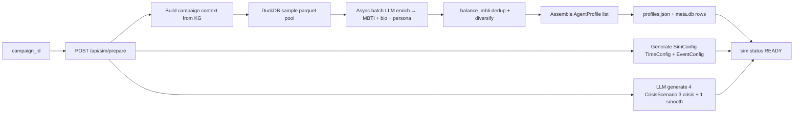

# 04 — Stage 3: Agent Generation + Sim Config

Biến persona pool (Parquet 20M rows) thành **N agent profiles** + **TimeConfig/EventConfig** + **CrisisScenario** sẵn sàng cho sim runtime.

Gọi là bước **Prepare** trong API: `POST /api/sim/prepare`.

> Production path = [apps/simulation/api/simulation.py:_generate_profiles](../apps/simulation/api/simulation.py) (Tier B refactor). [apps/core/app/services/profile_generator.py](../apps/core/app/services/profile_generator.py) là **LEGACY** — chỉ tests dùng.

## Pipeline tổng quan



## Bước 1 — Build campaign context

[`_build_campaign_context`](../apps/simulation/api/simulation.py) — kéo từ KG + spec:

- `CampaignSpec` từ `data/campaigns/<cid>/extracted/spec.json`.
- Top stakeholders + KPIs + identified_risks.
- Top N entities từ FalkorDB graph `<cid>` (qua direct Cypher).

Kết quả là 1 string context dùng cho:
- Mỗi LLM enrich call (định hướng persona phù hợp campaign).
- Domain extraction (`_extract_campaign_domains` — kéo về list keywords để filter parquet sample).

## Bước 2 — Sample parquet pool

[`ParquetProfileReader.sample_by_domain`](../libs/ecosim-common/src/ecosim_common/parquet_reader.py):

- Open parquet bằng **DuckDB** (lazy scan, không load full).
- `SELECT * FROM read_parquet('path/*.parquet') WHERE domain IN (...) ORDER BY random(seed=$seed) LIMIT $n × oversample`.
- `oversample = 2.5×` để có dư cho stage `_balance_mbti` filter.
- Output: `List[RawProfile]` — mỗi item có `age`, `gender`, `country`, `domain`, raw bio.

**Sanitize**: allowlist regex cho `domain` string (chống injection trong WHERE clause).

## Bước 3 — Async batch LLM enrich

[`_enrich_batch_async`](../apps/simulation/api/simulation.py) — gọi `LLMClient.chat_json_async` batch:

- **Batch size**: 5 profiles / 1 LLM call (giảm round-trip overhead).
- **Schema**: `BatchEnrichmentResponse` (Pydantic, [agent_schemas.py](../libs/ecosim-common/src/ecosim_common/agent_schemas.py)) chứa `enriched_agents[]` với `mbti`, `persona`, `bio`, `realname`, `username`.
- **MBTI inference**: từ persona narrative + age + gender + interests, LLM gán 1 trong 16 MBTI types.
- **Name pool**: [`NamePool.sample`](../libs/ecosim-common/src/ecosim_common/name_pool.py) — Vietnamese names gender-aware dedup (100 họ × 17-20 đệm × ~50 tên/gender).

**Retry + truncation**: nếu LLM trả thiếu (vd 4/5), batch còn lại retry.

## Bước 4 — `_balance_mbti` dedup + diversify

Mục tiêu: tránh imbalance (vd 8/10 agents cùng MBTI). Algorithm:

1. Count current distribution `{mbti: n}`.
2. Target distribution: roughly even (8 MBTI types × ~N/8 each cho 10 agents), với bias nhẹ theo MBTI phổ biến của Vietnam.
3. Filter từ pool oversample → giữ những agents có MBTI dưới target, drop excess.
4. Nếu pool không đủ multi-MBTI → fallback giữ skewed (chấp nhận imbalance).

## Bước 5 — Assemble AgentProfile

Schema ([models/simulation.py](../apps/core/app/models/simulation.py)):

```python
class AgentProfile(BaseModel):
    agent_id: int             # 0-indexed
    username: str             # snake_case từ realname + suffix
    realname: str             # "Nguyễn Văn A"
    bio: str                  # 1-2 câu intro
    persona: str              # narrative 3-5 câu (LLM-generated, campaign-aware)
    age: int                  # 18-65
    gender: str               # "male" | "female"
    mbti: str                 # 1 trong 16 types
    country: str              # "Vietnam"
```

Output: atomic write `data/campaigns/<cid>/sims/<sid>/profiles.json`.

**Persist vào meta.db**: mỗi agent insert vào `simulation_agents` table (sid, agent_id, name, mbti, ...) qua [`metadata_index.upsert_simulation_agents`](../libs/ecosim-common/src/ecosim_common/metadata_index.py).

## Bước 6 — Generate SimConfig

[`SimConfigGenerator`](../apps/core/app/services/sim_config_generator.py) — 3-step LLM pipeline (Stage Mirofish):

### 6.1 — TimeConfig

LLM sinh:
- `total_simulation_hours` (vd 168 = 1 week)
- `minutes_per_round` (vd 60)
- `total_rounds` (computed = hours × 60 / minutes_per_round)
- `agents_per_round_{min,max}` — bao nhiêu agents active mỗi round
- `peak_hours[]` / `off_peak_hours[]` — giờ vàng (vd 19-22)
- `period_multipliers[]` — `[1.0, 1.5, 0.5]` (normal/peak/off-peak)

### 6.2 — EventConfig

Initial posts (seed cho round 0):
- LLM sinh `initial_posts[]` — content + poster_type (`agent_0` | `influencer` | `system`).
- Posts này được agent_0 hoặc influencer post ở round 0 để kick start engagement.

### 6.3 — AgentBehaviorConfig (per agent)

LLM tinh chỉnh per-agent:
- `posts_per_week` (1-50)
- `comment_ratio` (0.0-1.0)
- `like_propensity` (0.0-1.0)
- Behavior multiplier theo MBTI (E/I tăng/giảm posts_per_week, F/T → like intensity).

Output: `data/campaigns/<cid>/sims/<sid>/config.json` (SimConfig — bao gồm TimeConfig + EventConfig + AgentBehaviorConfigs).

## Bước 7 — LLM generate CrisisScenarios

[`CrisisInjector.generate_scenarios`](../apps/core/app/services/crisis_injector.py) — sinh **4 scenarios** per sim:

- **3 crisis** scenarios (severity: low, medium, high/critical) — vd "Vào ngày X, scandal về Brand Y xảy ra".
- **1 smooth** scenario (`is_smooth: true`, no events) — baseline để control compare.

User chọn 1 trong 4 khi start sim qua `POST /api/sim/start { sim_id, scenario_id }`.

Schema ([models/campaign.py](../apps/core/app/models/campaign.py)):

```python
class CrisisScenario(BaseModel):
    scenario_id: str
    name: str
    description: str
    is_smooth: bool
    events: List[CrisisEvent]

class CrisisEvent(BaseModel):
    name: str
    description: str
    trigger_round: int        # 1-24
    severity: Literal["low", "medium", "high", "critical"]
    affected_stakeholders: List[str]
    news_headline: str
```

Output: `data/campaigns/<cid>/sims/<sid>/crisis_scenarios.json`.

## Crisis author strategy

[`CrisisEngine.resolve_author_id`](../apps/simulation/crisis_engine.py) — xác định ai sẽ post crisis news khi event trigger. `simulation_config.crisis_author_strategy`:

| Value | Behavior |
|-------|----------|
| `agent_0` (default) | Agent index 0 — convention: post từ "system account" |
| `influencer` | Pick agent có `posts_per_week` cao nhất |
| `system` | System user_id (không thuộc agents list) — XEM xét: requires patch OASIS |

## Sim status transitions

State machine từ `SimStatus` enum ([models/simulation.py](../apps/core/app/models/simulation.py)):

```
CREATED → PREPARING → READY → RUNNING → COMPLETED
                                      ↘ FAILED
```

| State | Trigger | Persist |
|-------|---------|---------|
| `CREATED` | `POST /api/sim/create` (rarely used standalone) | meta.db row inserted |
| `PREPARING` | `POST /api/sim/prepare` starts | meta.db status update |
| `READY` | profiles + config + crisis files written | meta.db status update |
| `RUNNING` | `POST /api/sim/start` spawns subprocess | meta.db `started_at` |
| `COMPLETED` | subprocess exit 0 + all expected files present | meta.db `completed_at`, kg_status=`completed` |
| `FAILED` | subprocess crash hoặc exit ≠ 0 | meta.db status + `error` |

## Cost breakdown (per sim prepare)

| Item | Count | Cost |
|------|-------|------|
| `_extract_campaign_domains` | 1 LLM | ~$0.01 (gpt-4o-mini) |
| Profile enrich batches | N/5 calls × $0.01 | ~$0.02 for 10 agents |
| `SimConfigGenerator` 3-step | 3 LLM | ~$0.05 |
| `CrisisInjector` 4 scenarios | 1 LLM (4 trong 1 prompt) | ~$0.02 |
| **Total** | ~10 calls | **~$0.10/sim prepare** |

Cheap compared to sim run (LLM cost = posts/comments × N rounds × per-call ~$0.001 = ~$0.50-2.00/sim depending on rounds).

## Resume hint (Tier B advanced)

Sau mỗi `Reflection` cycle, `profiles.json` được append:
- `persona_evolved` — updated narrative (max 3 cumulative insights)
- `reflection_insights[]` — list of insight strings per round

Cho phép **manual resume** (không auto): nếu sim re-prepared, profile generator có thể đọc `persona_evolved` từ sim cũ để dùng làm seed.

## Đọc tiếp

- [05_simulation_loop.md](05_simulation_loop.md) — runtime sau khi Prepare xong
- [07_storage_and_paths.md](07_storage_and_paths.md) — per-sim storage
