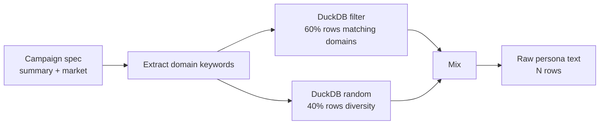

# 04 — Stage 3: Khởi tạo Agent

Biến persona từ dataset thực (parquet 20M rows) thành tập N agent cá nhân hoá kèm MBTI, bio, persona narrative, và cấu hình simulation (thời gian, sự kiện, recsys). Gọi là bước **prepare** trong API.

```mermaid
flowchart TB
    In[POST /api/sim/prepare<br/>campaign_id, num_agents=N] --> PG[ProfileGenerator]
    PG --> DD[DuckDB sample<br/>60% domain-relevant<br/>40% random diversity]
    DD --> NP[NamePool<br/>Vietnamese names]
    NP --> Enrich[LLM batch enrich<br/>MBTI + bio + persona]
    Enrich --> Profiles[profiles.json<br/>N agents]
    In --> SC[SimConfigGenerator]
    SC --> TC[LLM: TimeConfig<br/>rounds, periods, multipliers]
    SC --> EC[LLM: EventConfig<br/>initial posts, hot topics]
    TC --> CFG[simulation_config.json]
    EC --> CFG
    In --> CI[CrisisInjector]
    CI --> CR[LLM: CrisisScenario[]<br/>7 templates]
    CR --> CRJ[crisis_scenarios.json]
    Profiles --> Out[sim_id]
    CFG --> Out
    CRJ --> Out
```

## 1. ProfileGenerator

File: [apps/core/app/services/profile_generator.py](../apps/core/app/services/profile_generator.py)

### Parquet source

- Path: `data/dataGenerator/profile.parquet` (20M rows, cấu hình qua `Config.PARQUET_PROFILE_PATH`)
- Schema: `general_domain`, `specific_domain`, `persona`
- Được scan qua [ParquetProfileReader.sample_by_domains()](../apps/core/app/services/parquet_reader.py) — DuckDB query có `LIMIT` để không OOM khi scan 20M rows.

### Sampling strategy



Tỉ lệ 60/40 ở [profile_generator.py:169](../apps/core/app/services/profile_generator.py#L169) — cân bằng giữa relevance (những người thực sự quan tâm chiến dịch) và diversity (không echo chamber).

### LLM enrichment — batch

[apps/core/app/services/profile_generator.py:137-144](../apps/core/app/services/profile_generator.py#L137-L144)

- Batch size = 5 (default) — giảm số LLM call
- Prompt: `BATCH_COMPLETION_PROMPT` ([profile_generator.py:46-76](../apps/core/app/services/profile_generator.py#L46-L76))
- Temperature = mặc định 0.7
- LLM nhận `raw_persona_text` + campaign context → trả batch JSON có: `mbti`, `bio`, `username`, `age`, `gender`, và persona được viết lại 150-200 chữ nhúng campaign context một cách tự nhiên.

### Gán MBTI

- **Phương pháp:** LLM quyết định (không rule-based)
- Prompt yêu cầu assign 1 trong 16 MBTI types dựa trên raw persona
- Fallback `random.choice(MBTI_TYPES)` nếu LLM fail ([profile_generator.py:328](../apps/core/app/services/profile_generator.py#L328))
- MBTI sau này chuyển thành `CognitiveTraits` (post_mult, comment_mult, like_mult, feed_mult, impressionability, curiosity, ...) ở [apps/simulation/agent_cognition.py:150-250](../apps/simulation/agent_cognition.py#L150-L250) — xem [05_simulation_loop.md](05_simulation_loop.md).

### NamePool

File: [apps/core/app/services/name_pool.py](../apps/core/app/services/name_pool.py)

Pool tên tiếng Việt được chọn random. LLM sẽ nhúng tên này vào trong persona narrative tự nhiên. `username` được normalize thành ASCII-safe (không dấu, dấu cách → `_`).

### Profile JSON schema

```json
{
  "agent_id": 42,
  "username": "nguyen_thi_lan",
  "realname": "Nguyễn Thị Lan",
  "bio": "Freelance designer tại Hà Nội, mê cafe và thú cưng. Shopping online nhiều.",
  "persona": "Nguyễn Thị Lan, 28 tuổi, là designer freelance tại Hà Nội. Thu nhập trung bình 15 triệu/tháng. Thường xuyên mua sắm online trên Shopee, đặc biệt trong các đợt sale lớn... [150-200 chữ, có nhắc đến Black Friday nếu campaign liên quan]",
  "age": 28,
  "gender": "female",
  "mbti": "INFJ",
  "country": "Vietnam"
}
```

Chi tiết: [profile_generator.py:372-382](../apps/core/app/services/profile_generator.py#L372-L382), output wrapper: [profile_generator.py:459-475](../apps/core/app/services/profile_generator.py#L459-L475).

## 2. SimConfigGenerator

File: [apps/core/app/services/sim_config_generator.py](../apps/core/app/services/sim_config_generator.py)

Generate 2 config quan trọng qua 2 LLM call độc lập (không share context để tránh nhiễu).

### LLM Step 1 — TimeConfig

[sim_config_generator.py:147-180](../apps/core/app/services/sim_config_generator.py#L147-L180)

LLM dựa trên `campaign.timeline` + `campaign_type` → sinh:

```json
{
  "simulation_hours": 168,
  "rounds": 24,
  "period_multipliers": {
    "00-06": 0.3,
    "06-09": 0.8,
    "09-12": 1.2,
    "12-14": 1.5,
    "14-18": 1.0,
    "18-22": 1.8,
    "22-00": 0.6
  },
  "reasoning": "Peak hours buổi tối vì campaign nhắm user sau giờ làm..."
}
```

**Period multiplier** là hệ số nhân xác suất agent active trong khung giờ đó. Peak hours (18-22) có multiplier cao → nhiều agent post/comment. Ban đêm (00-06) giảm xuống 0.3.

### LLM Step 2 — EventConfig

[sim_config_generator.py:238-300](../apps/core/app/services/sim_config_generator.py#L238-L300)

```json
{
  "initial_posts": [
    {"content": "Black Friday sắp tới, ai hóng cùng?", "author_persona": "tech enthusiast"},
    {"content": "Shopee năm nay có deal gì hot không ta?", "author_persona": "casual shopper"},
    ...
  ],
  "hot_topics": ["giảm giá", "freeship", "flash sale"],
  "narrative_direction": "Ngày đầu: hype; ngày 3-4: feedback đầu tiên; ngày 5+: phàn nàn về server/deal ảo"
}
```

- `initial_posts` được inject vào Round 0 — tạo conversation starter
- `hot_topics` bias ChromaDB index weighting
- `narrative_direction` hint cho LLM khi sinh content round later

### RecConfig

Hardcoded defaults hoặc được set qua API (chưa LLM-generated). Tham số:
- `recommendation_count_per_round` (default 10)
- `popularity_bonus_weight` (default 0.1)
- `comment_decay_weight` (default 0.05)

Chi tiết thresholds + formula: [05_simulation_loop.md](05_simulation_loop.md) phần Semantic Matching.

## 3. CrisisInjector

File: [apps/core/app/services/crisis_injector.py](../apps/core/app/services/crisis_injector.py), [apps/simulation/crisis_engine.py](../apps/simulation/crisis_engine.py)

### 7 crisis templates

| Template | Mô tả | Ví dụ |
|----------|-------|-------|
| `price_change` | Thay đổi giá đột ngột | "Shopee tăng phí sàn 10%" |
| `scandal` | Vụ bê bối công ty | "CEO dính scandal chuyển tiền" |
| `news` | Tin breaking liên quan | "Báo chí đưa tin server crash" |
| `competitor` | Đối thủ ra đòn | "Lazada tung freeship 24h" |
| `regulation` | Thay đổi luật/chính sách | "Bộ Công thương ra quy định mới" |
| `positive_event` | Sự kiện tích cực bất ngờ | "Chính phủ khen campaign" |
| `custom` | LLM sinh theo tả | Đặc thù campaign |

### LLM sinh scenarios

CrisisInjector chọn 2-3 scenarios phù hợp campaign → LLM fill-in:

```json
{
  "scenario_id": "crisis_001",
  "template": "scandal",
  "trigger_round": 8,
  "title": "Rò rỉ dữ liệu user Shopee",
  "body": "Đêm qua, một nhóm hacker... [3-5 câu breaking news]",
  "affected_entities": ["Shopee", "ShopeePay"],
  "interest_perturbation": {
    "security": +0.3,
    "trust": -0.2,
    "privacy": +0.4
  }
}
```

- `trigger_round` quyết định round nào crisis được fire
- `interest_perturbation` dịch chuyển interest vector của agents (xem [05](05_simulation_loop.md#crisis-injection))

## 4. Endpoint prepare tổng hợp

`POST /api/sim/prepare` ([apps/simulation/api/simulation.py](../apps/simulation/api/simulation.py))

**Request:**
```json
{
  "campaign_id": "a3f1b29c",
  "num_agents": 20,
  "num_rounds": 24,
  "group_id": "a3f1b29c",
  "cognitive_toggles": {
    "enable_agent_memory": true,
    "enable_mbti_modifiers": true,
    "enable_interest_drift": true,
    "enable_reflection": true,
    "enable_graph_cognition": false
  },
  "crisis_events": []
}
```

**Response:**
```json
{
  "sim_id": "sim_b72e4f10",
  "status": "ready",
  "profiles_count": 20,
  "output_dir": "data/simulations/sim_b72e4f10",
  "time_config": {...},
  "event_config": {...},
  "crisis_scenarios": [...]
}
```

**Side effects:** Ghi files vào `data/simulations/{sim_id}/`:
- `profiles.json`
- `simulation_config.json` (có embed time_config + event_config + rec_config + cognitive_toggles)
- `crisis_scenarios.json`

## 5. Cognitive toggles

Bit switches cho các cơ chế ở stage 4:

| Toggle | Mặc định | Hiệu ứng khi ON |
|--------|----------|-----------------|
| `enable_agent_memory` | `true` | Inject memory summary vào system prompt mỗi round |
| `enable_mbti_modifiers` | `true` | Áp dụng post_mult/comment_mult/like_mult từ MBTI |
| `enable_interest_drift` | `true` | KeyBERT update interest vector mỗi round |
| `enable_reflection` | `true` | LLM reflect phasic mỗi 3 rounds → update persona |
| `enable_graph_cognition` | `false` | Read social context từ FalkorDB để inject vào prompt |

Tắt toggles để benchmark cost — ví dụ disable `graph_cognition` có thể giảm 30% FalkorDB load nhưng agent mất awareness về "ai follow ai".

## 6. Trace code

```
POST /api/sim/prepare
  └─ apps/simulation/api/simulation.py prepare()
     ├─ SimManager.create_sim()                    [services/sim_manager.py]
     │  └─ status: CREATED → PREPARING
     ├─ ProfileGenerator.generate()                [services/profile_generator.py:137]
     │  ├─ ParquetProfileReader.sample_by_domains() [services/parquet_reader.py]
     │  │  └─ DuckDB query (60/40 mix)
     │  ├─ NamePool.draw(N)                         [services/name_pool.py]
     │  └─ Batch LLM enrich
     │     └─ LLMClient.chat_json(BATCH_COMPLETION_PROMPT, batch=5)
     ├─ SimConfigGenerator.generate()              [services/sim_config_generator.py]
     │  ├─ LLMClient.chat_json(TIME_PROMPT)         → TimeConfig
     │  └─ LLMClient.chat_json(EVENT_PROMPT)        → EventConfig
     ├─ CrisisInjector.generate()                  [services/crisis_injector.py]
     │  └─ LLMClient.chat_json(CRISIS_PROMPT)
     ├─ Write profiles.json + simulation_config.json + crisis_scenarios.json
     └─ SimManager.set_ready()                     status: PREPARING → READY
```

## Gotchas

- **Parquet path sai** → scan fail silent (empty rows). Verify: `python -c "import duckdb; duckdb.sql('SELECT COUNT(*) FROM read_parquet(...)')"`
- **Batch LLM timeout** với `num_agents > 50`: tăng batch_size trong [profile_generator.py](../apps/core/app/services/profile_generator.py) hoặc chia nhỏ request.
- **MBTI distribution** có thể lệch (LLM thiên về INTJ, INFJ) — nếu cần balance, thêm rule post-hoc.
- **Crisis trigger_round > num_rounds**: crisis sẽ không bao giờ fire, kiểm tra ở CrisisInjector validation.
- **Same campaign_id prepare nhiều lần**: tạo sim_id mới mỗi lần, profiles khác nhau (sampling random). Muốn reproducible → cần seed manual.

Đi tiếp → [05_simulation_loop.md](05_simulation_loop.md)
