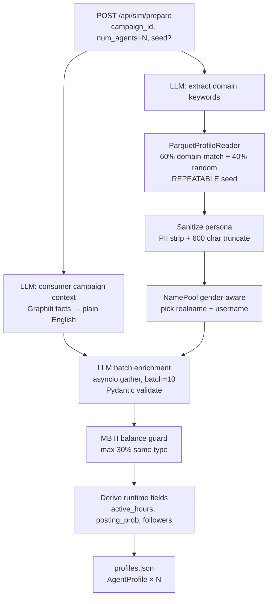

# 04 — Stage 3: Khởi tạo Agent

Biến persona từ dataset thực (parquet 20M rows) thành N agent profile kèm MBTI signal-from-persona, bio, persona narrative cá nhân hóa theo campaign, và bộ thuộc tính runtime. Gọi là bước **prepare** trong API.

Pipeline hiện tại (Tier B, ngày 2026-04-23) sống ở [apps/simulation/api/simulation.py](../apps/simulation/api/simulation.py) — **không phải** `apps/core/app/services/profile_generator.py` (giờ là legacy, chỉ tests dùng).



## 1. Input: `PrepareRequest`

File: [apps/simulation/api/simulation.py](../apps/simulation/api/simulation.py)

```json
{
  "campaign_id": "a3f1b29c",
  "num_agents": 20,
  "num_rounds": 24,
  "group_id": "a3f1b29c",
  "cognitive_toggles": { "enable_agent_memory": true },
  "crisis_events": [],
  "seed": 42
}
```

- `seed: int | null` (Tier B mới) — pass vào `random.Random` + DuckDB `REPEATABLE(seed)` + `NamePool(seed)`. 2 lần prepare cùng seed ⇒ output bit-identical (ngoại trừ LLM response vì temperature > 0).

## 2. Pipeline

### Step 1 — Domain extraction (LLM, 1 call)

Prompt `_DOMAIN_EXTRACT_PROMPT` yêu cầu 3-8 domain keywords liên quan campaign:

```json
{"domains": ["E-commerce", "Fashion", "Beauty", "Mobile apps", "Discounts"]}
```

Output này feed vào DuckDB ILIKE filter ở step 2. Nếu LLM fail → fallback random sampling.

### Step 2 — Parquet 60/40 sampling

File: [libs/ecosim-common/src/ecosim_common/parquet_reader.py](../libs/ecosim-common/src/ecosim_common/parquet_reader.py)

- 60% rows `sample_by_domains(domains, n*0.6, seed=seed)` — ILIKE match 2 field `general domain (top 1 percent)` + `specific domain (top 1 percent)`
- 40% rows `sample_random(n*0.4, seed=seed)` — đa dạng, tránh echo chamber
- Cả 2 dùng `USING SAMPLE n ROWS REPEATABLE({seed})` để reproducible
- Domain string được `_sanitize_domain()` — allowlist `[A-Za-z0-9 _&-]`, strip mọi ký tự khác → SQL injection-safe

### Step 3 — Consumer campaign context (LLM, 1 call)

`_get_consumer_campaign_context(campaign_spec)`:
- Query Graphiti hybrid search cho facts thực
- LLM rewrite thành 3-5 câu "consumer perspective" (bỏ KPI, risks, stakeholder list)
- **1 lần / campaign** — cache shared cho tất cả N agents

### Step 4 — Per-agent enrichment (LLM, async batches)

File: [apps/simulation/api/simulation.py](../apps/simulation/api/simulation.py) — `_enrich_batch_async`

Chia `num_agents` thành batches 10, gọi `asyncio.gather(*tasks)`. Mỗi batch:

1. Sanitize parquet persona qua `_sanitize_persona()`:
   - Strip email/phone regex (PII)
   - Escape `{` `}` (chống LLM-format injection từ dataset không trust)
   - Truncate 600 chars
2. Send prompt `_ENRICH_SYSTEM` + `_ENRICH_USER_TMPL` với pre-assigned name + gender + consumer context
3. LLM trả JSON array profiles với fields (persona 150-200 chữ, bio, age, mbti, interests)
4. `BatchEnrichmentResponse.model_validate(raw)` — Pydantic validate MBTI must-be-16-types, age 18-70, persona 100-3000 chars
5. Nếu batch fail → fallback rule-based `_mbti_from_traits(persona_text)` + concat parquet + consumer_ctx

Performance: với N=100 agents và BATCH=10 ⇒ 10 batches song song, tổng ≈ max(batch latency) ≈ 3-5s (không phải 20 × 3s = 60s như serial).

### Step 5 — MBTI balance guard

`_balance_mbti(mbtis, max_ratio=0.30)`: nếu > 30% agents cùng MBTI (LLM bias toward INTJ/INFJ), reshuffle phần dư sang type ít nhất.

### Step 6 — Derive runtime fields

`_derive_runtime_fields(mbti, rng)` từ MBTI suy ra:

| Field | Rule |
|-------|------|
| `posts_per_week` | `base * (1.3 if E else 0.8)` — Extroverts post nhiều hơn |
| `daily_hours` | `base * (1.2 if P else 0.9)` — Perceivers mò mạng nhiều hơn |
| `activity_level` | `posts_per_week/15 + daily_hours/8`, clamp [0.1, 1.0] |
| `posting_probability` | `0.15 + activity*0.5 + 0.1(if E)`, clamp ≤ 0.95 |
| `active_hours` | E → `9-22h`; I → `10-12 + 20-23h` (pattern khác nhau) |
| `followers` | Log-normal distribution qua `rng.choice` của 4 range |

## 3. Output schema (`AgentProfile`)

File: [libs/ecosim-common/src/ecosim_common/agent_schemas.py](../libs/ecosim-common/src/ecosim_common/agent_schemas.py)

```json
{
  "agent_id": 0,
  "realname": "Nguyễn Thị Lan",
  "username": "lan_nguyen_742",
  "age": 28,
  "gender": "female",
  "mbti": "INFJ",
  "country": "Vietnam",
  "persona": "<150-200 English words, name embedded, campaign awareness sentence>",
  "bio": "Freelance designer, Hanoi. Shopee sale hunter.",
  "original_persona": "<raw parquet text, for analysis>",
  "general_domain": "Creative Arts",
  "specific_domain": "Graphic Design",
  "interests": ["design", "shopping", "coffee", "pets"],
  "active_hours": [10, 11, 12, 20, 21, 22, 23],
  "activity_level": 0.55,
  "posting_probability": 0.42,
  "posts_per_week": 5,
  "daily_hours": 1.5,
  "followers": 420
}
```

Pydantic validate shape khi assemble. `active_hours` rỗng ⇒ fallback `[8..22]`.

## 4. Shared utilities (libs/ecosim-common)

| Module | Vai trò |
|--------|---------|
| [`ecosim_common.agent_schemas`](../libs/ecosim-common/src/ecosim_common/agent_schemas.py) | Pydantic: `AgentProfile`, `EnrichedAgentLLMOutput`, `BatchEnrichmentResponse`, `MBTI_TYPES` |
| [`ecosim_common.name_pool`](../libs/ecosim-common/src/ecosim_common/name_pool.py) | `NamePool(seed)` — gender-aware split (100 họ × 17-20 đệm × ~50 tên/gender), dedup |
| [`ecosim_common.parquet_reader`](../libs/ecosim-common/src/ecosim_common/parquet_reader.py) | `ParquetProfileReader` — `sample_by_domains(seed)`, `sample_random(seed)`, SQL injection-safe |
| [`ecosim_common.llm_client`](../libs/ecosim-common/src/ecosim_common/llm_client.py) | `LLMClient.chat_json_async` — async retry, strip code fences |

## 5. Cognitive toggles (vẫn giữ)

Bit switches cho các cơ chế ở simulation loop:

| Toggle | Mặc định | Hiệu ứng khi ON |
|--------|----------|-----------------|
| `enable_agent_memory` | `true` | Inject memory summary vào system prompt mỗi round |
| `enable_mbti_modifiers` | `true` | Áp dụng post_mult/comment_mult/like_mult từ MBTI |
| `enable_interest_drift` | `true` | KeyBERT update interest vector mỗi round |
| `enable_reflection` | `true` | LLM reflect phasic mỗi 3 rounds → update persona |
| `enable_graph_cognition` | `false` | Read social context từ FalkorDB để inject vào prompt |

## 6. Trace code

```
POST /api/sim/prepare
  └─ apps/simulation/api/simulation.py:prepare_simulation
     ├─ validate spec_path exists
     ├─ create SimState (status=PREPARING)
     ├─ _generate_profiles(num_agents, spec, seed)
     │  ├─ _extract_campaign_domains(llm, spec)                [1 LLM call]
     │  ├─ _sample_parquet_60_40(n, domains, seed)              [ParquetProfileReader]
     │  ├─ _get_consumer_campaign_context(spec)                 [1 LLM call + Graphiti]
     │  ├─ NamePool(seed).pick(gender=...)                      [per agent]
     │  ├─ _sanitize_persona(raw)                               [PII strip]
     │  ├─ asyncio.gather([_enrich_batch_async(...) × 10])      [async LLM batches]
     │  ├─ BatchEnrichmentResponse.model_validate(...)          [Pydantic]
     │  ├─ _mbti_from_traits(persona)                           [fallback nếu batch fail]
     │  ├─ _balance_mbti(mbtis, max_ratio=0.30)                 [reshuffle bias]
     │  └─ _derive_runtime_fields(mbti, rng)                    [active_hours, etc.]
     ├─ Write profiles.json + simulation_config.json + crisis_scenarios.json
     └─ status: PREPARING → READY
```

## 7. Verification

```bash
# 1. Reproducibility test (smoke)
curl -X POST localhost:5000/api/sim/prepare -H "Content-Type: application/json" \
  -d '{"campaign_id":"XXX","num_agents":20,"seed":42}'
# Run again with same seed → profiles identical modulo LLM stochasticity

# 2. Parquet sampling 60/40
python -c "
from ecosim_common.parquet_reader import ParquetProfileReader
r = ParquetProfileReader('data/dataGenerator/profile.parquet')
a = r.sample_by_domains(['Fashion'], 5, seed=42)
b = r.sample_by_domains(['Fashion'], 5, seed=42)
assert [x['persona'] for x in a] == [x['persona'] for x in b], 'not reproducible'
print('reproducible OK')
"

# 3. Run test suite
cd apps/core && pytest tests/test_profile_pipeline.py -v
```

## Gotchas

- **Parquet path sai** → fallback 1 persona duplicated N lần (logged warning, không crash).
- **LLM timeout** ⇒ batch return empty → rule-based fallback kick in cho batch đó.
- **MBTI distribution** balanced ≤ 30% same type (`_balance_mbti`), nhưng vẫn random nhiều hơn distribution thực tế dân số VN.
- **Same campaign_id prepare nhiều lần** với seed khác nhau ⇒ profiles khác; cùng seed ⇒ deterministic (parquet + NamePool + rng đều seeded).
- **Legacy `profile_generator.py`** còn ở `apps/core/app/services/` — chỉ dùng cho `tests/test_profile_pipeline.py`, **KHÔNG** import vào production.
- **Parquet 20M rows**: `sample_by_domains` tiered 10%→50%→100% sample để tránh full-scan trừ khi domain rare.

Đi tiếp → [05_simulation_loop.md](05_simulation_loop.md)
