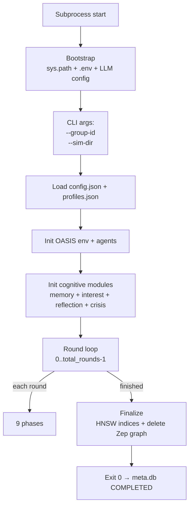

# 05 — Stage 4: Round Loop Runtime

File dày nhất — toàn bộ cơ chế ra quyết định của agents nằm ở đây. **Đọc file này nếu chỉ chọn 1 file**.

Sau Stage 3 (Prepare) xong, sim ở status `READY` với `profiles.json` + `config.json` + `crisis_scenarios.json` trên disk. `POST /api/sim/start` spawn **subprocess** chạy `run_simulation.py` trong sim's `.venv/` (Python 3.11). Subprocess đọc artifacts từ disk + chạy round loop tới `total_rounds` rồi exit.

## Subprocess entry — `run_simulation.py`

[run_simulation.py](../apps/simulation/run_simulation.py) — ~2300 dòng, là **subprocess entry**, không phải module import từ FastAPI.



| Bootstrap step | Code | Vai trò |
|----------------|------|---------|
| Windows encoding fix | `run_simulation.py:15-18` | UTF-8 stdout/stderr cho Windows console |
| Shared library path | `run_simulation.py:28-31` | Walk up tìm `libs/ecosim-common/src` + `vendored/oasis` |
| `.env` loading + LLM remap | `run_simulation.py:51-76` | `LLM_API_KEY` → `OPENAI_API_KEY` cho openai SDK |
| CLI args | `run_simulation.py:87-94` | `--group-id` (= sim_id) + `--sim-dir` |
| Config load | `run_simulation.py:98-113` | `config.json` (Phase 5) hoặc legacy `simulation_config.json` |
| Time config | `run_simulation.py:115-146` | hours/round, period_multipliers |
| Profile + DB paths | `run_simulation.py:149-165` | `profiles.json`, `oasis_simulation.db` |
| OASIS imports + agent graph | `run_simulation.py:192-196` | `generate_reddit_agent_graph()` |

## Round loop — 9 phases

| Phase | Code range | Mục đích |
|-------|------------|----------|
| **1. Crisis check + inject** | ~1093-1130 | Scheduled events trigger? Real-time inject? |
| **2. Feed build** | ~1140-1200 | `PostIndexer.index_from_db()` + `decide_agent_actions()` |
| **3. Reflection** | ~1300+ | `maybe_reflect()` mỗi N rounds |
| **4. Posting** | ~1350+ | `_generate_post_content()` LLM per posting agent |
| **5. Re-index** | ~1450+ | Add new posts vào ChromaDB cho round sau |
| **6. Interactions** | ~1500+ | `env.step(actions)` — OASIS Reddit step |
| **7. Persistence** | ~1650+ | `_write_actions()` append jsonl atomic |
| **8. Memory + Drift** | ~1700+ | `agent_memory.end_round()` + `interest_tracker.update_after_round()` |
| **9. Zep section dispatch** (Phase 15) | ~1750-1820 | Content actions → Zep extract → MERGE FalkorDB |

### Phase 1 — Crisis

[`CrisisEngine`](../apps/simulation/crisis_engine.py):

- **Scheduled events**: từ `crisis_scenarios.json` (chosen scenario). Round trigger so với `event.trigger_round` → activate.
- **Real-time injection**: `POST /api/sim/<sid>/inject-crisis` (frontend hoặc external trigger giữa sim).
- **Perturbation relevance** ([`compute_agent_relevance`](../apps/simulation/crisis_engine.py)): scale theo Jaccard giữa crisis keywords/domains và agent interests. Agent không match vẫn có **floor 0.2** (không immune hoàn toàn).
- **Author resolution**: `crisis_author_strategy` ∈ `agent_0` | `influencer` | `system` (xem 04).
- **7 crisis types**: `price_change`, `scandal`, `news`, `competitor`, `regulation`, `supply_chain`, `incident`.

### Phase 2 — Feed build + action plan

#### PostIndexer (ChromaDB)

[`PostIndexer`](../apps/simulation/interest_feed.py) — **per-sim** ChromaDB persistent client tại `<sim_dir>/chroma/` (collection `ecosim_{sim_id}`):

- Index từng post từ SQLite (`index_from_db`) → embedding 384-dim qua OpenAI Embeddings API (centralized `LLMClient`, KHÔNG dùng local MiniLM).
- Khi cần recommend cho agent X: query `n_results=K` với input = `agent.interest_vector` text.

#### Rule-based action decision

Thay vì LLM mỗi vòng (đắt), EcoSim dùng formula:

```
post_probability(agent) = (posts_per_week / 7) × hours_per_round × period_multiplier × mbti_modifier
```

Trong đó:
- `posts_per_week`: từ AgentBehaviorConfig (Stage 3 LLM-generated).
- `hours_per_round`: `total_simulation_hours / total_rounds`.
- `period_multiplier`: peak/off-peak từ TimeConfig.
- `mbti_modifier`: E/I → ±20%, P/J → ±10%.

`should_post(agent, ...)` flip coin với probability đó. Tương tự `should_comment`, `should_like`.

Gotcha (per CLAUDE.md): `get_post_probability(profile, hours_per_round)` chia theo `simulation_hours/num_rounds`, **không phải `/7.0`**.

### Phase 3 — Reflection

[`AgentReflection.maybe_reflect`](../apps/simulation/agent_cognition.py) — interval-based (vd mỗi 3 rounds):

- LLM summarize agent memory buffer + base persona → 1 insight string.
- Append insight vào `persona_evolved` (max 3 cumulative).
- Persist atomic write `profiles.json` (replace `persona_evolved` + append `reflection_insights[]`).

**Gate**: requires `enable_reflection=true` AND `enable_agent_memory=true` trong SIM_CONFIG.

### Phase 4 — Post generation

[`_generate_post_content`](../apps/simulation/run_simulation.py) — LLM gọi cho mỗi agent đã `should_post`:

Prompt context:
- Persona narrative (persona_evolved nếu có).
- MBTI + age + gender + interests (top-K).
- Memory buffer (FIFO 5-round, LLM-summarized).
- Crisis directive (nếu round có active crisis).
- **Graph context** (`get_social_context`) → ⛔ **disabled hiện tại** — `GraphCognitiveHelper._DISABLED=True`.

Tạo `create_post` action với content + group_id + author user_id.

### Phase 5 — Re-index posts

Sau khi posts được tạo, re-index immediately vào ChromaDB để round sau pick up. [`PostIndexer.index_post`](../apps/simulation/interest_feed.py).

### Phase 6 — OASIS interactions

[`env.step(actions)`](../vendored/oasis/) — vendored OASIS handles:
- `create_post` → SQLite `post` table.
- `create_comment` → SQLite `comment` table.
- `like_post` / `dislike_post` → SQLite `like` / `dislike`.
- `follow` → SQLite `follow`.
- `repost` → SQLite `post` với `original_post_id`.
- `update_rec_table` — OASIS internal rec system (patched bởi PostIndexer cho interest-based).

### Phase 7 — Persistence

[`_write_actions`](../apps/simulation/run_simulation.py):

- Append each action vào `actions.jsonl` (atomic via `atomic_append_jsonl`).
- Schema mỗi line: `{user_id, agent_name, action_type, info, timestamp, content?}`.
- Action types observed: `sign_up`, `create_post`, `create_comment`, `like_post`, `do_nothing`, `follow`, `repost`, ...

### Phase 8 — Memory + Drift

#### AgentMemory (FIFO)

[`AgentMemory`](../apps/simulation/agent_cognition.py:23):

- Buffer **max 5 rounds** per agent.
- `end_round()` → record actions + observations → LLM summary → push to buffer.
- Khi buffer full → drop oldest, keep newest 5.
- `inject_into_prompt()` → list of round summaries cho LLM consumption.
- `dump_stats()` ghi `memory_stats.json` mỗi round (buffer fullness, LLM injection count).

**Gate**: `enable_agent_memory=true`.

#### InterestVectorTracker (KeyBERT drift)

[`InterestVectorTracker.update_after_round`](../apps/simulation/agent_cognition.py:555):

```
for each engaged content (posts liked/commented/created):
    keyphrases = _extract_keyphrases(content)   # KeyBERT MMR diversity=0.5
    for kw in keyphrases:
        interests[kw] += boost_weight   # default 0.15

for each non-engaged interest:
    interests[k] *= decay_factor       # default 0.92 per round

# add NEW keywords (curiosity)
new_kws = [kw for kw in keyphrases if kw not in interests]
for kw in new_kws[:curiosity_n]:
    interests[kw] = curiosity_weight   # default 0.3

# profile floor (conviction) — base interests không drop quá floor
for base_kw in base_profile.interests:
    if interests[base_kw] < floor:
        interests[base_kw] = floor     # default 0.2

# prune weak
interests = {k: v for k, v in interests.items() if v > prune_threshold}
```

**KeyBERT verified**: log signature `Interest vectors: N total interests tracked` (xuất hiện ở `simulation.log`).

**Fallback**: nếu `keybert` không cài → log `[COGNITION] KeyBERT not installed, using N-gram fallback`. Verified hiện tại KeyBERT đang chạy đúng (xem README.md installation).

### Phase 9 — Zep section dispatch (Phase 15)

Cuối mỗi round, content actions (create_post + create_comment, content ≥ 30 chars) đi qua **10-node pipeline** trong [sim_zep_section_writer.py:write_round_sections_via_zep](../apps/simulation/sim_zep_section_writer.py):

| Node | Job | Code |
|------|-----|------|
| 1 | Filter content traces (drop structural) | `_filter_traces` |
| 2 | Enrich agent name + role | `_enrich_agent_meta` |
| 3 | Convert trace → 1 section text natural Vietnamese | `_format_post_section`, `_format_comment_section` |
| 4 | Build `EpisodeData(type="text")` list | inline |
| 5 | `zep.graph.add_batch` + poll until processed (timeout 180s) | `_dispatch_batch` |
| 6 | Fetch nodes/edges/episodes (cumulative Zep state) | `_fetch_zep_data` |
| 7 | Filter delta vs master | `_filter_master_overlap` |
| 8 | Re-embed local (4 batch — entities, facts, episodes, edges) | `_reembed_local` |
| 9 | Cypher MERGE multi-label `:Entity:Brand`, edges, `:Episodic`, `:MENTIONS` | inline MERGE |
| 10 | Reroute Zep-extracted `:Agent` → seeded `:SimAgent` | `_reroute_agents` |

Round N+1 cognitive query (`GraphCognitiveHelper.get_social_context()` if enabled) thấy data round 1..N cumulative.

**Sim COMPLETED** → `finalize_sim_post_run()` chạy 1 lần:
- **Node 11**: build Graphiti HNSW + lookup indices (vector search ready).
- **Node 12**: delete Zep sim graph (free quota).

**Cost**: 5-15 Zep credits/round × 5-10 rounds = 25-150 credits/sim. Free tier 1000/mo → ~7-20 sims.

**Gates**:
- `ZEP_API_KEY` (env) — required.
- `ZEP_SIM_RUNTIME=true` (env) — enable Phase 15 ở runtime.
- `ENABLE_GRAPH_MEMORY=true` (env, default) — global gate.

## Section text format (Phase 15)

Mỗi section text được Zep extract entities từ:

- Post: `"{name} ({role}) đăng bài viết tại Round N: {content}"`
- Comment: `"{name} ({role}) bình luận tại Round N trên bài viết của {parent_name}: {content}"`

**Lưu ý**: KHÔNG inject MBTI vào text — chỉ name + role (vd "người tiêu dùng", "KOL"). Reason: Zep extract MBTI là entity rác.

## Cognitive feature gates

| Flag | Default | Phase | Effect |
|------|---------|-------|--------|
| `enable_agent_memory` | `false` | 1 | FIFO 5-round buffer + LLM injection |
| `enable_mbti_modifiers` | `false` | 2 | Apply MBTI multipliers to action freq |
| `enable_interest_drift` | `false` | 3 | KeyBERT-based interest evolution per round |
| `enable_reflection` | `false` | 4 | Periodic LLM reflection (requires memory enabled) |
| `enable_graph_cognition` | `false` | 5 | ⛔ DISABLED qua `GraphCognitiveHelper._DISABLED=True` |

User toggle qua `cognitive_toggles` field trong `POST /api/sim/prepare`.

## Graph cognition — current state

[`GraphCognitiveHelper`](../apps/simulation/agent_cognition.py:964) gọi `FalkorGraphSearcher` để fetch:
- `get_social_context(agent_name)` — ai đã tương tác với agent, chủ đề gì.
- `get_interest_entities(agent_name)` — entities liên quan agent.

**Status**: `_DISABLED=True` (line 987). Lý do: `FalkorGraphSearcher.connect()` import `graphiti_core.driver.falkordb_driver.FalkorDriver` mà module đó **không tồn tại trên bất kỳ version PyPI nào** (đã probe 14 versions từ 0.5 đến 0.29).

**Refactor path** (chưa làm):
1. Rewrite `FalkorGraphSearcher` dùng `from falkordb import FalkorDB` (raw Cypher) — pattern y hệt 16+ write site.
2. Query universal: `MATCH (me:SimAgent {name, sim_id})-[r]-(neighbor) RETURN type(r), labels(neighbor), neighbor.name, properties(r)`.
3. Format → text inject vào posting prompt.

**Trade-off khi refactor**: mất vector similarity search (Graphiti HNSW) cho entities. Bù qua ChromaDB cho post semantic.

## Persistence artifacts per round

Mỗi round (atomic writes):

| File | Updated bởi | Nội dung |
|------|-------------|----------|
| `actions.jsonl` | Phase 7 | Append: 1 action per line |
| `oasis_simulation.db` | Phase 6 | OASIS SQLite — `post`, `comment`, `like`, `follow`, `trace`, ... |
| `progress.json` | inline | `current_round`, `status`, `last_updated` |
| `memory_stats.json` | Phase 8 | Buffer stats per agent |
| `agent_tracking.txt` | Phase 8 | Cognitive snapshot legacy text |
| `tracking.jsonl` | Phase 8 | New JSONL — 1 round/line per tracked agent (cognitive_traits, interest_vector, memory, graph context, actions) |
| `simulation.log` | continuous | stdout subprocess |
| `crisis_log.jsonl` | Phase 1 | Crisis events triggered |
| `chroma/` (collection) | Phase 5 | Post embeddings indexed |
| FalkorDB sim graph | Phase 9 | Multi-label entities + edges from Zep extract |

## Resume + crash recovery

Sim subprocess crash → meta.db status sẽ kẹt ở `RUNNING`. Không có auto-resume; user phải:
- Inspect `simulation.log` để hiểu lỗi.
- Manual re-run nếu cần.
- Hoặc delete sim qua `DELETE /api/sim/<sid>`.

Một số file (actions.jsonl, oasis_simulation.db) là append-only/atomic — partial data từ sim cũ vẫn dùng được cho post-sim analysis nếu sim đến đủ round.

## SSE streaming progress

`GET /api/sim/<sid>/stream` (SSE) — Sim service reads `progress.json` polling + forwards qua SSE event stream. Frontend dùng `useSse<T>` hook ([apps/frontend/hooks/use-sse.ts](../apps/frontend/hooks/use-sse.ts)) để render live progress bar + actions feed.

Caddy `flush_interval=-1` forward each event ngay (no buffering).

## Đọc tiếp

- [06_post_simulation.md](06_post_simulation.md) — sau khi sim COMPLETED
- [06d_report.md](06d_report.md) — Report agent ReACT
- [07_storage_and_paths.md](07_storage_and_paths.md) — sim_dir layout
