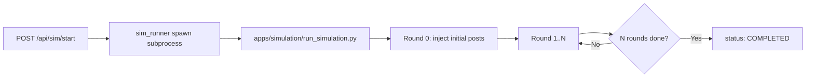
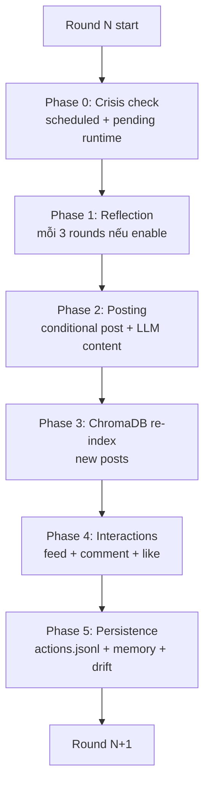
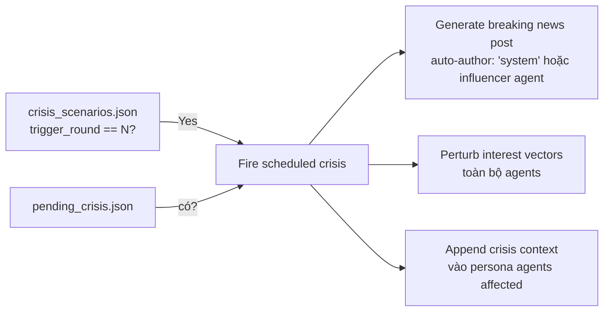
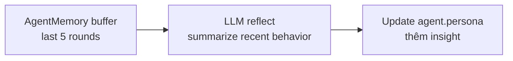
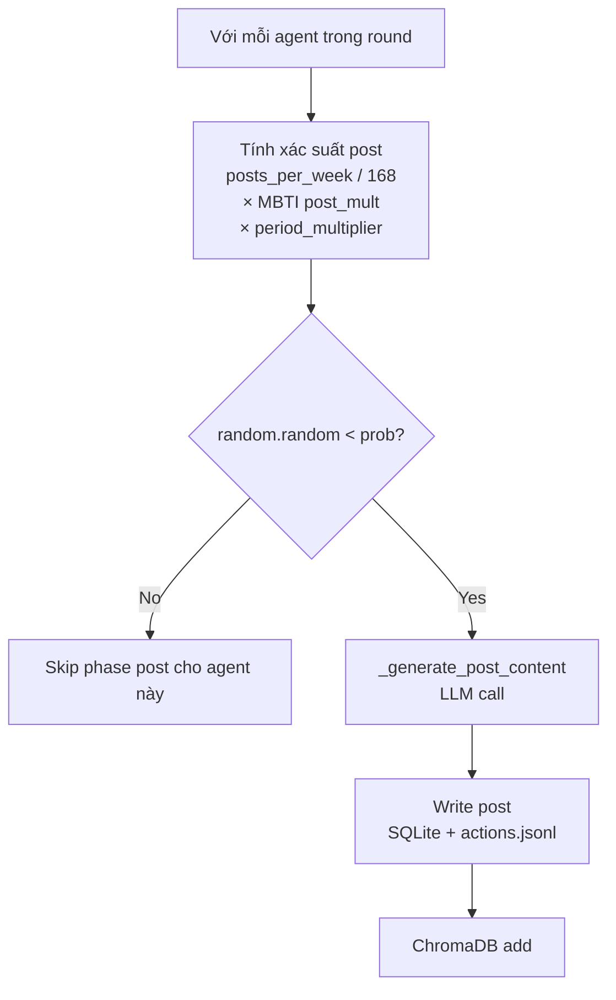
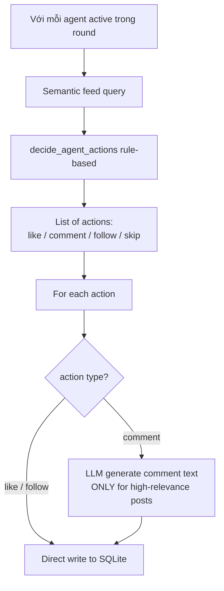
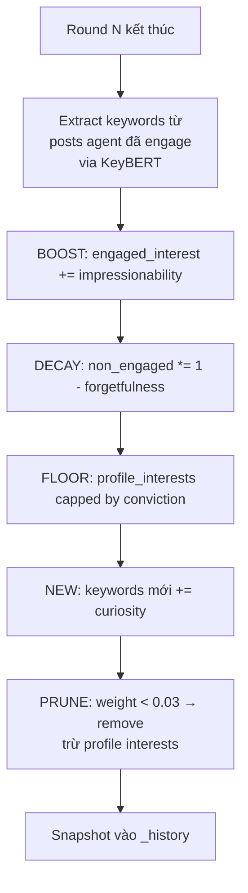
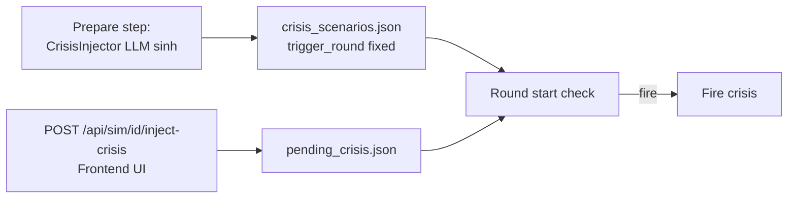
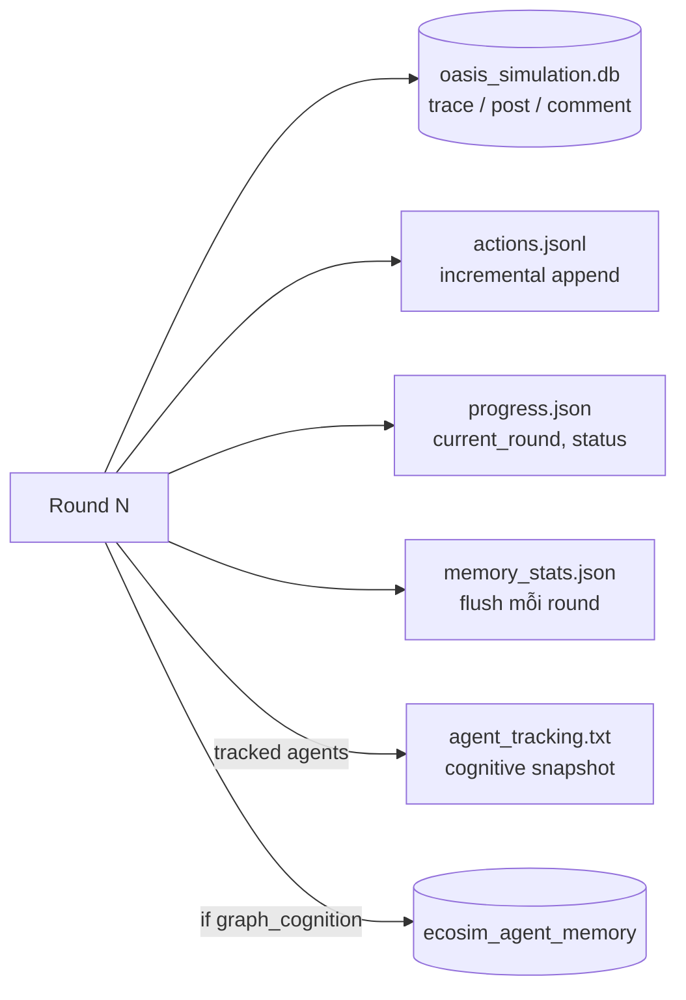

# 05 — Stage 4: Vòng mô phỏng

Đây là file tài liệu dày nhất vì cơ chế ra quyết định của EcoSim tập trung toàn bộ ở đây. Nếu bạn chỉ đọc một file, đọc file này.

## Tổng quan



Subprocess dùng `.venv` riêng của OASIS (`apps/simulation/.venv/Scripts/python.exe`) để không conflict với env của Core Service.

## 1. Cấu trúc một round

Mỗi round có 5 phase, được điều khiển từ `main loop` trong [apps/simulation/run_simulation.py:755-1000](../apps/simulation/run_simulation.py#L755-L1000):



### Phase 0 — Crisis check

[run_simulation.py:763-821](../apps/simulation/run_simulation.py#L763-L821)



Crisis runtime injection qua `POST /api/sim/{id}/inject-crisis` — ghi `pending_crisis.json`, subprocess đọc mỗi đầu round.

### Phase 1 — Reflection (conditional)

Chỉ chạy nếu `enable_reflection=true` VÀ `round_num % REFLECTION_INTERVAL == 0` (mặc định 3).

[run_simulation.py:826-845](../apps/simulation/run_simulation.py#L826-L845)



Kết quả: persona "tiến hoá" theo thời gian. Agent nhận ra patterns như "tôi like nhiều post về tech → có lẽ tôi quan tâm mạnh hơn tôi tưởng".

### Phase 2 — Posting (rule-based + LLM content)

Đây là điểm khác biệt lớn nhất so với OASIS.



**Công thức xác suất post** ([interest_feed.py:324-336](../apps/simulation/interest_feed.py#L324-L336)):

```python
def should_post(profile, rng, post_mult=1.0):
    # posts_per_week từ profile (default ~7)
    # chia 168 (số giờ/tuần) → prob mỗi round 1h
    base = get_post_probability(profile)  # [:320]
    prob = min(1.0, base * post_mult)
    return rng.random() < prob
```

Ví dụ: agent có `posts_per_week=14`, MBTI ENFP (`post_mult=1.2`), period peak (`×1.5`):
```
prob = (14/168) * 1.2 * 1.5 = 0.15  (15% mỗi round)
```

LLM chỉ được gọi khi đã quyết định post, ở `_generate_post_content()` ([run_simulation.py:613-644](../apps/simulation/run_simulation.py#L613-L644)). Prompt có:
- Agent persona + recent memory
- Current interest keywords (top-5 từ interest vector)
- Crisis context (nếu persona đã bị perturbed)
- Hot topics từ event config
- Narrative direction hint

### Phase 3 — ChromaDB re-index

[run_simulation.py:928](../apps/simulation/run_simulation.py#L928)

Posts mới tạo ở Phase 2 được embed và thêm vào ChromaDB collection của simulation. Embedding model: `all-MiniLM-L6-v2` (default ChromaDB).

Collection key: `posts_{sim_id}` — tồn tại trong memory suốt run, flush về disk khi sim kết thúc.

### Phase 4 — Interactions



**Semantic feed query** ([interest_feed.py:203-254](../apps/simulation/interest_feed.py#L203-L254)):

```python
# Score composite: semantic distance bớt đi cho post phổ biến, 
# cộng thêm decay cho post đã có comment nhiều
score = semantic_distance - popularity_bonus + comment_decay

# ChromaDB query top-K posts theo score
results = collection.query(
    query_texts=[interest_vector_str],
    n_results=recommendation_count_per_round
)
```

**decide_agent_actions** — áp dụng thresholds similarity ([interest_feed.py:401-403](../apps/simulation/interest_feed.py#L401-L403)):

| Distance band | Xác suất Like | Xác suất Comment |
|---------------|---------------|------------------|
| `< 0.7` (Strong match) | 100% | 50% |
| `0.7 ≤ d < 1.0` (Moderate) | 75% | 15% |
| `1.0 ≤ d < 1.3` (Weak) | 30% | 0% |
| `d ≥ 1.3` (No match) | 10% (chance) | 0% |

Tất cả xác suất × `MBTI like_mult` và `comment_mult`.

**LLM được gọi cho comment** ([run_simulation.py:646-674](../apps/simulation/run_simulation.py#L646-L674)) — chỉ cho posts có distance < 1.0 (strong hoặc moderate). Comment cho weak match không có ý nghĩa content.

### Phase 5 — Persistence

- **SQLite trace**: `trace(user_id, action, info, created_at)` ([run_simulation.py:147](../apps/simulation/run_simulation.py#L147))
- **actions.jsonl export**: 1 dòng = 1 action ([run_simulation.py:507-584](../apps/simulation/run_simulation.py#L507-L584))
- **AgentMemory**: flush recent actions → 1-line summary ([agent_cognition.py:60-88](../apps/simulation/agent_cognition.py#L60-L88))
- **Interest drift**: KeyBERT update interest vectors (chi tiết dưới)
- **FalkorDB graph memory**: nếu `enable_graph_cognition` ([run_simulation.py:487-488](../apps/simulation/run_simulation.py#L487-L488))
- **Progress json**: `{current_round, total_rounds, status: "running"}`

## 2. Cognitive traits từ MBTI

[apps/simulation/agent_cognition.py:150-250](../apps/simulation/agent_cognition.py#L150-L250)

MBTI được map thành 8 multipliers/traits:

| Dimension | Trait | Effect |
|-----------|-------|--------|
| **E/I** | `post_mult`, `comment_mult` | Extravert post/comment nhiều hơn (E: ×1.2, I: ×0.8) |
| **F/T** | `like_mult` | Feeler like nhiều hơn (F: ×1.3, T: ×0.9) |
| **P/J** | `feed_mult` | Perceiver explore rộng hơn (P: top-20, J: top-10) |
| **All types** | `impressionability` | Khả năng boost interest khi engage (0.1-0.9) |
| **All types** | `forgetfulness` | Rate decay interest cũ (0.1-0.9) |
| **All types** | `curiosity` | Weight interest mới (0.1-0.9) |
| **All types** | `conviction` | Floor protect profile interests (0.1-0.9) |

Ví dụ INTJ: low `impressionability` (0.2), low `forgetfulness` (0.2), medium `curiosity` (0.4), high `conviction` (0.8). Sở thích thay đổi chậm, bám core identity.

Đối lập ENFP: high `impressionability` (0.7), medium `forgetfulness` (0.5), high `curiosity` (0.8), low `conviction` (0.3). Sở thích nhảy liên tục.

## 3. KeyBERT Adaptive Interest Drift

Đây là cơ chế "học" của agent — sau mỗi round, interest vector được update dựa trên những gì agent đã engage.

[apps/simulation/agent_cognition.py:308-482](../apps/simulation/agent_cognition.py#L308-L482) (setup), [agent_cognition.py:589-648](../apps/simulation/agent_cognition.py#L589-L648) (update logic)

### Setup KeyBERT

```python
# agent_cognition.py:326
keybert = KeyBERT(model='all-MiniLM-L6-v2')

# agent_cognition.py:396-402
keywords = keybert.extract_keywords(
    engaged_posts_text,
    keyphrase_ngram_range=(1, 3),  # unigram → trigram
    use_mmr=True,                   # Maximal Marginal Relevance
    diversity=0.5,                  # cân giữa relevance và diversity
    top_n=10
)
```

### Update per-round rules



**Công thức chi tiết** ([agent_cognition.py:589-648](../apps/simulation/agent_cognition.py#L589-L648)):

```python
for keyword, weight in interests.items():
    if keyword in engaged_this_round:
        # BOOST
        weight += agent.traits.impressionability
    else:
        # DECAY
        weight *= (1.0 - agent.traits.forgetfulness)

    # FLOOR (bảo vệ core identity)
    if keyword in profile_interests:
        weight = max(weight, agent.traits.conviction)

# NEW
for kw in new_keywords_from_engagement:
    if kw not in interests:
        interests[kw] = agent.traits.curiosity

# PRUNE (sparse vector)
interests = {
    kw: w for kw, w in interests.items()
    if w >= 0.03 or kw in profile_interests
}
```

Snapshot mỗi round được lưu vào `_history[agent_id][round_num]` để visualize drift sau simulation.

### Ví dụ drift over rounds

Agent INTJ (low impressionability, low forgetfulness), profile interest = `{"tech": 0.8, "tài chính": 0.7}`:

| Round | Engaged | Interest vector (top) |
|-------|---------|-----------------------|
| 0 | — | tech 0.80, tài chính 0.70 |
| 1 | tech posts | **tech 0.90**, tài chính 0.63 |
| 2 | tech, AI posts | tech 0.95, **AI 0.40**, tài chính 0.57 |
| 5 | không engage tài chính | tech 0.95, AI 0.55, **tài chính 0.50** (floor by conviction 0.5) |

Với agent ENFP cùng profile:

| Round | Engaged | Interest vector (top) |
|-------|---------|-----------------------|
| 0 | — | tech 0.80, tài chính 0.70 |
| 1 | meme, giải trí | **meme 0.80, giải trí 0.80**, tech 0.40, tài chính 0.35 |
| 2 | meme, thời trang | meme 0.95, thời trang 0.80, giải trí 0.40, tech 0.20 (prune sắp tới) |

Thấy rõ: INTJ bám core, ENFP nhảy sang topic mới rất nhanh.

## 4. Cross-round Memory

[apps/simulation/agent_cognition.py:23-109](../apps/simulation/agent_cognition.py#L23-L109)

### AgentMemory — FIFO buffer

```python
class AgentMemory:
    def __init__(self, max_rounds=5):
        self.buffer = deque(maxlen=max_rounds)

    def flush_round(self, agent_id, round_num, actions):
        summary = _summarize_actions(actions)  # 1-line string
        self.buffer.append({
            "round": round_num,
            "summary": summary
        })

    def inject_prompt(self):
        return "Your recent activity:\n" + "\n".join(
            f"Round {m['round']}: {m['summary']}" for m in self.buffer
        )
```

Memory được prepend vào system prompt mỗi khi LLM được gọi (post content, comment, reflection). Agent "nhớ" 5 round gần nhất.

Stats về memory usage ghi vào `memory_stats.json`: avg_summary_len, buffer_fullness_by_round, total_injections.

### FalkorDB Graph Memory (optional)

Khi `enable_graph_cognition=true`:

[apps/simulation/falkor_graph_memory.py](../apps/simulation/falkor_graph_memory.py) + [run_simulation.py:299-320](../apps/simulation/run_simulation.py#L299-L320)

- Database riêng: `ecosim_agent_memory` (không dùng `ecosim` vì conflict với campaign KG)
- `FalkorGraphMemoryUpdater`: batch write, `batch_size=5`, `flush_interval=10s`
- Schema: nodes (Agent, Post, Topic, Event), edges (AUTHORED, ENGAGED_WITH, FOLLOWS, MENTIONED)
- Read: `GraphCognitiveHelper.get_social_context(agent_id)` → append snippet vào persona khi LLM sinh content ([run_simulation.py:891-893](../apps/simulation/run_simulation.py#L891-L893))

Ví dụ social context:
```
Recent social context:
- Bạn đã comment post của @anna3 (2 round trước)
- @long_tech đang follow bạn
- Topic "black friday" đang hot (15 posts trong round này)
```

Giúp agent có awareness network-level không gói gọn trong FIFO memory của chính mình.

## 5. Crisis injection

[apps/simulation/crisis_engine.py](../apps/simulation/crisis_engine.py)

### Hai nguồn crisis



### Fire crisis

[run_simulation.py:780-800](../apps/simulation/run_simulation.py#L780-L800)

1. **Generate breaking news post** — tác giả là "system" hoặc một agent "influencer" nổi bật
2. **Perturb interest vectors** — thêm/sửa weights theo `interest_perturbation`
3. **Append persona context** — các agents affected được inject "Recent news: [crisis body]" vào persona ([run_simulation.py:886-887](../apps/simulation/run_simulation.py#L886-L887))

Crisis log ghi vào `crisis_log.jsonl` và có thể query qua `GET /api/sim/{id}/crisis-log`.

## 6. Persistence artifacts



### SQLite schema

```sql
CREATE TABLE trace (user_id INT, action TEXT, info JSON, created_at TIMESTAMP);
CREATE TABLE post (post_id INT PRIMARY KEY, user_id INT, content TEXT, ...);
CREATE TABLE comment (comment_id INT PRIMARY KEY, post_id INT, user_id INT, ...);
CREATE TABLE user (user_id INT PRIMARY KEY, name TEXT, bio TEXT, ...);
CREATE TABLE like_table (user_id INT, post_id INT, PRIMARY KEY(user_id, post_id));
CREATE TABLE follow (follower_id INT, followee_id INT, PRIMARY KEY(follower_id, followee_id));
```

### actions.jsonl line format

```json
{
  "user_id": 42,
  "agent_name": "Nguyễn Thị Lan",
  "action_type": "create_comment",
  "info": {
    "post_id": 87,
    "post_content": "Black Friday năm nay có gì hot?",
    "post_author_name": "Trần Văn A",
    "comment_content": "Mình thấy freeship không còn nữa, buồn ghê..."
  },
  "timestamp": "2026-04-22T14:32:01"
}
```

Action types: `create_post`, `create_comment`, `like_post`, `follow_user`, `repost`.

### agent_tracking.txt (debugging)

Chỉ ghi cho các `tracked_agents` cấu hình trong `simulation_config.json`:

```
=== Agent 42 (INTJ) at Round 5 ===
MBTI: INTJ
Traits: impressionability=0.2, forgetfulness=0.2, curiosity=0.4, conviction=0.8
Interest top-5: tech 0.95, AI 0.60, tài chính 0.50, startup 0.45, Shopee 0.35
Memory buffer (last 5):
  Round 1: posted about Black Friday hype
  Round 2: commented on 3 tech posts
  ...
Evolved persona (after reflection):
  Nguyễn Văn X, 32 tuổi, đam mê công nghệ ngày càng sâu...
```

## 7. SSE streaming progress

`GET /api/sim/{id}/stream` — Server-Sent Events cho frontend real-time progress.

Subprocess không trực tiếp push SSE; thay vào đó ghi `progress.json` + `actions.jsonl`. Simulation Service serve SSE bằng cách poll file + yield event:

```
event: round_start
data: {"round": 5, "total": 24, "status": "running"}

event: action
data: {"user_id": 42, "action_type": "create_post", "post_id": 87}

event: crisis
data: {"scenario_id": "crisis_001", "title": "Rò rỉ dữ liệu..."}

event: round_complete
data: {"round": 5, "actions_count": 127, "elapsed_s": 42.1}

event: done
data: {"status": "completed", "total_rounds": 24, "total_actions": 2840}
```

Gateway forwarding SSE: [apps/gateway/gateway.py:117](../apps/gateway/gateway.py#L117) (no buffering).

## 8. Trace code đầy đủ

```
POST /api/sim/start (sim_id)
  └─ apps/simulation/api/simulation.py start()
     ├─ SimManager.get(sim_id)  status READY → RUNNING
     └─ subprocess.Popen([OASIS_VENV_PYTHON, run_simulation.py, --sim-dir])
        └─ apps/simulation/run_simulation.py main()
           ├─ Load simulation_config.json + profiles.json + crisis_scenarios.json
           ├─ Init ChromaDB collection + AgentMemory + KeyBERT
           ├─ Optional: FalkorGraphMemoryUpdater
           ├─ Round 0: inject initial_posts (ManualAction)
           ├─ For round 1..N:
           │  ├─ Phase 0: check + fire crisis         [:763]
           │  ├─ Phase 1: reflection (if eligible)    [:826]
           │  ├─ Phase 2: posting
           │  │  ├─ time-based agent selection
           │  │  ├─ should_post() rule-based          [interest_feed.py:324]
           │  │  └─ _generate_post_content LLM         [run_simulation.py:613]
           │  ├─ Phase 3: ChromaDB re-index           [:928]
           │  ├─ Phase 4: interactions
           │  │  ├─ query_posts_for_agent              [interest_feed.py:203]
           │  │  ├─ decide_agent_actions              [interest_feed.py:401]
           │  │  └─ _generate_comment LLM (if d<1.0)  [run_simulation.py:646]
           │  └─ Phase 5: persistence
           │     ├─ append actions.jsonl
           │     ├─ AgentMemory.flush_round
           │     ├─ InterestDrift.update_all          [agent_cognition.py:589]
           │     ├─ graph_updater.add_action (opt)    [run_simulation.py:487]
           │     └─ progress.json write
           └─ SimManager.set_completed
```

## Gotchas

- **Subprocess env**: `run_simulation.py` cần `LLM_API_KEY` từ `.env` parent process. Simulation Service pass qua `subprocess.Popen(env=...)` — verify không strip env.
- **ChromaDB persistence**: Collection chỉ exist trong process subprocess. Nếu sim crash, restart phải re-index từ đầu (đọc SQLite posts).
- **KeyBERT slow start**: Lần đầu load model `all-MiniLM-L6-v2` mất ~5-10s. Nếu test nhiều simulation nhỏ, giữ model cache.
- **Time-based selection bias**: period_multipliers có thể tạo "sóng" không tự nhiên (agent toàn post 19:00). Nếu muốn smooth, giảm variance trong TimeConfig prompt.
- **Crisis perturbation quá mạnh**: interest_perturbation values > 0.5 có thể làm mọi agent converge cùng topic → monoculture. Cap ở ±0.3 hợp lý.
- **Graph memory OOM**: với 100 agents × 24 rounds, FalkorDB `ecosim_agent_memory` có thể ~100k nodes + 500k edges. Batch write (`batch_size=5, flush_interval=10s`) đã giảm tải; tăng nếu LLM wait.
- **LLM rate limit**: Scripts gọi 100-500 LLM/round với 20 agents. Upgrade tier hoặc dùng local model qua Ollama (`LLM_BASE_URL=http://localhost:11434/v1`).

Đi tiếp → [06_post_simulation.md](06_post_simulation.md)
