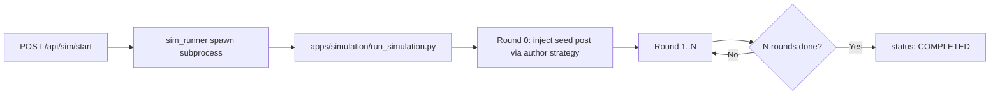
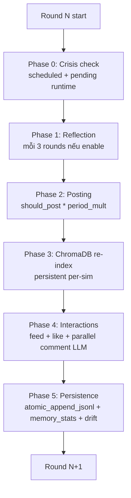
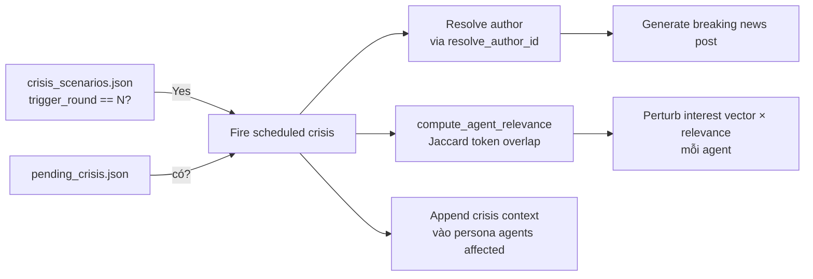
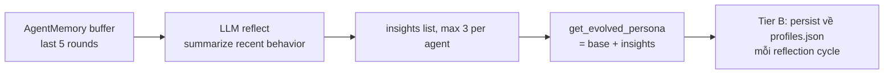
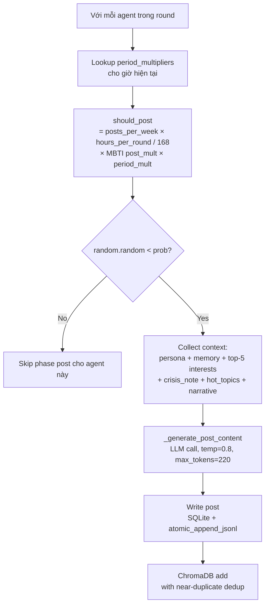
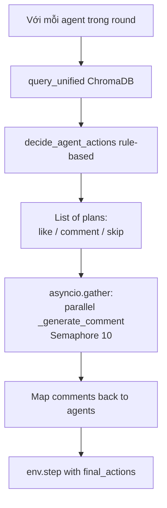

# 05 — Stage 4: Vòng mô phỏng

Đây là file tài liệu dày nhất vì cơ chế ra quyết định của EcoSim tập trung toàn bộ ở đây. Nếu bạn chỉ đọc một file, đọc file này.

Pipeline đã trải qua một đợt refactor Tier B (ngày 2026-04-24) — các số liệu + công thức + artifacts dưới đây phản ánh **code thực tế**. Nếu thấy claim sai lệch, file này là nguồn chính; chỉnh docs + code cùng lúc.

## Tổng quan



Subprocess dùng `.venv` riêng của OASIS (`apps/simulation/.venv/Scripts/python.exe`) để không conflict với env của Core Service.

## 1. Cấu trúc một round

Mỗi round có 5 phase:



### Phase 0 — Crisis check

[apps/simulation/run_simulation.py](../apps/simulation/run_simulation.py) Phase 0 block:



Crisis runtime injection qua `POST /api/sim/{id}/inject-crisis` — ghi `pending_crisis.json`, subprocess đọc mỗi đầu round.

**Author strategy** ([apps/simulation/crisis_engine.py](../apps/simulation/crisis_engine.py) `resolve_author_id`):
- `"agent_0"` (default) — hardcode agent 0.
- `"influencer"` — agent có `followers` cao nhất trong profiles.
- `"system"` — alias cho `agent_0` (chưa có system user thật).

Cấu hình qua `simulation_config.json.crisis_author_strategy` (áp cho cả seed post Round 0 và breaking news).

**Relevance filter** — Tier B fix: crisis không còn perturb uniform toàn đàn. `compute_agent_relevance(event, profiles)` tính Jaccard giữa:
- crisis terms: `interest_keywords` ∪ `affected_domains` ∪ title tokens ≥ 3 ký tự
- agent terms: `interests` ∪ `general_domain` ∪ `specific_domain`

Kết quả scale ∈ `[0.2, 1.0]` — floor 0.2 để mọi agent vẫn biết tin nóng, nhưng agent match sẽ bị tác động mạnh hơn (weight_boost + decay_factor đều nhân với relevance).

### Phase 1 — Reflection (conditional)

Chỉ chạy nếu `enable_reflection=true` VÀ `round_num % reflection_interval == 0` (mặc định 3).



[apps/simulation/agent_cognition.py `AgentReflection`](../apps/simulation/agent_cognition.py)

Base persona KHÔNG modified. Insights append lên top. Tier B: sau mỗi reflection cycle, `profiles.json` được atomic write kèm `persona_evolved` + `reflection_insights` — sim có thể resume khi crash.

### Phase 2 — Posting

Đây là điểm khác biệt lớn nhất so với OASIS.



**Công thức xác suất post** ([apps/simulation/interest_feed.py](../apps/simulation/interest_feed.py) `get_post_probability`):

```python
def get_post_probability(profile, hours_per_round=24.0):
    posts_per_week = profile.get("posts_per_week", 3)
    hours_per_week = 7 * 24  # 168
    return min(1.0, posts_per_week * hours_per_round / hours_per_week)
```

Trước Tier B công thức là `posts_per_week / 7.0` — agent `posts_per_week ≥ 7` luôn post mỗi round (sai 24×). Đã fix: giờ scale theo `hours_per_round = simulation_hours / num_rounds` (thường 7 với config mặc định 168h/24 rounds).

Ví dụ agent `posts_per_week=14`, MBTI ENFP (`post_mult=1.2`), giờ peak (`period_mult=1.5`), `hours_per_round=7`:
```
base = 14 * 7 / 168 = 0.583
prob = 0.583 * 1.2 * 1.5 = 1.05 → clamp 1.0 (100% round đó)
```

**Period multipliers** — Tier B H3 fix: `_period_mult_for_round(round_num)` tính `current_hour = (round_num * HOURS_PER_ROUND) % 24`, lookup bucket trong `time_config.period_multipliers`. Bucket wrap midnight (ví dụ `"22-00"`) được xử lý đúng.

**LLM post prompt** — Tier B H1 enrichment, inject full 7 components:
- Agent persona (+ insights từ reflection nếu có)
- Recent memory từ AgentMemory (Round X-Y buffer)
- Top 5 interest keywords từ drift tracker
- Crisis note (`get_persona_modifier`) nếu active crisis
- Hot topics từ `event_config`
- Narrative direction từ `event_config`
- Topic template (rotating từ 8 templates)

Temperature=0.8, max_tokens=220 được set trên `model_config_dict`.

### Phase 3 — ChromaDB re-index

**Tier B C2+C3 fix**: `PostIndexer(sim_id, persist_dir=sim_dir/chroma)` — collection name `ecosim_{sim_id}` (không còn shared `ecosim_posts`), dùng `PersistentClient` nên survive subprocess crash. `_indexed_ids` được rebuild từ collection khi reopen.

**Dedup**: `index_post` kiểm semantic distance < `dedup_threshold=0.15`, post gần identical bị skip (log + mark indexed để khỏi kiểm lại).

Embedding model: `all-MiniLM-L6-v2` (default ChromaDB).

### Phase 4 — Interactions



**Semantic feed query** ([apps/simulation/interest_feed.py](../apps/simulation/interest_feed.py) `query_unified`):

```python
final_dist = semantic_dist - popularity_bonus + comment_decay
# popularity_bonus = min(0.25, followers / 20000)
# comment_decay = previous_comments * 0.3
```

**Thresholds similarity** (distance sau re-rank):

| Distance band | Xác suất Like | Xác suất Comment |
|---------------|---------------|------------------|
| `< 0.7` (Strong match) | 100% | 50% |
| `0.7 ≤ d < 1.0` (Moderate) | 75% | 15% |
| `1.0 ≤ d < 1.3` (Weak) | 30% | 0% |
| `d ≥ 1.3` (No match) | 10% | 0% |

Tất cả xác suất × `MBTI like_mult` / `comment_mult`.

**Feed size** (`get_feed_size(daily_hours, feed_mult)`):
- Base theo daily_hours: 0.5h→3 posts, 1h→5, 1.5h→7, 2h→10, 3h→15, >3h→20
- × MBTI `feed_mult`: P=1.2, J=0.9 → peak size 24 (P với >3h), min 18 (J với >3h). Agent ít thời gian: P=3.6 ~ J=2.7.

**LLM được gọi cho comment** — chỉ cho posts có distance < 1.0 (strong hoặc moderate). Tier B M1: các comment call chạy **song song** qua `asyncio.gather` với `Semaphore(10)` — N=20 agents, 2 comments/agent, 3s/call giảm từ serial 120s xuống ~12s.

### Phase 5 — Persistence + Sim KG hybrid (Phase 13/15)

- **SQLite trace**: `trace(user_id, action, info, created_at)` — structural actions (like/follow/vote/sign_up/repost) sống ở đây
- **actions.jsonl** (Tier B C4): `atomic_append_jsonl` 1 record/lần, track offset trong state; KHÔNG còn full-rewrite
- **AgentMemory**: flush recent actions → 1-line summary; FIFO 5-round buffer
- **memory_stats.json** (Tier B C6): dump mỗi round qua `AgentMemory.dump_stats()` — `{current_round, num_agents, max_buffer, total_rounds_logged, avg_summary_len, buffer_fullness_by_agent}`
- **Interest drift**: KeyBERT update interest vectors, wrap try/except để KeyBERT fail không crash sim (Tier B H5)
- **Evolved persona persist**: mỗi reflection cycle ghi `profiles.json` với `persona_evolved` + `reflection_insights` (Tier B H4)
- **Sim KG hybrid (Phase 13/15)** — content actions (post + comment ≥30 chars) → end-of-round Zep extraction:
  - [apps/simulation/sim_zep_section_writer.py](../apps/simulation/sim_zep_section_writer.py) `write_round_sections_via_zep()` chạy 10-node pipeline:
    1. Filter content traces → 2. Enrich agent name + role → 3. Convert mỗi trace → 1 section text natural Vietnamese ("{name} ({role}) đăng bài viết tại Round N: ..." hoặc "{name} ({role}) bình luận tại Round N trên bài viết của {parent}: ...") → 4. Build `EpisodeData(type="text")` list → 5. `zep.graph.add_batch` + poll until processed (timeout 180s) → 6. Fetch nodes/edges/episodes (cumulative state Zep server) → 7. Filter delta (loại entities trùng master) → 8. Re-embed local 4 batch (Zep KHÔNG expose embeddings) → 9. Cypher MERGE multi-label `:Entity:Brand`, edges với fact, `:Episodic`, `:MENTIONS` → 10. Reroute extracted Agent → seeded `:SimAgent` (idempotent)
  - **Round N+1** cognitive query (`GraphCognitiveHelper.get_social_context()`) thấy data round 1..N (real-time cumulative)
  - Yêu cầu: `ZEP_API_KEY` + `ZEP_SIM_RUNTIME=true`. Prepare flow: `create_sim_zep_graph` apply sim ontology (10 entity + 10 edge tại [libs/ecosim-common/src/ecosim_common/sim_zep_ontology.py](../libs/ecosim-common/src/ecosim_common/sim_zep_ontology.py))
  - Cost: 5-15 Zep credits/round × 5-10 rounds = 25-150 credits/sim
- **FalkorDB sim graph contents**: `:SimAgent` (seeded prepare), `:Entity` master clone (Layer 1 — fork master KG), `:Entity` Zep extract (Layer 3, source='zep_extract'), `:Episodic`. Không còn `:Post`, `:Comment`, `[:POSTED]`, `[:LIKED]`, `[:FOLLOWED]`
- **Sim KG delta persist** ([apps/simulation/sim_kg_snapshot.py](../apps/simulation/sim_kg_snapshot.py)): chỉ entities/edges sinh mới, không duplicate master. Cascade restore: master → fork → apply delta
- **Optional: legacy `enable_graph_cognition`** (FalkorDB `ecosim_agent_memory` database) — agent memory updater queue, batch worker. Replaced bởi Phase 13 hybrid; còn giữ cho backward compat
- **Progress json**: `{current_round, total_rounds, status: "running", crisis_summary}`

### Sim COMPLETED — finalize

`finalize_sim_post_run()` chạy 1 lần sau tất cả rounds:
- **Node 11**: build Graphiti HNSW + lookup indices trên FalkorDB sim graph (cho Report/Interview hybrid search)
- **Node 12**: delete Zep sim graph (free quota)
- **Eviction cron** ([apps/simulation/sim_evict_cron.py](../apps/simulation/sim_evict_cron.py)): periodic cleanup Zep graphs cho sims đã COMPLETED quá X giờ

## 2. Cognitive traits từ MBTI

[apps/simulation/agent_cognition.py](../apps/simulation/agent_cognition.py) `get_behavior_modifiers` + `get_cognitive_traits`

MBTI được map thành 8 multipliers/traits:

| Dimension | Trait | Effect |
|-----------|-------|--------|
| **E/I** | `post_mult`, `comment_mult` | Extravert post/comment nhiều hơn (E: ×1.2, I: ×0.8) |
| **F/T** | `like_mult` | Feeler like nhiều hơn (F: ×1.3, T: ×0.9) |
| **P/J** | `feed_mult` | Perceiver explore rộng hơn (P: ×1.2, J: ×0.9) |
| **All types** | `impressionability` | Khả năng boost interest khi engage (**code: 0.05-0.3**) |
| **All types** | `forgetfulness` | Rate decay interest cũ (**code: 0.05-0.3**) |
| **All types** | `curiosity` | Weight interest mới (0.1-0.9) |
| **All types** | `conviction` | Floor protect profile interests (0.1-0.9, floor = conviction * 0.3) |

⚠️ **Caveat**: current mapping dùng dict-overwrite per MBTI char (không phải merge composition). Với bảng hiện tại, ENFJ và ENFP chỉ khác `feed_mult` (0.9 vs 1.2) — 16 types collapse xuống không tới 16 hành vi thật sự. Cần test distribution khi modify map để không lẫn.

## 3. KeyBERT Adaptive Interest Drift

[apps/simulation/agent_cognition.py](../apps/simulation/agent_cognition.py) `InterestVectorTracker`

### Setup KeyBERT

- Lazy singleton, load lần đầu ~5-10s (`all-MiniLM-L6-v2` từ SentenceTransformer)
- Fallback N-gram extraction nếu KeyBERT không load được

### Update per-round rules

```python
for keyword, weight in interests.items():
    if keyword in engaged_this_round:
        weight += traits.impressionability
        weight = min(1.0, weight)  # clamp
    else:
        weight *= (1.0 - traits.forgetfulness)

    if keyword in profile_interests:
        floor = traits.conviction * 0.3
        weight = max(floor, weight)

# NEW: keywords mới += traits.curiosity
# PRUNE: weight < 0.03 và source != "profile" → remove
```

Crisis perturbation: `inject_crisis_interests(agent_id, scaled_perturbation, round)` với `weight_boost` và `decay_factor` đã scale theo relevance (Tier B).

### Snapshot

`_history[agent_id][round_num]` giữ vector trọn đời. Memory ~1.2 MB cho N=100, 24 rounds.

## 4. Cross-round Memory

[apps/simulation/agent_cognition.py](../apps/simulation/agent_cognition.py) `AgentMemory`

- `MAX_BUFFER=5` FIFO buffer per agent (hardcoded, Tier C sẽ promote config)
- `end_round(round_num)`: rule-based string summary (không LLM)
- `get_context(agent_id)`: format `"Your recent activity:\nRound X: ...\nRound Y: ..."` inject vào prompts
- `dump_stats(path, num_agents, current_round)`: ghi `memory_stats.json` (Tier B C6)

### Sim KG hybrid (Phase 13/15) — primary mechanism cho cognitive context

Đã thay thế cơ chế `falkor_graph_memory.py` cũ. Read path: `GraphCognitiveHelper.get_social_context(agent_name)` query FalkorDB sim graph (group_id=sim_id) — đọc `:SimAgent`, `:Entity` (master + Zep extract), `:Episodic` đã build trong Phase 5 mỗi round.

Search helpers:
- [apps/simulation/falkor_graph_searcher.py](../apps/simulation/falkor_graph_searcher.py) — entity/edge lookup + hybrid search adapter
- [apps/simulation/agent_memory_graph.py](../apps/simulation/agent_memory_graph.py) — agent-centric memory queries (recent posts/comments theo agent)
- [apps/simulation/agent_tracking_writer.py](../apps/simulation/agent_tracking_writer.py) — write `agent_tracking.txt` snapshot per round

**Data giữ lại sau sim COMPLETED** — post-simulation (Report, Interview, Survey) query từ FalkorDB sim graph (Cypher) + sim ChromaDB (semantic). Zep sim graph deleted (Node 12 finalize) — không cần.

### Optional: legacy `enable_graph_cognition` (toggle off by default)

Trước Phase 13, agent memory dùng FalkorDB database riêng `ecosim_agent_memory`. Cơ chế này **deprecated** nhưng còn giữ cho backward compat — `enable_graph_cognition=false` mặc định. Nếu bật, code path qua Graphiti factory ở [libs/ecosim-common/src/ecosim_common/graphiti_factory.py](../libs/ecosim-common/src/ecosim_common/graphiti_factory.py).

## 5. Crisis injection (detail)

[apps/simulation/crisis_engine.py](../apps/simulation/crisis_engine.py)

7 template + custom. `get_events_for_round(round)` + `load_pending_events(sim_dir, round)` cho scheduled và real-time.

Key methods:
- `get_interest_perturbation(event)` → `{keywords, weight_boost, decay_factor, source}`
- `compute_agent_relevance(event, profiles)` → `{agent_id: [0.2, 1.0]}` (Tier B)
- `resolve_author_id(strategy, profiles)` → agent_id cho crisis post (Tier B)

## 6. Persistence artifacts

```
data/simulations/{sim_id}/
├── profiles.json                  ← có persona_evolved + reflection_insights (Tier B)
├── simulation_config.json
├── campaign_context.txt
├── oasis_simulation.db            ← SQLite trace/post/comment/like_table/follow (structural)
├── actions.jsonl                  ← atomic_append_jsonl, 1 action/line (Tier B)
├── progress.json                  ← atomic_write_json
├── memory_stats.json              ← Tier B C6: dump mỗi round
├── build_progress.json            ← (Phase 15) per-round Zep batch build status
├── crisis_log.json                ← active crises log
├── crisis_scenarios.json
├── pending_crisis.json            ← runtime injection (deleted after consumed)
├── agent_tracking.txt             ← cognitive snapshot cho tracked_agent_id
├── chroma/                        ← ChromaDB PersistentClient cho posts (Tier B C3)
├── chroma_delta/                  ← (Phase D.4) per-sim ChromaDB delta cho KG
└── kg/
    └── snapshot_delta.json        ← (Phase D.4) sim KG delta persist
```

### actions.jsonl line format

```json
{
  "user_id": 42,
  "agent_name": "Nguyễn Thị Lan",
  "action_type": "create_comment",
  "info": {
    "post_id": 87,
    "content": "Mình thấy freeship không còn nữa, buồn ghê..."
  },
  "timestamp": "2026-04-22T14:32:01"
}
```

Action types: `create_post`, `create_comment`, `like_post`, `follow_user`, `repost`, `sign_up`, `refresh`, `do_nothing`.

### memory_stats.json format

```json
{
  "current_round": 8,
  "num_agents": 20,
  "max_buffer": 5,
  "total_rounds_logged": 87,
  "avg_summary_len": 42.3,
  "total_injections": 0,
  "buffer_fullness_by_agent": {"0": 5, "1": 4, "2": 3, "...": "..."}
}
```

## 7. SSE streaming progress

`GET /api/sim/{id}/stream` — Server-Sent Events cho frontend real-time progress.

Subprocess ghi `progress.json` + `actions.jsonl` atomic. Simulation Service serve SSE bằng cách poll file + yield event:

```
event: round_start
data: {"round": 5, "total": 24, "status": "running"}
event: action
data: {"user_id": 42, "action_type": "create_post", "post_id": 87}
event: crisis
data: {"scenario_id": "crisis_001", "title": "Rò rỉ dữ liệu..."}
event: done
data: {"status": "completed", "total_rounds": 24, "total_actions": 2840}
```

Gateway (Caddy) có `flush_interval -1` để không buffer SSE.

## 8. Trace code đầy đủ

```
POST /api/sim/start (sim_id)
  └─ apps/simulation/api/simulation.py start()
     ├─ SimManager.get(sim_id)  status READY → RUNNING
     └─ subprocess.Popen([OASIS_VENV_PYTHON, run_simulation.py, --sim-dir])
        └─ apps/simulation/run_simulation.py main()
           ├─ Load config: num_rounds, time_config, event_config, crisis_events
           ├─ HOURS_PER_ROUND = simulation_hours / num_rounds
           ├─ Init ChromaDB PersistentClient (sim_dir/chroma) + AgentMemory + KeyBERT
           ├─ Optional: FalkorGraphMemoryUpdater (batch thread)
           ├─ Round 0: resolve seed author (strategy) → inject seed post
           ├─ For round 1..N:
           │  ├─ Phase 0: check + fire crisis
           │  │  ├─ resolve_author_id → breaking news post
           │  │  └─ compute_agent_relevance → scaled perturbation
           │  ├─ Phase 1: reflection (if eligible)
           │  ├─ Phase 2: posting
           │  │  ├─ _period_mult_for_round
           │  │  ├─ should_post(post_mult, period_mult, hours_per_round)
           │  │  └─ _generate_post_content (persona + memory + interests + crisis + hot_topics + narrative)
           │  ├─ Phase 3: ChromaDB re-index (incremental + dedup)
           │  ├─ Phase 4: interactions
           │  │  ├─ query_unified
           │  │  ├─ decide_agent_actions
           │  │  └─ asyncio.gather(_generate_comment...) Semaphore 10
           │  └─ Phase 5: persistence
           │     ├─ atomic_append_jsonl actions
           │     ├─ AgentMemory.end_round + dump_stats
           │     ├─ InterestVectorTracker.update_after_round (try/except)
           │     ├─ graph_updater.add_action (queue, non-blocking)
           │     ├─ persist evolved persona → profiles.json (every reflection cycle)
           │     └─ progress.json write
           └─ SimManager.set_completed
```

## Gotchas

- **Subprocess env**: `run_simulation.py` cần `LLM_API_KEY` từ `.env` parent process. Simulation Service pass qua `subprocess.Popen(env=...)`.
- **ChromaDB persistence** (Tier B): Collection nằm ở `sim_dir/chroma/` — survive crash. Nếu xóa sim_dir, ChromaDB mất cùng lúc (điều này OK vì sim lost).
- **KeyBERT slow start**: Lần đầu load model `all-MiniLM-L6-v2` mất ~5-10s. Singleton cached cho cả process.
- **Time-based selection bias**: period_multipliers có thể tạo "sóng" không tự nhiên (agent toàn post 19:00). Nếu muốn smooth, giảm variance trong TimeConfig prompt.
- **Crisis perturbation (Tier B fix)**: giờ scale theo agent relevance (Jaccard token overlap với `affected_domains` + `interest_keywords` + title). Agent không match vẫn có floor 0.2 để không hoàn toàn "mù tin".
- **Graph memory KHÔNG cleanup**: post-simulation (Report, Interview, Survey) đọc từ `ecosim_agent_memory` → giữ lại là intentional.
- **LLM rate limit**: Parallel comment generation (Semaphore 10) có thể bùng nổ calls nếu N lớn. Giảm concurrency nếu rate-limit, hoặc dùng local model qua Ollama (`LLM_BASE_URL=http://localhost:11434/v1`).
- **Evolved persona in profiles.json** (Tier B): field `persona_evolved` + `reflection_insights` được append — khi resume sim, code phải dùng `persona_evolved` nếu có (hiện chưa implement auto-resume, cần manual).
- **actions.jsonl atomic append** (Tier B): chỉ append record mới, không rewrite. Nếu reset sim ⇒ phải xóa file cũ trước (code tự làm ở Round 0).

Đi tiếp → [06_post_simulation.md](06_post_simulation.md)
