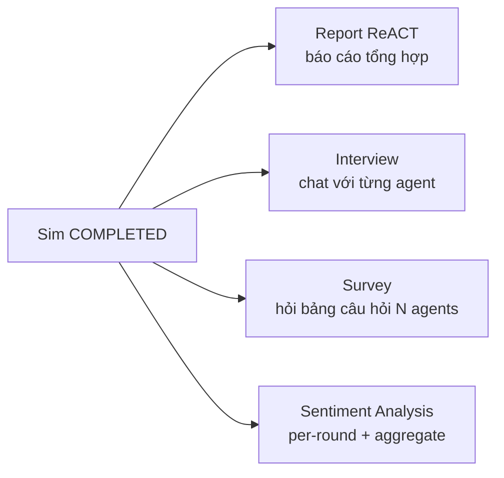
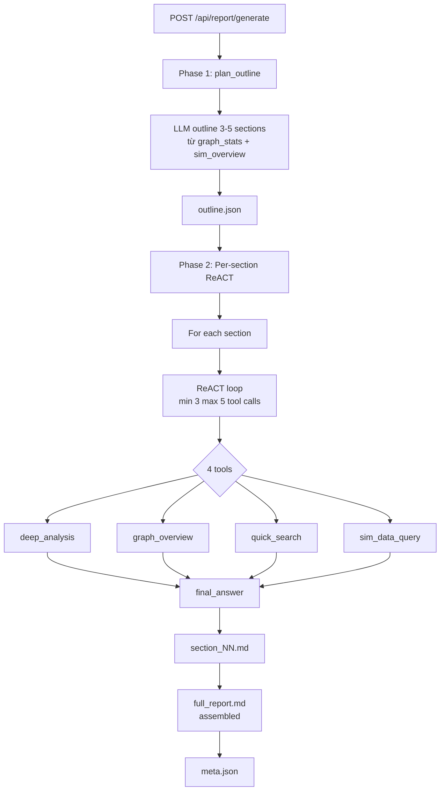
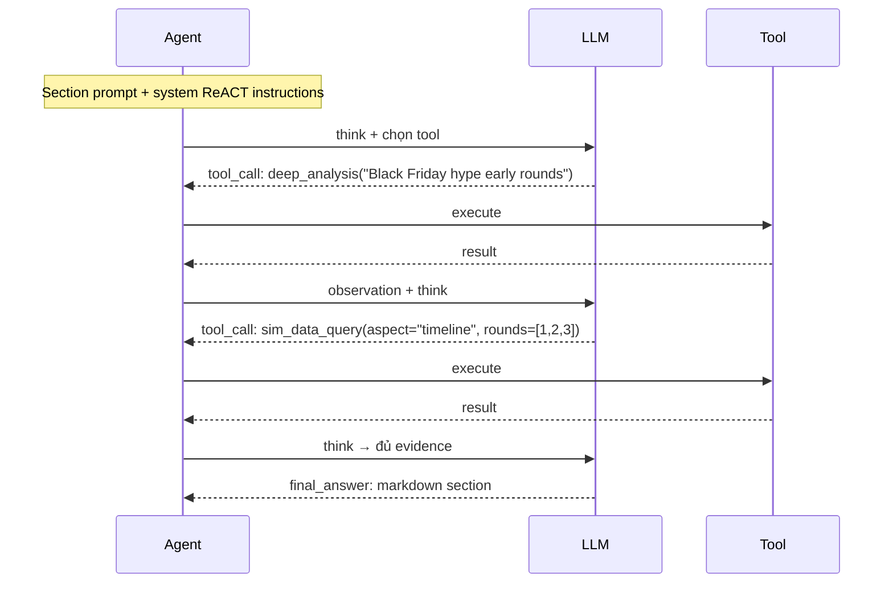
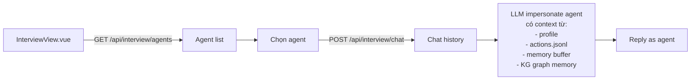
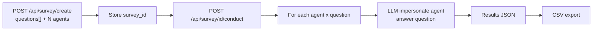
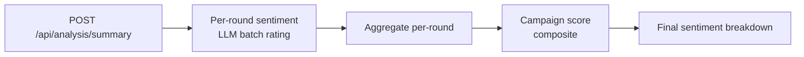
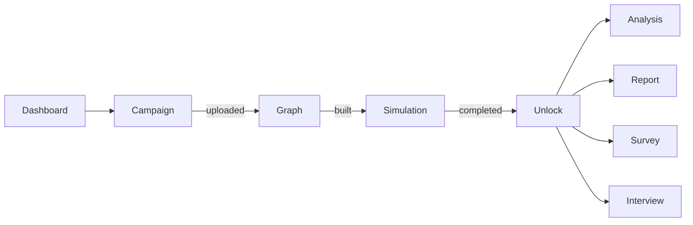

# 06 — Stage 5: Phân tích hậu mô phỏng

Khi simulation kết thúc (`status: COMPLETED`), có **4 luồng phân tích** độc lập mà người dùng có thể kích hoạt:



Nguồn dữ liệu: `data/simulations/{sim_id}/` (SQLite + actions.jsonl) + FalkorDB graph (campaign KG + agent memory KG nếu có).

## 1. Report — ReACT agent

File: [apps/core/app/services/report_agent.py](../apps/core/app/services/report_agent.py)

Hai pha: **Phase 1 — planning outline**, **Phase 2 — per-section ReACT loop**.



### Phase 1 — Outline

[report_agent.py:567-617](../apps/core/app/services/report_agent.py#L567-L617)

LLM nhận:
- `graph_stats`: số entity + edge theo type
- `sim_overview`: total actions + action distribution + round count

→ sinh outline:
```json
{
  "title": "Phân tích chiến dịch Shopee Black Friday 2026",
  "summary": "Chiến dịch đạt 80% KPI dự kiến với hiệu ứng sóng rõ ở round 5-7...",
  "sections": [
    {"idx": 1, "title": "Tổng quan bối cảnh chiến dịch", "description": "..."},
    {"idx": 2, "title": "Phản ứng sớm của community", "description": "..."},
    {"idx": 3, "title": "Lan truyền khủng hoảng rò rỉ dữ liệu", "description": "..."},
    {"idx": 4, "title": "Kết quả và khuyến nghị", "description": "..."}
  ]
}
```

### Phase 2 — ReACT per-section

[report_agent.py:637-752](../apps/core/app/services/report_agent.py#L637-L752)



**Constraints:**
- `MIN_TOOL_CALLS = 3` — bắt buộc 3 tool call trước khi cho phép `final_answer`
- `MAX_TOOL_CALLS = 5`
- Nếu LLM mix `tool_call` + `final_answer` trong cùng response → treat as invalid, retry
- Max 3 retry → chấp nhận nếu đã có ≥ MIN_TOOL_CALLS

### 4 Tools

[report_agent.py:213-218](../apps/core/app/services/report_agent.py#L213-L218)

| Tool | Input | Output | Dùng khi |
|------|-------|--------|----------|
| `deep_analysis(query)` | Free-text query | Aggregated synthesis từ multi-entity graph search + sim actions | Khi cần hiểu sâu một pattern/phenomenon |
| `graph_overview()` | — | All entities + edges + type distribution | Section về bối cảnh |
| `quick_search(keyword)` | Keyword | Fast entity + edge match | Tra cứu nhanh |
| `sim_data_query(aspect, ...)` | Aspect enum | Actions/agents/content/timeline/impact/sentiment | Lấy concrete data cho claims |

**Aspect của `sim_data_query`:**
- `overview`: total counts, action type distribution, active agents
- `actions`: filter theo type + round range
- `agents`: profile + cognitive snapshot của agent cụ thể
- `content`: top posts/comments by engagement
- `timeline`: round-by-round activity
- `impact`: crisis effects (pre/post compare)
- `sentiment`: sentiment score aggregate (nếu đã run sentiment analysis)

### Output

`data/simulations/{sim_id}/report/`:

| File | Format | Mô tả |
|------|--------|-------|
| `meta.json` | JSON | `report_id, sim_id, status, sections_count, total_tool_calls, duration_s` |
| `outline.json` | JSON | Phase 1 output |
| `section_01.md`..`section_NN.md` | Markdown | Phase 2 output mỗi section |
| `full_report.md` | Markdown | Concat tất cả sections + campaign context header |
| `agent_log.jsonl` | JSONL | Timestamped ReACT trace (think / tool_call / observation / final_answer) |

### Endpoints

Core Service ([apps/core/app/api/report.py](../apps/core/app/api/report.py)):

| Method | Path | Mô tả |
|--------|------|-------|
| POST | `/api/report/generate` | Start report. Requires `SIM_COMPLETED`. Returns 202. |
| GET | `/api/report/{sim_id}` | Return `full_report.md` + meta |
| GET | `/api/report/{sim_id}/outline` | Return `outline.json` |
| GET | `/api/report/{sim_id}/section/{idx}` | Return `section_NN.md` |
| GET | `/api/report/{sim_id}/progress` | `{sections_completed, total, current_tool_call}` |
| POST | `/api/report/{sim_id}/chat` | Q&A với report context |

### Chat after report

[report_agent.py:898-945](../apps/core/app/services/report_agent.py#L898-L945)

Khi user đã có report và muốn hỏi thêm ("Agent 42 có đặc điểm gì?"):

- Load `full_report.md` (tối đa 15k chars context)
- Load sim summary data
- Allow max 2 tool calls (thay vì 3-5 như generate)
- Stream answer

## 2. Interview — Chat with individual agent

File: [apps/simulation/api/interview.py](../apps/simulation/api/interview.py), frontend [apps/frontend/src/views/InterviewView.vue](../apps/frontend/src/views/InterviewView.vue)



### Endpoints

| Method | Path | Mô tả |
|--------|------|-------|
| GET | `/api/interview/agents?sim_id=` | List agents với profile snapshot |
| POST | `/api/interview/chat` | `{sim_id, agent_id, message, history[]}` → reply |
| GET | `/api/interview/history?sim_id=&agent_id=` | Full chat history |
| GET | `/api/interview/profile?sim_id=&agent_id=` | Cognitive state + evolved persona |

### Mechanics

LLM được prompt:
> Bạn là [persona]. Bạn vừa tham gia một mô phỏng 24 round. Đây là các action bạn đã làm:
> [top-20 actions từ actions.jsonl]
> Bộ nhớ gần nhất: [last 5 rounds memory]
> Sở thích hiện tại: [top-5 interest keywords]
>
> Trả lời câu hỏi sau như chính bạn: [user message]

Agent "sống" sau sim — có thể giải thích tại sao like post X, comment Y, follow ai.

## 3. Survey — Bulk Q&A

File: [apps/core/app/services/survey_engine.py](../apps/core/app/services/survey_engine.py), [apps/simulation/api/survey.py](../apps/simulation/api/survey.py), frontend [SurveyView.vue](../apps/frontend/src/views/SurveyView.vue)



### Question types

[apps/core/app/models/survey.py](../apps/core/app/models/survey.py):

```json
{
  "question_id": "q1",
  "type": "single_choice | multi_choice | open_ended | likert",
  "text": "Bạn sẽ mua hàng trong Black Friday?",
  "options": ["Có chắc chắn", "Có thể", "Không", "Không biết"]
}
```

### Endpoints

| Method | Path | Mô tả |
|--------|------|-------|
| GET | `/api/survey/default-questions` | Template set câu hỏi |
| POST | `/api/survey/create` | `{sim_id, questions, num_agents, include_sim_context}` |
| POST | `/api/survey/{survey_id}/conduct` | Run — synchronous, timeout 600s |
| GET | `/api/survey/{survey_id}/results` | JSON distribution |
| GET | `/api/survey/{survey_id}/results/export` | CSV |
| GET | `/api/survey/latest?sim_id=` | Latest survey cho sim |

### Include sim context

Flag `include_sim_context=true` → agent được prompt kèm toàn bộ actions + memory của sim. `false` → agent trả lời dựa chỉ trên persona (baseline, chưa bị simulation bias).

So sánh 2 mode = attribution: mức độ simulation thay đổi niềm tin agent.

## 4. Sentiment Analysis

[apps/simulation/api/report.py](../apps/simulation/api/report.py) prefix `/api/analysis`, frontend [AnalysisView.vue](../apps/frontend/src/views/AnalysisView.vue)

### Multi-step pipeline



### Endpoints

| Method | Path | Mô tả |
|--------|------|-------|
| GET | `/api/analysis/simulations` | List sims đã analyze |
| GET | `/api/analysis/cached?sim_id=` | Cached results nếu đã run |
| POST | `/api/analysis/save?sim_id=` | Lưu kết quả |
| GET | `/api/analysis/summary?sim_id=&num_rounds=` | Aggregate summary |
| GET | `/api/analysis/sentiment?sim_id=` | Breakdown: positive/neutral/negative % |
| GET | `/api/analysis/per-round?sim_id=` | Time-series per round |
| GET | `/api/analysis/score?sim_id=&num_rounds=` | Composite campaign score |

### Metrics

- **Engagement**: avg posts + comments per agent per round
- **Sentiment**: percentage positive/neutral/negative comments (LLM rated)
- **Campaign score**: weighted composite — engagement × sentiment × KPI hit rate
- **Time-series**: per-round series để detect inflection points (crisis effects)

Kết quả visualized với Chart.js trong [AnalysisView.vue](../apps/frontend/src/views/AnalysisView.vue).

## 5. Frontend workflow

Pinia store [apps/frontend/src/stores/appStore.js](../apps/frontend/src/stores/appStore.js) enforces sequential unlocking:



Router guard ở [apps/frontend/src/router/index.js](../apps/frontend/src/router/index.js) redirect locked routes → next unlocked. Debug mode: `?debug=1` URL param bypass.

**No persistence**: appStore state cleared on page refresh — fresh state policy ([appStore.js:5-12](../apps/frontend/src/stores/appStore.js#L5-L12)). User phải đi lại workflow.

## 6. Trace code — report generation

```
POST /api/report/generate (sim_id)
  └─ apps/core/app/api/report.py generate()
     ├─ SimManager.assert_status(COMPLETED)
     └─ ReportAgent.generate(sim_id)                 [services/report_agent.py:205]
        ├─ Phase 1: plan_outline                     [:567]
        │  └─ LLMClient.chat_json(OUTLINE_PROMPT)
        │     + graph_stats + sim_overview
        ├─ Write outline.json
        ├─ For each section:
        │  └─ _generate_section_react               [:637]
        │     ├─ ReACT loop (min 3 max 5 tool calls)
        │     │  ├─ LLMClient.chat → tool_call JSON
        │     │  ├─ Execute tool (deep_analysis / graph_overview / quick_search / sim_data_query)
        │     │  ├─ Append observation
        │     │  └─ Loop until final_answer + ≥ MIN_TOOL_CALLS
        │     ├─ Parse final_answer markdown
        │     └─ Write section_NN.md + log agent_log.jsonl
        ├─ Assemble full_report.md
        └─ Write meta.json status: completed
```

## Gotchas

- **Report requires SIM_COMPLETED**: nếu gọi khi status chỉ `RUNNING` → 400 error. Verify qua `/api/sim/status`.
- **ReACT loop infinite**: nếu LLM liên tục skip tool_call → MAX_TOOL_CALLS bảo vệ, nhưng có thể kết thúc ở retry limit với section ngắn. Log rõ trong `agent_log.jsonl`.
- **Sentiment analysis cost**: mỗi comment 1 LLM call → sim 2000 comments = 2000 LLM calls. Default `num_rounds=1` cho summary preview; tăng dần.
- **Interview cho agent có memory khác sau mỗi câu**: cross-question state không persist giữa invocations — mỗi lần chat, agent "resurrect" từ snapshot cuối sim. Muốn chat liên tục → pass `history[]` trong request.
- **Survey timeout**: với 50 agents × 10 câu = 500 LLM calls. Default timeout 600s đủ cho batch concurrent; nếu scale lớn cần queue.
- **FalkorDB graph query slow** khi Report tool `deep_analysis` — với KG > 10k nodes cần index tuning trong Cypher.

Đi tiếp → [reference.md](reference.md)
