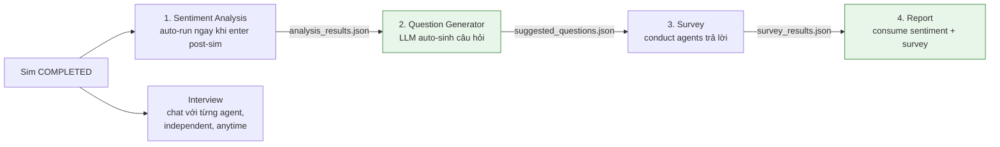

# 06 — Stage 5: Phân tích hậu mô phỏng

Khi simulation kết thúc (`status: COMPLETED`), có **4 luồng phân tích** — chia theo workflow tuyến tính (Sentiment → Survey → Report) cộng với Interview chạy độc lập bất cứ lúc nào.

## Workflow



Flow này khuyến khích user chạy theo thứ tự để Report có evidence phong phú nhất. Với `auto_run_sentiment=true` (default), Report tự chạy Sentiment nếu chưa có cache.

## 4 flows chi tiết

| # | Flow | File docs | Input | Output |
|---|------|-----------|-------|--------|
| 1 | **Sentiment Analysis** | [06a_sentiment_analysis.md](06a_sentiment_analysis.md) | SQLite trace + actions.jsonl | `analysis_results.json` (aggregate + per_round + NSS + campaign_score) |
| 2 | **Survey** | [06b_survey.md](06b_survey.md) | Campaign spec + sim overview + sentiment | `{survey_id}.json` + `survey_results.json` |
| 3 | **Report** | [06d_report.md](06d_report.md) | Sim data + sentiment + survey + KG | `full_report.md` + `evidence.json` + `agent_log.jsonl` |
| — | **Interview** | [06c_interview.md](06c_interview.md) | Agent profile + actions + memory | Per-session chat history |

Survey có 2 mode:
- **Auto-generate questions** — LLM sinh 8-12 câu dựa trên sim context (dùng cho cả user interactive lẫn automated Report pipeline).
- **Manual** — user định nghĩa câu hỏi.

## Endpoints nhanh

```
/api/analysis/summary?sim_id=XX           # Sentiment
/api/survey/generate-questions             # NEW — LLM auto-gen
/api/survey/default-questions              # NEW — canonical defaults
/api/survey/create                         # Tạo survey
/api/survey/{sid}/conduct                  # Run LLM per agent × question
/api/survey/latest?sim_id=XX               # Lấy latest survey kết quả
/api/report/generate                       # Generate báo cáo (auto consume sentiment + survey)
/api/interview/agents?sim_id=XX            # List agents để chat
/api/interview/chat                        # Gửi message, nhận reply
```

## Artifact overview (post-sim)

```
data/simulations/{sim_id}/
├── analysis_results.json          ← Sentiment (cached)
├── suggested_questions.json       ← Generator output (cached)
├── {survey_id}.json               ← Raw survey + responses
├── survey_results.json            ← Aggregated cho quick load
└── report/
    ├── outline.json
    ├── section_01.md..section_NN.md
    ├── full_report.md
    ├── evidence.json              ← EvidenceStore items
    ├── meta.json
    └── agent_log.jsonl
```

## Frontend workflow

Frontend Next.js 16 dùng **campaign-centric IA** — không có pipeline lock. Routes là `/campaigns/[id]/...` với tabs:

```
/campaigns/[campaignId]/
  ├─ ./                  ← Overview
  ├─ ./spec              ← Full spec
  ├─ ./graph             ← KG browser (cache-status tri-state)
  └─ ./sims/[simId]/
      ├─ ./              ← Run (SSE feed + progress)
      ├─ ./analysis      ← Sentiment
      ├─ ./report        ← ReACT report
      ├─ ./survey        ← Composer + results
      └─ ./interview     ← Per-agent chat
```

State qua **Zustand** ([apps/frontend/stores/app-store.ts](../apps/frontend/stores/app-store.ts)) với `persist` middleware → localStorage key `ecosim.app` (recent campaigns + debug flag). UI state ở `ui-store.ts` (sidebar collapsed, command palette, toasts) không persist.

Components đọc persisted state phải gate qua `useHydrated()` ([apps/frontend/hooks/use-hydration.ts](../apps/frontend/hooks/use-hydration.ts)) tránh React hydration mismatch.

## Common gotchas

- **Mọi flow yêu cầu `SIM_COMPLETED`** — nếu gọi khi status `RUNNING` → 400. Verify qua `/api/sim/status`.
- **Sentiment cost**: local RoBERTa model, zero API call cho sentiment scoring. Chi phí chủ yếu ở campaign_score aggregation.
- **Survey cost**: N_agents × N_questions LLM calls qua `LLM_FAST_MODEL_NAME` (fallback main). Mặc định 10 agents × 10 questions = 100 calls (~$0.02 với gpt-4o-mini).
- **Report preflight**: nếu `auto_run_sentiment=true` (default) thì Report tự chạy Sentiment. `auto_run_survey=false` (default) để user kiểm soát chi phí.
- **Sim KG hybrid (Phase 13/15)**: data sống trong FalkorDB sim graph (group_id=sim_id) + sim ChromaDB delta — Report, Interview, Survey đều query từ đây. Zep sim graph deleted khi sim COMPLETED (free quota).

Đi tiếp chi tiết từng flow → [06a](06a_sentiment_analysis.md) · [06b](06b_survey.md) · [06c](06c_interview.md) · [06d](06d_report.md) · [reference](reference.md)
