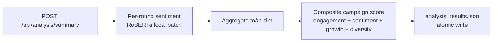

# 06a — Sentiment Analysis

**Scope**: Đo lường phản ứng (tích cực / trung lập / tiêu cực) của agents với chiến dịch + tính campaign effectiveness score tổng hợp.

Đây là flow **đầu tiên** trong workflow hậu mô phỏng — nên chạy trước Survey/Report để cache `analysis_results.json` phục vụ cho Report evidence.

## Multi-step pipeline



Model: HuggingFace `cardiffnlp/twitter-roberta-base-sentiment-latest` (local, zero API cost). Fallback: OpenAI-compatible LLM batch nếu model không load được.

File: [apps/simulation/sentiment_analyzer.py](../apps/simulation/sentiment_analyzer.py) `CampaignReportGenerator`

## Endpoints

Prefix `/api/analysis/*` — routed qua Simulation Service ([apps/simulation/api/report.py](../apps/simulation/api/report.py)).

| Method | Path | Mô tả |
|--------|------|-------|
| GET | `/api/analysis/simulations` | List sims đã có DB |
| GET | `/api/analysis/cached?sim_id=` | Cached results nếu đã run |
| POST | `/api/analysis/save?sim_id=` | Lưu kết quả custom |
| GET | `/api/analysis/summary?sim_id=&num_rounds=` | Full aggregate (quantitative + engagement + sentiment + per_round + score) — cũng auto-save vào `analysis_results.json` |
| GET | `/api/analysis/sentiment?sim_id=` | Chỉ breakdown positive/neutral/negative |
| GET | `/api/analysis/per-round?sim_id=` | Time-series per round |
| GET | `/api/analysis/score?sim_id=&num_rounds=` | Composite score |

## Output format

`data/campaigns/<cid>/sims/<sid>/analysis_results.json` (resolve qua meta.db `sentiment_path`):

```json
{
  "timestamp": "2026-04-24T14:32:01",
  "results": {
    "quantitative": {
      "total_posts": 40,
      "total_comments": 78,
      "total_likes": 152,
      "total_agents": 10,
      "unique_posters": 8,
      "unique_commenters": 7,
      "comments_per_post": 1.95,
      "likes_per_post": 3.8
    },
    "engagement": {
      "engagement_rate": 46.0,
      "rating": "GOOD",
      "total_interactions": 230,
      "agents": 10,
      "rounds": 5
    },
    "sentiment": {
      "distribution": {"positive": 45, "neutral": 20, "negative": 13},
      "nss": 41.0,
      "total_comments": 78,
      "positive_pct": 57.7,
      "neutral_pct": 25.6,
      "negative_pct": 16.7,
      "details": [
        {"comment_id": 87, "content": "...", "sentiment": "positive", "score": 0.92},
        ...
      ],
      "model": "cardiffnlp/twitter-roberta-base-sentiment-latest"
    },
    "per_round": [
      {"round": 1, "posts": 5, "likes": 18, "comments": 12, "sentiment": {...}, "nss": 45.0},
      ...
    ],
    "campaign_score": {
      "campaign_score": 0.72,
      "rating": "GOOD",
      "components": {
        "engagement_norm": 0.68,
        "sentiment_norm": 0.82,
        "growth_norm": 0.65,
        "diversity_norm": 0.75
      },
      "weights": {
        "engagement": 0.40,
        "sentiment": 0.30,
        "growth": 0.20,
        "diversity": 0.10
      }
    }
  }
}
```

## Metrics chi tiết

- **Engagement rate**: `(likes + comments) / (agents × rounds) × 100` — agent-round engagement density.
- **NSS (Net Sentiment Score)**: `(positive% - negative%)` — tiêu biểu cho "mood" toàn sim.
- **Campaign score** (composite):
  - 40% engagement (chuẩn hóa với baseline 50%)
  - 30% sentiment (NSS chuẩn hóa về [0, 1])
  - 20% growth (follower / post growth giữa rounds)
  - 10% diversity (số unique posters / total agents)
  - Rating scale: `0-0.3: POOR`, `0.3-0.5: AVERAGE`, `0.5-0.7: GOOD`, `0.7+: EXCELLENT`

## Tích hợp với Report

[06d — Report](06d_report.md) consume `analysis_results.json` qua tool **`sentiment_result`** (thêm Tier B redesign):
- Extract `nss + per_round + top_positive / top_negative comments`
- Register vào EvidenceStore với `source=SIM`
- Section 5 "Khảo Sát & Phản Hồi Thị Trường" trong default outline cite evidence này

Nếu `auto_run_sentiment=true` (default) và `analysis_results.json` chưa có → Report tự invoke `CampaignReportGenerator.generate_full_report(num_rounds=1)` trong preflight.

## Visualization (Next.js 16)

Frontend [apps/frontend/app/campaigns/[campaignId]/sims/[simId]/analysis/page.tsx](../apps/frontend/app/campaigns/[campaignId]/sims/[simId]/analysis/page.tsx) render Recharts với:

- Stacked bar chart per-round (positive/neutral/negative)
- Header strip `+N =N −N across all rounds` từ `totals`
- 2 column "Top positive" / "Top negative" excerpts (5 mỗi bên, sort by score)

**Normalize adapter** ([apps/frontend/lib/api/analysis.ts](../apps/frontend/lib/api/analysis.ts)): backend trả raw shape `sentiment.distribution + sentiment.details + per_round[].sentiment.*` (nested). Frontend page expect flat shape `{totals, top_positive, top_negative, per_round: [{round, positive, neutral, negative}]}`. Adapter `normalize()`:

- Flatten `per_round[].sentiment.{positive,neutral,negative}` → flat keys
- Sort `sentiment.details` by score → split top 10 positive + top 10 negative
- Map `sentiment.distribution` → `totals`

Khi gọi `getAnalysisCached()` hoặc `runAnalysis()` đều đi qua adapter → UI consistent.

## Dashboard integration

Dashboard summary ([apps/core/app/api/dashboard.py:get_sentiment_timeseries](../apps/core/app/api/dashboard.py)) query meta.db trực tiếp:

```sql
SELECT round_num, AVG(positive), AVG(negative), AVG(neutral)
FROM sentiment_summaries
GROUP BY round_num ORDER BY round_num
```

Column tên `round_num` (không phải `round` — đã fix bug SQL). Output dùng cho landing dashboard chart aggregate cross-sim.

## Gotchas

- **Sentiment model first load**: lần đầu load RoBERTa ~5-10s. Subsequent calls instant.
- **Vietnamese text**: RoBERTa twitter-sentiment hỗ trợ multilingual khá tốt. Nếu fine-tune cần cho tiếng Việt chuyên sâu → swap model trong `CampaignReportGenerator.__init__`.
- **num_rounds fallback**: nếu không truyền hoặc = 1, pipeline vẫn compute full data, chỉ điều chỉnh engagement normalization.
- **Cache**: `analysis_results.json` không auto-invalidate. Nếu sim update (rare), xóa file trước khi rerun.
- **Score `POOR`**: không phải "campaign tồi" — có thể do sim quá ngắn (N_rounds nhỏ) hoặc không có crisis (baseline thấp).

Đi tiếp → [06b — Survey](06b_survey.md) · [06d — Report](06d_report.md)
