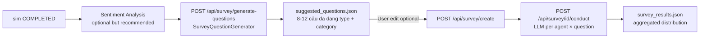

# 06b — Survey

**Scope**: Hỏi bảng câu hỏi cho N agents sau khi sim kết thúc. Agents trả lời in-character dựa trên profile + sim experience. Kết quả phục vụ cả **user analytics** lẫn **Report evidence**.

## Hai mode

### 1. Manual mode (legacy)
User tự định nghĩa 5-10 câu hỏi + `POST /api/survey/create`.

### 2. Auto-generate mode (new)
LLM tự sinh 8-12 câu hỏi dựa trên:
- Campaign spec (name, type, market, KPIs, risks)
- Sim overview (action counts, MBTI distribution, rounds)
- Sentiment summary (nếu đã chạy Sentiment Analysis)
- Crisis events (nếu có)



## Question schema

File: [apps/core/app/models/survey.py](../apps/core/app/models/survey.py)

```python
class QuestionType(str, Enum):
    SCALE_1_10 = "scale_1_10"      # 1-10 rating
    YES_NO = "yes_no"               # yes/no với lý do
    OPEN_ENDED = "open_ended"       # câu trả lời dài
    MULTIPLE_CHOICE = "multiple_choice"

class QuestionCategory(str, Enum):
    GENERAL = "general"
    SENTIMENT = "sentiment"
    BEHAVIOR = "behavior"
    ECONOMIC = "economic"

class ReportSection(str, Enum):
    EXECUTIVE = "executive"           # S1 (hiếm dùng)
    CONTEXT = "context"                # S2: cohorts, demographics
    CONTENT = "content"                # S3: topics, narrative
    KPI = "kpi"                        # S4: measurable behaviors
    RESPONSE = "response"              # S5: crisis reaction, sentiment
    RECOMMENDATION = "recommendation"  # S6: future intent, suggestions

class SurveyQuestion(BaseModel):
    id: str
    text: str
    question_type: QuestionType
    options: List[str] = []
    category: QuestionCategory
    rationale: str = ""        # Tier B+ — lý do câu hỏi quan trọng
    report_section: str = ""   # Tier B++ — tag target Report section
```

## Survey Question Generator

File: [apps/core/app/services/survey_question_generator.py](../apps/core/app/services/survey_question_generator.py)

### Prompt design

LLM nhận:
- Campaign summary (name + type + market + KPIs + risks)
- Sim overview (N agents, N rounds, action type distribution, MBTI distribution)
- Sentiment distribution nếu có
- Crisis events nếu có

LLM sinh 8-12 câu đa dạng với các rules:
- **Question type distribution**: ≥ 20% `scale_1_10`, ≥ 20% `open_ended`, phần còn lại mix
- **Category mandatory theo campaign_type**:

| Campaign type | Mandatory categories |
|---------------|---------------------|
| `marketing` | general + sentiment + behavior |
| `pricing` | economic + behavior + sentiment |
| `policy` | sentiment + behavior |
| `product_launch` | behavior + sentiment |
| `expansion` | general + economic |
| `other` | general + sentiment |

- **Report Section coverage** (Tier B++): mỗi câu hỏi PHẢI tag `report_section` ∈
  `{executive, context, content, kpi, response, recommendation}`. Cần cover ≥ 3 sections
  trong mandatory list `{context, content, response, recommendation}` — để mỗi Report
  section có data support.
- **Crisis-aware**: nếu có `crisis_events`, force thêm 1-2 câu tag `report_section="response"` về crisis reaction
- **Language**: auto-detect từ `campaign_spec.market` — VN → Vietnamese, EN → English
- **Options**: `scale_1_10` → `["1","2",...,"10"]`; `yes_no` → `["Yes","No"]`; `open_ended` → `[]`
- **Forbidden**: KHÔNG hỏi về revenue/doanh thu/orders/đơn hàng/giá/ROI — sim không
  trace những thứ này, Report không cite được (không measurable).

### Validation

- Pydantic validate từng item match `SurveyQuestion` schema
- LLM retry 1 lần với stricter prompt nếu fail
- Fallback: `DEFAULT_QUESTIONS` (5 câu cố định) nếu LLM hỏng toàn bộ

### Output example

```json
{
  "sim_id": "sim_abc",
  "count": 10,
  "saved_to": "data/simulations/sim_abc/suggested_questions.json",
  "questions": [
    {
      "id": "q1",
      "text": "Bạn đánh giá mức độ ấn tượng của chiến dịch Black Friday 2026? (1-10)",
      "question_type": "scale_1_10",
      "options": ["1", "2", ..., "10"],
      "category": "sentiment",
      "rationale": "Đo directly brand impact, so sánh được với sentiment analysis aggregate"
    },
    {
      "id": "q2",
      "text": "Sau khi biết tin 'Shopee tăng phí sàn 10%', bạn phản ứng thế nào?",
      "question_type": "open_ended",
      "options": [],
      "category": "behavior",
      "rationale": "Thu thập textual reaction tới crisis event đã inject"
    },
    ...
  ]
}
```

## Endpoints

Prefix `/api/survey/*` — routed qua Simulation Service ([apps/simulation/api/survey.py](../apps/simulation/api/survey.py)) và Core Service ([apps/core/app/api/survey.py](../apps/core/app/api/survey.py)).

| Method | Path | Mô tả |
|--------|------|-------|
| GET | `/api/survey/default-questions` | **NEW** — canonical default 5 câu (category-valid enum) |
| POST | `/api/survey/generate-questions` | **NEW** — LLM sinh 8-12 câu theo sim context |
| POST | `/api/survey/create` | `{sim_id, questions}` — questions optional (default = DEFAULT_QUESTIONS) |
| POST | `/api/survey/{sid}/conduct` | Run — synchronous, timeout 600s |
| GET | `/api/survey/{sid}/results` | JSON distribution |
| GET | `/api/survey/{sid}/results/export` | Export JSON (download) |
| GET | `/api/survey/latest?sim_id=` | Latest survey cho sim |

### `/api/survey/generate-questions` request

```json
{
  "sim_id": "sim_abc",
  "count": 10,
  "categories": null,          // optional whitelist; null = all relevant
  "use_sentiment": true,       // include analysis_results.json
  "use_crisis": true           // force crisis reaction questions
}
```

### `/api/survey/create` với generated questions

Frontend flow: user gọi `/generate-questions` → preview modal → user edit optional → pass `questions` array vào `/create`.

## Conduct flow — shared 2-phase interview

File: [apps/simulation/api/survey.py](../apps/simulation/api/survey.py) `conduct_survey`

Survey dùng chung primitives với Interview / Report — `load_context_blocks` + `build_response_prompt` từ [libs/ecosim-common/src/ecosim_common/agent_interview.py](../libs/ecosim-common/src/ecosim_common/agent_interview.py).

Pipeline mỗi câu hỏi × mỗi agent:

1. **Rule-based intent mapping** (không gọi LLM): `_map_question_to_intent(q)` dựa `category` + `report_section` → canonical interview intent:

   | question.category / report_section | → intent | blocks loaded |
   |-------------------------------------|----------|---------------|
   | `sentiment` / `response` | `opinion_campaign` | profile_basic + persona + campaign + interests |
   | `behavior` / `content` | `motivation` | profile_basic + persona + interests + recent_actions |
   | `report_section=kpi` | `projection` | profile_basic + persona + interests + recent_actions |
   | `report_section=context` | `identity` | profile_basic + persona + interests |
   | `report_section=recommendation` | `projection` | — same — |
   | else | `general` | profile_basic + persona + activity_summary |

2. **Context block cache per (agent, intent)** — nhiều câu hỏi share 1 intent → chỉ load blocks 1 lần mỗi agent. Giảm redundant dispatch cost.
3. **`build_response_prompt`** compose English scaffold + selective blocks + `extra_rules=[SURVEY_JSON_FORMAT_RULE]` (appends Rule 8 — format instruction).
4. **Phase 3 LLM call** dùng `LLM_FAST_MODEL_NAME` (fallback `LLM_MODEL_NAME`). User message = `"Survey question: {q.text}\nFormat: {format_hint}"`. System prompt giữ in-character; format hint cho biết scale/yes_no/mc structure.

**Persona**: `build_response_prompt` tự ưu tiên `persona_evolved` qua `ctx_persona` loader — consistent với Interview/Report.

Cost: `N_agents × N_questions` LLM calls nhưng ở fast model, selective context (~800 tokens/call vs ~1500 tokens/call cũ). 10 agents × 10 questions ≈ $0.005 với `gpt-4o-mini`.

Response rows thêm 2 field mới: `intent` (classified intent) + `report_section` (nếu question có tag) cho phép Report audit tại sao block này được load.

## Result aggregation

File: [apps/simulation/api/survey.py:137](../apps/simulation/api/survey.py#L137) `_aggregate_results`

Per question type:
- **scale_1_10** → `average, min, max, distribution {1: cnt, 2: cnt, ...}`
- **yes_no** → `distribution {"YES": N, "NO": M, "MAYBE": K}` (extractor regex)
- **multiple_choice** → `distribution {"Option A": cnt, ...}`
- **open_ended** → `key_themes` (top-5 words, stop word filtered)

Cross-analysis: matrix `agent × question` cho frontend table view.

## Artifact paths

```
data/simulations/{sim_id}/
├── suggested_questions.json     ← generator output (cached)
├── {survey_id}.json             ← raw survey + all responses
└── survey_results.json          ← aggregated (fast load, preferred)
```

## Tích hợp với Report

[06d — Report](06d_report.md) consume qua tool **`survey_result(survey_id?)`**:
- Empty `survey_id` → load latest qua `_find_latest_survey_file(sim_dir)`
- Extract distribution per closed question + key_themes per open
- Register EvidenceStore: mỗi question notable → 1 evidence item
- Section 5 cite evidence này với `(EV-n)` anchors

## Include sim context flag

`Survey.include_sim_context=true` (default) → agent được prompt kèm recent actions + memory của sim. `false` → agent trả lời chỉ dựa trên persona (baseline).

**So sánh 2 mode = attribution measurement**: mức độ simulation thay đổi niềm tin agent. Run cùng questions 2 lần, diff = sim bias.

## Gotchas

- **Survey cost scaling**: 50 agents × 15 questions = 750 calls. Default timeout 600s đủ cho batch concurrent; scale lớn cần queue.
- **Vietnamese extractor**: `_extract_yes_no` có list từ đồng nghĩa — nếu agent trả lời từ mới (vd "Okela"), fallback "MAYBE". Extend list nếu thấy sai lệch.
- **Open-ended key themes**: simple word frequency, không dùng KeyBERT. Để nâng cao, swap sang KeyBERT trong `_aggregate_results`.
- **Generator LLM fail**: fallback về DEFAULT_QUESTIONS (5 câu cố định). Log warning rõ trong `sim-svc.survey`.
- **`rationale` field**: chỉ filled cho auto-gen questions. Manual questions để empty — OK.

Đi tiếp → [06c — Interview](06c_interview.md) · [06d — Report](06d_report.md)
