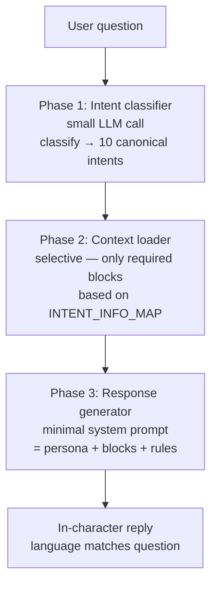

# 06c — Interview

**Scope**: User chat interactively với từng agent. Agent "sống" sau simulation — có thể giải thích tại sao like post X, comment Y, follow ai.

Interview **độc lập** với các flow khác — có thể chạy bất cứ lúc nào sau sim COMPLETED, không yêu cầu Sentiment/Survey cached.

## Flow — 2-phase architecture (Tier B++ redesign)

Thay vì nhét TẤT CẢ dữ liệu (posts, comments, likes, timeline, KG, ...) vào 1 system prompt lớn — Interview giờ chạy qua 3 phase:



File: [apps/simulation/api/interview.py](../apps/simulation/api/interview.py) · frontend [InterviewView.vue](../apps/frontend/src/views/InterviewView.vue)

### Phase 1 — Intent classifier

Small LLM call (max_tokens=150, temperature=0.1) với `INTENT_CLASSIFIER_PROMPT` (English) — classify user question thành 1 trong 10 canonical intents:

| Intent | Ví dụ |
|--------|-------|
| `identity` | "Bạn là ai?" / "Who are you?" |
| `recall_posts` | "Bạn đã đăng những gì?" |
| `recall_comments` | "Bạn đã bình luận gì?" |
| `recall_specific` | "Bạn có post về Shopee không?" |
| `opinion_campaign` | "Bạn nghĩ gì về chiến dịch?" |
| `opinion_crisis` | "Phản ứng của bạn khi rò rỉ dữ liệu?" |
| `social_network` | "Bạn follow ai?" |
| `motivation` | "Tại sao bạn like post đó?" |
| `projection` | "Lần sau bạn sẽ làm gì?" |
| `general` | catch-all |

Output JSON:
```json
{"intent": "recall_posts", "confidence": 0.92, "language": "vi",
 "needs_specific_topic": false, "topic_hint": ""}
```

Nếu LLM fail → fallback `"general"` + confidence 0.0 (graceful degradation).

### Phase 2 — Context loader (selective)

`INTENT_INFO_MAP` maps mỗi intent → danh sách blocks cần load:

| Intent | Blocks loaded |
|--------|---------------|
| `identity` | profile_basic + persona + interests |
| `recall_posts` | profile_basic + posts |
| `recall_comments` | profile_basic + comments |
| `recall_specific` | profile_basic + posts + comments + likes |
| `opinion_campaign` | profile_basic + persona + campaign + interests |
| `opinion_crisis` | profile_basic + persona + crisis + recent_actions |
| `social_network` | profile_basic + graph_context |
| `motivation` | profile_basic + persona + interests + recent_actions |
| `projection` | profile_basic + persona + interests + recent_actions |
| `general` | profile_basic + persona + activity_summary |

Mỗi block có loader function riêng (`_ctx_profile_basic`, `_ctx_posts`, `_ctx_comments`, ...). Output tiếng Anh section header + data giữ ngôn ngữ gốc (Vietnamese persona text giữ Vietnamese).

Lợi ích:
- System prompt ngắn hơn **~3-5×** so với cũ (1.3k chars vs 5-10k)
- Topic filter: `recall_specific` intent có `topic_hint` từ classifier → filter posts/comments theo keyword
- Cost giảm: intent classifier small call (~150 tokens) + main response với context nhỏ thay vì 2k-5k tokens monolithic

### Phase 3 — Response generator

`INTERVIEW_RESPONSE_SYSTEM_PROMPT` (English scaffolding) composer:

```
You are role-playing as {name}, a participant in a social-media campaign
simulation. You are being interviewed. Stay strictly in character.

=== YOUR IDENTITY ===
{profile_basic}

=== YOUR PERSONA ===
{persona}

=== DETECTED INTENT ===
Classified intent: {intent}
User question language: {language}

=== RELEVANT CONTEXT ===
{context_blocks}   ← only loaded blocks

=== RESPONSE RULES ===
1. Answer ONLY based on the data shown above. No fabrication.
2. Match user's language (Vietnamese if question is Vietnamese, English if English).
3. Speak in first person. Reflect MBTI + stance naturally, don't announce them.
4. Quote own content verbatim when recalling.
5. If missing info, say so honestly.
6. Keep to 2-5 sentences unless asked for a list.
7. No (EV-N) tags — conversation, not report.
```

Main LLM call: `max_tokens=500, temperature=0.7`, history cap 10 turns.

**Model routing — fast model for all 3 phases**: cả classifier (Phase 1) lẫn response (Phase 3) đều route qua `LLM_FAST_MODEL_NAME` (fallback về `LLM_MODEL_NAME` nếu env không set). Phase 3 không cần reasoning model mạnh vì context đã được selective-load; fast model (vd `gpt-4o-mini`, `llama-3.1-8b-instant`, Ollama `llama3.1:8b`) đủ để in-character reply. Response JSON trả thêm field `intent.model_used` cho audit.

### Shared primitives — reuse cho Survey + Report

Cả `INTERVIEW_INTENTS`, `INTENT_INFO_MAP`, `INTENT_CLASSIFIER_PROMPT`, `classify_intent`, `load_context_blocks`, `build_response_prompt`, `INTERVIEW_RESPONSE_SYSTEM_PROMPT`, 9 `ctx_*` builtin loaders đều sống ở [libs/ecosim-common/src/ecosim_common/agent_interview.py](../libs/ecosim-common/src/ecosim_common/agent_interview.py) — shared module dùng chung bởi:

- `apps/simulation/api/interview.py` (chat interactive — endpoint này)
- `apps/simulation/api/survey.py` (bulk Q&A — xem [06b](06b_survey.md))
- `apps/core/app/services/report_agent.py` tool `interview_agents` (xem [06d](06d_report.md))

Sim-specific loaders (`campaign`, `crisis`) cần `SIM_DIR` filesystem access nên giữ local ở `interview.py` và merge vào loaders registry qua closure (`_sim_loaders_registry(sim_id)`). Survey/Report không cần 2 loaders này nên chỉ dùng `BUILTIN_LOADERS`.

### Response format

```json
{
  "agent_name": "Nguyễn Thị Lan",
  "response": "Mình có post về Black Friday hôm round 2, nội dung...",
  "intent": {
    "classified_as": "recall_specific",
    "confidence": 0.92,
    "language": "vi",
    "context_blocks_loaded": ["profile_basic", "posts", "comments", "likes"],
    "model_used": "gpt-4o-mini"
  },
  "context_stats": {...}
}
```

## Endpoints

| Method | Path | Mô tả |
|--------|------|-------|
| GET | `/api/interview/agents?sim_id=` | List agents với profile snapshot |
| POST | `/api/interview/chat` | `{sim_id, agent_id, message, history[]}` → reply |
| GET | `/api/interview/history?sim_id=&agent_id=` | Full chat history (nếu persist) |
| GET | `/api/interview/profile?sim_id=&agent_id=` | Cognitive state + evolved persona |

## Mechanics

LLM được prompt:
```
Bạn là [persona_evolved || persona]. 
Bạn vừa tham gia một mô phỏng {N_rounds} round.

Đây là các action bạn đã làm:
[top-20 actions từ actions.jsonl]

Bộ nhớ gần nhất:
[last 5 rounds memory summary]

Sở thích hiện tại:
[top-5 interest keywords từ drift tracker]

Graph context (nếu có):
[social relationships từ FalkorDB ecosim_agent_memory]

Trả lời câu hỏi sau như chính bạn: [user message]
```

## Tier B persona_evolved fix (H4)

**Quan trọng**: sau mỗi reflection cycle (mặc định 3 rounds), `profiles.json` được ghi thêm 2 field:
- `persona_evolved`: base persona + insights tích luỹ từ reflection
- `reflection_insights`: list str (max 3 insights per agent)

Interview code ưu tiên `persona_evolved` trước `persona` gốc để câu trả lời nhất quán với behavior agent đã thực hiện trong rounds cuối:

```python
persona = (
    profile.get("persona_evolved")
    or profile.get("persona", "")
    or profile.get("user_char", "")
)
```

Nếu dùng `persona` gốc khi interview thì agent sẽ "quên" insights mình đã learn — mâu thuẫn với posts đã tạo.

## FalkorDB graph memory

Nếu simulation enable `graph_cognition=true`, Interview có thể query social context:
- "Bạn follow ai trong sim?" → query `(Agent)-[:FOLLOWS]->(Agent)` trong `ecosim_agent_memory` database
- "Bạn đã tương tác với ai nhiều nhất?" → aggregate `ENGAGED_WITH` edges

Data giữ nguyên sau sim COMPLETED — đó là design intent cho post-simulation analytics.

## Conversation state

Interview chat **stateless per call** — mỗi request là 1 independent LLM call. Muốn multi-turn → client pass `history[]` trong request body:

```json
{
  "sim_id": "sim_abc",
  "agent_id": 5,
  "message": "Tại sao bạn like post của anna3?",
  "history": [
    {"role": "user", "content": "Bạn thường post về gì?"},
    {"role": "assistant", "content": "Mình hay chia sẻ về..."},
    ...
  ]
}
```

Limit history 10 messages (cuộc hội thoại đầu cắt nếu dài).

## So sánh với Survey

| Aspect | Interview | Survey |
|--------|-----------|--------|
| Số agent mỗi call | 1 | N (bulk) |
| Interactive | ✓ (multi-turn) | ✗ (1 câu hỏi = 1 LLM call) |
| Evidence cho Report | ✗ không consume | ✓ qua `survey_result` tool |
| Cost | Low per session | High (N_agents × N_questions) |
| Use case | Debug cognitive traits, qualitative exploration | Quantitative measurement |

Interview hữu ích khi bạn muốn hiểu **tại sao** một agent hành xử như vậy — ví dụ khi thấy anomaly trong cohort analysis của Report.

## Gotchas

- **Cross-question state không persist**: mỗi POST là independent. Muốn chat liên tục phải pass `history[]`.
- **Agent có thể "hallucinate"**: Vì persona evolved + memory context có thể không cover mọi chi tiết, agent bịa thêm. Nhưng đây là feature, không phải bug — mô phỏng sense of self.
- **No recording**: history không auto-save. Client (frontend/Postman) tự lưu nếu cần replay.
- **persona_evolved cần reflection enabled**: nếu `enable_reflection=false` trong sim config, `persona_evolved` = `persona` gốc. Interview vẫn hoạt động bình thường.

Đi tiếp → [06a — Sentiment](06a_sentiment_analysis.md) · [06b — Survey](06b_survey.md) · [06d — Report](06d_report.md)
