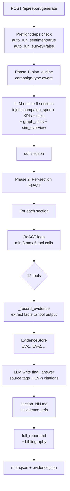
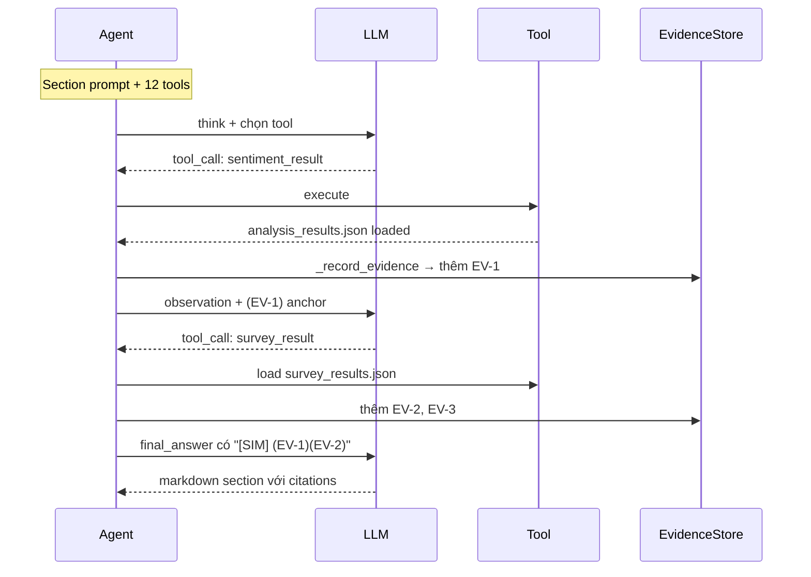

# 06d — Report

**Scope**: ReACT agent 2-phase sinh báo cáo markdown toàn diện. Consume output của Sentiment + Survey + KG + raw sim data qua 12 tools, cite evidence bằng anchor `(EV-n)`.

File: [apps/core/app/services/report_agent.py](../apps/core/app/services/report_agent.py)

## Workflow



## Phase 0 — Preflight dependency check (Tier B redesign new)

`ReportAgent.generate()` chạy `_preflight_deps()` ngay sau load sim data:

```python
deps = {"sentiment": "missing|cached|auto_generated|failed", "survey": "missing|cached"}
```

- **Sentiment**: nếu `auto_run_sentiment=true` (default) và `analysis_results.json` chưa có → auto-invoke `CampaignReportGenerator.generate_full_report(num_rounds=1)` + save
- **Survey**: nếu `auto_run_survey=false` (default) → chỉ log warning nếu thiếu. User explicit opt-in qua `auto_run_survey=true` mới trigger auto-gen questions + conduct (tốn chi phí cao)

Kết quả preflight log vào `agent_log.jsonl` + add 2 evidence items "deps_status" vào EvidenceStore (để bibliography minh bạch).

## Phase 1 — Outline (campaign-type aware)

[report_agent.py `plan_outline` + `PLAN_USER_PROMPT`](../apps/core/app/services/report_agent.py)

LLM nhận:
- `campaign_name, campaign_type, market, kpis, identified_risks`
- `graph_stats`: entity + edge count theo type
- `sim_overview`: total actions + action distribution + round count + MBTI distribution

Outline **thích nghi với campaign_type**:
- `marketing` → engagement, share-of-voice, sentiment, brand lift
- `pricing` → price sensitivity, cohort response, competitor reaction
- `policy` → stance shift, polarization, regulation narrative
- `product_launch` → adoption curve, early adopter vs laggard, feedback themes

Default outline (khi LLM fail) **6 sections**:

| # | Section | Tool suggestions |
|---|---------|------------------|
| 1 | Executive Summary | (tổng hợp, không tool) |
| 2 | Bối Cảnh & Đối Tượng | graph_overview, sim_data_query(overview), agent_cohort_analysis |
| 3 | Diễn Biến & Nội Dung Chính | sim_data_query(timeline), topic_cluster, narrative_quotes |
| 4 | Đánh Giá KPI & Engagement | kpi_check, influencer_detection, sim_data_query(actions) |
| 5 | **Khảo Sát & Phản Hồi Thị Trường** | **sentiment_result, survey_result**, crisis_impact_timeline, narrative_quotes |
| 6 | Khuyến Nghị Chiến Lược | (tổng hợp từ sections trước) |

Section 5 thay thế "Tác Động Biến Cố" cũ — rebrand để bao gồm survey results + sentiment.

## Phase 2 — ReACT per-section với Evidence



**Constraints:**
- `MIN_TOOL_CALLS = 3` — bắt buộc 3 tool call trước `final_answer`
- `MAX_TOOL_CALLS = 5`
- Mỗi tool result → `_record_evidence` extract facts → anchors `(EV-n)` inject vào observation
- LLM phải cite anchors trong `final_answer` để evidence traceable

## 13 Tools

[report_agent.py `TOOL_DEFS`](../apps/core/app/services/report_agent.py)

| Tool | Params | Output | Dùng cho |
|------|--------|--------|----------|
| `deep_analysis` | `{query}` | Multi-entity graph synthesis + relevant sim actions | Exploration |
| `graph_overview` | `{}` | Entities + edges + type distribution | Bối cảnh |
| `quick_search` | `{keyword}` | Entity + edge keyword match | Tra cứu nhanh |
| `sim_data_query` | `{aspect}` | Aspect-specific stats | Claim data |
| `kpi_check` | `{}` | **Pre-classify** measurable/unmeasurable KPIs. Unmeasurable (revenue/orders/conversion/...) auto-flagged; LLM chỉ score measurable. | Section KPI |
| `influencer_detection` | `{top_k}` | Top-K agents theo log-weighted engagement | Section stakeholders |
| `topic_cluster` | `{top_k}` | KeyBERT topics + share of voice per round | Section content |
| `crisis_impact_timeline` | `{crisis_id?}` | Per-crisis pre/post engagement + samples | Section crisis |
| `agent_cohort_analysis` | `{segment_by}` | Cohort breakdown | Section segments |
| `narrative_quotes` | `{theme, k}` | k quotes diverse agents kèm post_id/round | Content-heavy sections |
| `sentiment_result` | `{}` | Load `analysis_results.json` → aggregate + NSS + per-round + top ± samples | Section 5 |
| `survey_result` | `{survey_id?}` | Latest hoặc specific survey → **grouped by report_section** + distribution per question | Section 5 |
| **`interview_agents`** | `{question, sample_pct=20, stratify_by="random\|mbti", max_agents=10}` | **Real-time** phỏng vấn X% agents in-character, trả quotes + themes | Section 3 + 5 qualitative |

**Hint khi sparse content** (Tier B C1 fix): `sim_data_query(content)` trả `_hint` gợi ý fallback nếu posts+comments < 5.

## Anti-hallucination (Tier B++ redesign)

Report LLM có xu hướng bịa số (doanh thu / đơn hàng / %khách hàng hài lòng) khi KPI đề cập metric sim KHÔNG trace. 3 lớp bảo vệ:

### Lớp 1 — `SIM_DATA_CAPABILITIES` inject vào system prompt

Prompt section giờ có block liệt kê chính xác:
- **Sim CÓ trace**: actions (post/comment/like/follow), sentiment RoBERTa, cognitive (MBTI/interests/memory), KG entities, crisis events
- **Sim KHÔNG trace**: revenue, orders, transactions, CTR, ROI, pricing, inventory, satisfaction score (trừ khi từ survey_result/interview_agents), brand lift, market share

Rule: nếu metric thuộc "KHÔNG trace" → verdict='unmeasurable', không bịa số.

### Lớp 2 — `_tool_kpi_check` pre-classification

Trước khi LLM score, mỗi KPI được keyword-classify vào 1 trong 6 category unmeasurable:
- `revenue` — doanh thu / VNĐ / tỷ / triệu đồng
- `orders` — đơn hàng / transactions / giao dịch
- `conversion` — CTR / ROI / ROAS / funnel
- `pricing_inventory` — giá bán / inventory / tồn kho
- `satisfaction_external` — khách hàng hài lòng / NPS / brand lift
- `market_share` — thị phần / competitor metrics

KPI match → auto-verdict `unmeasurable` + note "Sim không trace [category]". Chỉ measurable KPIs được pass vào LLM — giảm cơ hội bịa số.

### Lớp 3 — `_scan_fabrication` post-generation warning

Sau `final_answer` parsed, regex detect pattern nghi bịa:
- `\d+[.,]\d+\s*(VNĐ|VND|USD|triệu|tỷ|đồng)`
- `\d{3,}\s*(đơn hàng|orders|giao dịch)`
- `\d+%\s*(khách hàng|customers)\s+hài lòng`
- `(ROI|CTR|ROAS)\s+(đạt|reached)\s+\d+`

Match + KHÔNG có `(EV-N)` anchor trong ±80 chars → log `fabrication_warning` vào `agent_log.jsonl`. Scanner **không auto-remove content** (risk false positive) — chỉ flag để review.

## Interview Agents — qualitative depth (shared 2-phase)

`interview_agents` tool cho phép Report phỏng vấn real-time một sample agents trong sim. Tool **dùng chung primitives** với Interview/Survey ở [libs/ecosim-common/src/ecosim_common/agent_interview.py](../libs/ecosim-common/src/ecosim_common/agent_interview.py):

1. **Phase 1 — classify intent 1 lần per tool call** (fast model, JSON). Question cố định across sampled agents nên chỉ classify một lần.
2. **Phase 2 — `load_context_blocks`** per agent theo `INTENT_INFO_MAP[intent]` với `BUILTIN_LOADERS` (không có `campaign`/`crisis` — 2 loader đó chỉ có ở Sim service vì cần `SIM_DIR`; Report đã có tool `sim_data_query` + `crisis_impact_timeline` cho scope đó).
3. **Phase 3 — `build_response_prompt`** + fast-model call (`LLM_FAST_MODEL_NAME`, fallback `LLM_MODEL_NAME`). In-character reply 1-3 câu.

```
<tool_call>{
  "name": "interview_agents",
  "parameters": {
    "question": "Điều gì khiến bạn quan tâm tới chiến dịch?",
    "sample_pct": 20,
    "stratify_by": "mbti",
    "max_agents": 10
  }
}</tool_call>
```

Với `N_agents=10, sample_pct=20` → 2 Phase-3 LLM calls + 1 Phase-1 classifier call. `stratify_by="mbti"` lấy 1 agent mỗi MBTI type hiện có để đảm bảo diversity. Hard cap `max_agents=20` để control cost.

Output JSON:
```json
{
  "question": "...",
  "sample_size": 2, "total_agents": 10,
  "stratify_by": "mbti",
  "intent": "motivation",
  "intent_confidence": 0.88,
  "language": "vi",
  "context_blocks_loaded": ["profile_basic", "persona", "interests", "recent_actions"],
  "model_used": "gpt-4o-mini",
  "responses": [
    {"agent_id": 3, "agent_name": "...", "mbti": "ENFP",
     "age": 28, "gender": "female", "answer": "..."},
    ...
  ],
  "themes": ["deal", "freeship", "shopee"]
}
```

Evidence: mỗi response → EvidenceItem(source=**MEM**, quote=answer, ref chứa `agent_id`, `question`, **`intent`**). Summary evidence chính cũng chứa intent + `context_blocks_loaded` cho audit. Default outline Section 3 + Section 5 có suggestion dùng tool này để bổ sung voice-of-agent.

**Note**: Report section writer (outline + per-section ReACT loop) vẫn dùng `LLM_MODEL_NAME` (main model) vì cần reason over evidence + tool calls. Chỉ 3 Phase-3 answer generation trong interview_agents route qua fast model.

## Source tags + Evidence citations

Mỗi claim phải có **source tag**:
- `[SIM]` dữ liệu mô phỏng (actions, posts, comments, sentiment, survey)
- `[KG]` knowledge graph (entities + relationships)
- `[SPEC]` campaign spec (KPIs, stakeholders, risks)
- `[CALC]` tính toán
- `[MEM]` agent memory / reflection insights

Mỗi số liệu cụ thể phải có **evidence anchor** `(EV-n)` resolve ở bibliography cuối báo cáo.

Ví dụ câu chuẩn (Section 5):
```
Sentiment aggregate cho thấy 58% positive, 17% negative (NSS=+41) [SIM] (EV-4). 
Survey Q3 "Cảm nhận chung về chiến dịch" có 72% trả lời "Rất tích cực"/"Tích cực" [SIM] (EV-7), 
xác nhận xu hướng của sentiment analysis.
> "Deal Shopee năm nay quá đỉnh!" — Nguyễn Thị Lan (Round 4) (EV-9)
```

Bibliography cuối:
```
## Nguồn dữ liệu tham chiếu
- [EV-4] SIM: Sentiment: 58% pos, 17% neg (NSS=+41, n=78 comments) (aspect=sentiment)
- [EV-7] SIM: Survey Q3 'Cảm nhận chung': 72% positive responses (survey_id=survey_abc)
- [EV-9] SIM: Quote [create_comment] by Nguyễn Thị Lan @ round 4 — "Deal Shopee năm nay quá đỉnh!"
```

## Output artifacts

`data/simulations/{sim_id}/report/`:

| File | Format | Mô tả |
|------|--------|-------|
| `meta.json` | JSON | `report_id, sim_id, status, sections_count, total_tool_calls, total_evidence, evidence_refs_per_section, duration_s` |
| `outline.json` | JSON | Phase 1 output (có `suggested_tools`) |
| `section_01.md`..`section_NN.md` | Markdown | Phase 2 output, có `[SIM]`/`(EV-n)` |
| `full_report.md` | Markdown | Metadata block + sections + bibliography |
| `evidence.json` | JSON | Tất cả EvidenceItem (source, summary, quote, ref, raw) |
| `agent_log.jsonl` | JSONL | ReACT trace + `evidence_added` per tool call |
| `progress.json` | JSON | Runtime progress |

## Endpoints

Core Service ([apps/core/app/api/report.py](../apps/core/app/api/report.py)):

| Method | Path | Mô tả |
|--------|------|-------|
| POST | `/api/report/generate` | `{sim_id, campaign_id?, auto_run_sentiment=true, auto_run_survey=false, survey_id?}`. Returns 200 với report_path |
| GET | `/api/report/{sim_id}` | `full_report.md` + meta |
| GET | `/api/report/{sim_id}/outline` | `outline.json` |
| GET | `/api/report/{sim_id}/section/{idx}` | `section_NN.md` |
| GET | `/api/report/{sim_id}/progress` | `{sections_completed, total, current_tool_call}` |
| POST | `/api/report/{sim_id}/chat` | Q&A với report context |

## Trace code đầy đủ

```
POST /api/report/generate (sim_id, auto_run_sentiment, auto_run_survey, survey_id)
  └─ apps/core/app/api/report.py generate()
     ├─ SimManager.assert_status(COMPLETED)
     └─ ReportAgent.generate(sim_id, auto_run_sentiment=true, ...)
        ├─ _load_sim_data (profiles.json preferred, fallback .csv)
        ├─ Load memory_stats.json nếu có (Tier B artifact)
        ├─ _load_campaign_spec (kpis, risks)
        ├─ EvidenceStore() reset
        ├─ _preflight_deps:
        │  ├─ Sentiment: check analysis_results.json → auto-run nếu thiếu
        │  └─ Survey: check latest → log only (no auto-run unless explicit)
        ├─ Phase 1: plan_outline (campaign-type aware)
        │  └─ LLMClient.chat_json(PLAN_USER_PROMPT có campaign_type + kpis)
        ├─ Write outline.json
        ├─ For each section (6 sections default):
        │  └─ _generate_section_react
        │     ├─ ReACT loop (min 3 max 5 tool calls)
        │     │  ├─ LLMClient.chat → tool_call JSON
        │     │  ├─ Execute tool (12 tools available, bao gồm sentiment_result + survey_result)
        │     │  ├─ _record_evidence → EvidenceStore.add → anchors (EV-n)
        │     │  ├─ Append observation có anchors + hint sparse
        │     │  └─ Loop until final_answer với [SIM]/(EV-n)
        │     ├─ Parse final_answer markdown
        │     ├─ section.evidence_refs = [EV ids]
        │     └─ Write section_NN.md + log agent_log.jsonl (+evidence_added)
        ├─ Assemble full_report.md (metadata header + sections + bibliography)
        ├─ Write evidence.json
        └─ Write meta.json (total_evidence, evidence_refs_per_section)
```

## Chat after report

[report_agent.py `chat()` method](../apps/core/app/services/report_agent.py)

Khi user đã có report và muốn hỏi thêm:
- Load `full_report.md` (≤ 15k chars context)
- Load sim summary data
- Allow max 2 tool calls (vs 3-5 cho generate)
- Stream answer

## Gotchas

- **Report requires SIM_COMPLETED**: nếu gọi khi `RUNNING` → 400.
- **auto_run_sentiment cost**: local RoBERTa model, zero API call cho scoring. Safe để default true.
- **auto_run_survey cost**: 100+ LLM calls. Mặc định false — user phải explicit opt-in.
- **ReACT evidence-citation mismatch**: LLM có thể quên cite `(EV-n)`. `evidence_refs` track qua `_record_evidence` độc lập với LLM output, bibliography vẫn render đủ.
- **KeyBERT fallback**: Nếu Core venv không có `keybert` → `topic_cluster` tự fallback regex word-frequency.
- **profiles.json vs .csv**: Tier B code ghi `profiles.json`. Report load ưu tiên JSON, fallback CSV legacy.
- **Sparse content hint** (Tier B C1): `sim_data_query(content)` trả `_hint` nếu < 5 items, gợi ý chuyển sang `narrative_quotes`/`topic_cluster`.
- **Section 5 evidence density**: nếu cả sentiment + survey đều missing và `auto_run=false`, section 5 sẽ thiếu quantitative claims → report yếu. Warning log rõ trong `agent_log.jsonl`.

Đi tiếp → [06a — Sentiment](06a_sentiment_analysis.md) · [06b — Survey](06b_survey.md) · [06c — Interview](06c_interview.md)
