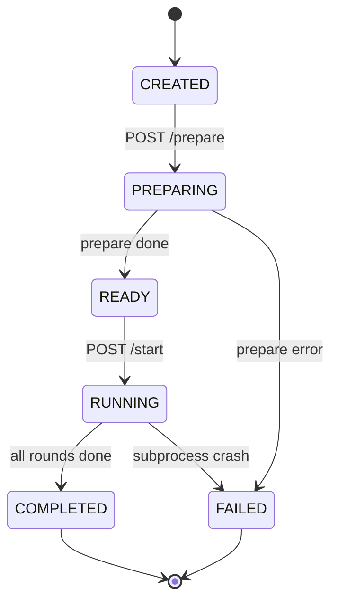

# Reference

Tra cứu nhanh: endpoints, env vars, file layout, database schemas. Không giải thích concept — dành cho [01_overview.md](01_overview.md) và các file stage.

## 1. API endpoints (qua Gateway port 5000)

### Campaign (Core :5001)

| Method | Path | Req body / query | Response |
|--------|------|------------------|----------|
| POST | `/api/campaign/upload` | `multipart/form-data: file` | `{campaign_id, name, type, market, ...}` |
| POST | `/api/campaign/parse` | `{text: str}` | `CampaignSpec` |
| GET | `/api/campaign/{id}` | — | `CampaignSpec` |
| GET | `/api/campaign/list` | — | `[{id, name, created_at}]` |

### Graph / KG (Simulation :5002)

| Method | Path | Query / body | Response |
|--------|------|--------------|----------|
| POST | `/api/graph/build` | `{campaign_id, group_id?}` | `{method, nodes_in_graph, edges_in_graph}` — kg_direct_writer + atomic snapshot |
| POST | `/api/graph/ingest` | `{doc_path, group_id, source_description}` | `{chunks_added}` (legacy Graphiti path) |
| POST | `/api/graph/snapshot` | `?campaign_id=` | `{snapshot_path}` — dump from FalkorDB (one-time migration) |
| POST | `/api/graph/restore` | `?campaign_id=` | `{nodes, edges, duration_s}` — reload disk → FalkorDB (~5s, no API calls) |
| GET | `/api/graph/cache-status` | `?campaign_id=` | `{state: "fresh"\|"snapshot_only"\|"active", ...}` |
| GET | `/api/graph/search` | `?q=&group_id=&num_results=` | `[{entity, score}]` |
| GET | `/api/graph/entities` | `?group_id=&limit=` | `[{name, type, description}]` |
| GET | `/api/graph/edges` | `?group_id=&limit=` | `[{source, target, type}]` |
| GET | `/api/graph/stats` | `?group_id=` | `{entity_types{}, edge_types{}}` |
| GET | `/api/graph/list` | — | `[group_id]` |
| DELETE | `/api/graph/clear` | `?group_id=` | `{deleted}` |

### Simulation (Simulation :5002)

| Method | Path | Body / query | Response |
|--------|------|--------------|----------|
| POST | `/api/sim/prepare` | `{campaign_id, num_agents, num_rounds, group_id?, cognitive_toggles?, crisis_events?}` | `{sim_id, status: ready, ...}` |
| POST | `/api/sim/start` | `{sim_id, group_id?}` | `{status: running}` |
| GET | `/api/sim/status` | `?sim_id=` | `{status, current_round, ...}` |
| GET | `/api/sim/list` | — | `[SimState]` |
| GET | `/api/sim/{sim_id}/profiles` | — | `[AgentProfile]` |
| GET | `/api/sim/{sim_id}/config` | — | `simulation_config.json` |
| GET | `/api/sim/{sim_id}/actions` | — | `actions.jsonl` rows |
| GET | `/api/sim/{sim_id}/progress` | — | `{current_round, total_rounds, actions_count}` |
| GET | `/api/sim/{sim_id}/cognitive` | — | Cognitive snapshot các agents |
| GET | `/api/sim/{sim_id}/stream` | — | SSE events |
| POST | `/api/sim/{sim_id}/inject-crisis` | `{template, title, body, ...}` | `{injected_round}` |
| GET | `/api/sim/{sim_id}/crisis-log` | — | `[fired_crisis]` |

### Report (Core :5001)

| Method | Path | Body | Response |
|--------|------|------|----------|
| POST | `/api/report/generate` | `{sim_id}` | 202 `{report_id}` |
| GET | `/api/report/{sim_id}` | — | `full_report.md` |
| GET | `/api/report/{sim_id}/outline` | — | `outline.json` |
| GET | `/api/report/{sim_id}/section/{idx}` | — | `section_NN.md` |
| GET | `/api/report/{sim_id}/progress` | — | `{sections_completed, total}` |
| POST | `/api/report/{sim_id}/chat` | `{message, history[]}` | `{reply, tool_calls[]}` |

### Sentiment Analysis (Simulation :5002)

| Method | Path | Query | Response |
|--------|------|-------|----------|
| GET | `/api/analysis/simulations` | — | List sims analyzed |
| GET | `/api/analysis/cached` | `?sim_id=` | Cached results |
| POST | `/api/analysis/save` | `?sim_id=` + body | `{saved}` |
| GET | `/api/analysis/summary` | `?sim_id=&num_rounds=` | Summary aggregate |
| GET | `/api/analysis/sentiment` | `?sim_id=` | Positive/neutral/negative % |
| GET | `/api/analysis/per-round` | `?sim_id=` | Time-series |
| GET | `/api/analysis/score` | `?sim_id=&num_rounds=` | Composite score |

### Survey (Simulation :5002)

| Method | Path | Body / query | Response |
|--------|------|--------------|----------|
| GET | `/api/survey/default-questions` | — | Template questions |
| POST | `/api/survey/create` | `{sim_id, questions, num_agents, include_sim_context}` | `{survey_id}` |
| POST | `/api/survey/{survey_id}/conduct` | — | `{completed}` |
| GET | `/api/survey/{survey_id}/results` | — | Distribution JSON |
| GET | `/api/survey/{survey_id}/results/export` | — | CSV |
| GET | `/api/survey/latest` | `?sim_id=` | Latest survey |

### Interview (Simulation :5002)

| Method | Path | Body / query | Response |
|--------|------|--------------|----------|
| GET | `/api/interview/agents` | `?sim_id=` | `[{agent_id, name, mbti}]` |
| POST | `/api/interview/chat` | `{sim_id, agent_id, message, history[]}` | `{reply}` |
| GET | `/api/interview/history` | `?sim_id=&agent_id=` | Full history |
| GET | `/api/interview/profile` | `?sim_id=&agent_id=` | Cognitive snapshot |

### Dashboard (Core :5001)

| Method | Path | Response |
|--------|------|----------|
| GET | `/api/dashboard/summary` | Aggregate counters: campaigns, sims by status, recent activity |
| GET | `/api/dashboard/recent` | Recent campaign + sim activity feed |

### Health

| Method | Path | Response |
|--------|------|----------|
| GET | `/api/health` | `{status: ok\|degraded, services: {core, simulation}}` |
| GET | `/api/health/gateway` | `{status: "ok"}` (Caddy liveness) |

## 2. Environment variables

File: [.env.example](../.env.example)

| Var | Default | Dùng ở | Mô tả |
|-----|---------|--------|-------|
| `LLM_API_KEY` | — | Tất cả services gọi LLM | OpenAI-compatible API key |
| `LLM_BASE_URL` | `https://api.openai.com/v1` | Cùng trên | Endpoint OpenAI-compatible |
| `LLM_MODEL_NAME` | `gpt-4o-mini` | Cùng trên | Main reasoning model (report ReACT, sim profile gen, crisis, sim config) |
| `LLM_FAST_MODEL_NAME` | = main | Sim/Survey/Interview | High-frequency in-character calls (intent classifier + per-agent reply) |
| `LLM_EXTRACTION_MODEL` | `gpt-4o` | Stage 1 + Stage 3 KG | STRONGER tier cho extraction (precision Vietnamese business docs) |
| `FALKORDB_HOST` | `localhost` | Core + Sim | FalkorDB host |
| `FALKORDB_PORT` | `6379` | Cùng trên | Port |
| `FALKORDB_USERNAME` | (empty) | Cùng trên | Optional auth |
| `FALKORDB_PASSWORD` | (empty) | Cùng trên | Optional auth |
| `FALKORDB_BOLT_PORT` | `7687` | (optional) | Bolt protocol nếu dùng |
| `ZEP_API_KEY` | — | Sim runtime hybrid + master KG Zep path | Zep Cloud API key (bắt buộc cho Phase 13) |
| `ZEP_SIM_RUNTIME` | `false` | apps/simulation/run_simulation.py | Bật section-per-action Zep extraction (Phase 13/15) |
| `CORE_SERVICE_URL` | `http://localhost:5001` | Gateway | Route target |
| `SIM_SERVICE_URL` | `http://localhost:5002` | Gateway | Route target |
| `CORE_UPSTREAM` / `SIM_UPSTREAM` | (Caddy substitutes) | Caddyfile | Override upstream cho local dev ngoài Docker |
| `GATEWAY_UPSTREAM` | `http://localhost:5000` | Frontend `next.config.ts` | Server-side rewrite target |
| `CORE_SERVICE_PORT` | `5001` | [apps/core/run.py](../apps/core/run.py) | Bind port |
| `GATEWAY_PORT` | `5000` | Caddy | Bind port |
| `FLASK_DEBUG` | `true` | Core | Flask debug |
| `MAX_UPLOAD_SIZE_MB` | `50` | Core | Upload limit |
| `UPLOAD_DIR` | `data/uploads` | Core | Per-campaign storage root |
| `PARQUET_PROFILE_PATH` | `data/dataGenerator/profile.parquet` | ProfileGenerator | Parquet pool |
| `ENABLE_GRAPH_MEMORY` | `false` | run_simulation.py | (Legacy) FalkorDB `ecosim_agent_memory` — replaced bởi Phase 13 hybrid |

## 3. File layout

```
EcoSim/
├── .env                                       ← runtime env (gitignored)
├── .env.example                               ← template
├── .claude/                                   ← Claude Code agent config
│   └── settings.json                          ← permissions allowlist
├── CLAUDE.md                                  ← Claude Code guidance
├── README.md                                  ← human quick-start
├── docker-compose.yml                         ← 5-service stack
├── pyrightconfig.json                         ← IDE typing (libs + vendored)
├── scripts/
│   ├── start.ps1 / stop.ps1 / restart.ps1     ← Windows dev scripts
│   ├── backup_falkordb.ps1 / .sh              ← FalkorDB volume backup
│   ├── wipe_phase10.ps1                       ← Phase 10 wipe utility
│   └── test_zep_auth.py                       ← Zep auth probe
│
├── libs/                                      ← ★ Shared Python libraries
│   └── ecosim-common/
│       ├── pyproject.toml
│       └── src/ecosim_common/
│           ├── config.py                      ← EcoSimConfig (single source of truth)
│           ├── llm_client.py                  ← LLMClient sync + async, 3-tier model
│           ├── file_parser.py                 ← FileParser + CampaignDocumentParser
│           ├── atomic_io.py                   ← atomic_write_json / atomic_append_jsonl
│           ├── chroma_client.py               ← KG ChromaDB factories (master + sim delta)
│           ├── zep_client.py                  ← AsyncZep singleton + sim helpers
│           ├── zep_label_map.py               ← Zep labels → canonical mapper
│           ├── sim_zep_ontology.py            ← 10 entity + 10 edge sim ontology (Phase 13)
│           ├── graphiti_factory.py            ← Centralized Graphiti client builder
│           ├── agent_interview.py             ← 10 intents + context loaders + response prompt
│           ├── agent_schemas.py               ← AgentProfile + EnrichedAgentLLMOutput Pydantic
│           ├── name_pool.py                   ← Gender-aware Vietnamese name pool
│           ├── parquet_reader.py              ← DuckDB-backed profile sampler
│           ├── path_resolver.py               ← Per-campaign path resolution
│           ├── sim_manifest.py                ← Sim list + metadata index
│           ├── metadata_index.py / metadata_migrations.py ← Schema versioning
│           └── survey_question_gen.py         ← LLM auto-generate survey questions
│
├── vendored/                                  ← ★ Upstream camel-ai (don't touch)
│   └── oasis/
│       └── (pyproject + oasis/ + generator/ + …)
│
├── apps/
│   ├── gateway/
│   │   ├── Caddyfile                          ← ★ Caddy 2 reverse proxy config
│   │   ├── gateway.py.bak                     ← legacy Flask fallback
│   │   └── Dockerfile
│   │
│   ├── core/                                  ← Core Service (Flask :5001)
│   │   ├── run.py                             ← entry
│   │   ├── app/
│   │   │   ├── __init__.py                    ← app factory: campaign_bp + report_bp + dashboard_bp
│   │   │   ├── api/
│   │   │   │   ├── campaign.py                ← registered
│   │   │   │   ├── report.py                  ← registered
│   │   │   │   ├── dashboard.py               ← registered (NEW)
│   │   │   │   ├── graph.py                   ← legacy, not registered
│   │   │   │   ├── simulation.py              ← legacy, not registered
│   │   │   │   └── survey.py                  ← legacy, not registered
│   │   │   ├── services/
│   │   │   │   ├── campaign_parser.py         ← Stage 1 LLM extract (gpt-4o tier)
│   │   │   │   ├── ontology_generator.py
│   │   │   │   ├── graph_builder.py           ← orphan, not called
│   │   │   │   ├── graphiti_service.py
│   │   │   │   ├── profile_generator.py       ← legacy, test-only
│   │   │   │   ├── sim_config_generator.py
│   │   │   │   ├── crisis_injector.py
│   │   │   │   ├── sim_manager.py
│   │   │   │   ├── graph_query.py
│   │   │   │   ├── kg_retriever.py            ← Tool adapter cho report_agent
│   │   │   │   └── report_agent.py            ← ReACT 2-phase
│   │   │   ├── models/{campaign,simulation,ontology,survey}.py
│   │   │   └── utils/
│   │   │       ├── llm_client.py              ← thin adapter → ecosim_common.llm_client
│   │   │       └── file_parser.py             ← (legacy)
│   │   ├── tests/
│   │   │   ├── test_campaign_pipeline.py
│   │   │   ├── test_profile_pipeline.py
│   │   │   └── test_metadata_concurrent.py    ← (NEW) metadata index race tests
│   │   └── Dockerfile
│   │
│   ├── simulation/                            ← Simulation Service (FastAPI :5002)
│   │   ├── sim_service.py                     ← uvicorn app
│   │   ├── api/
│   │   │   ├── simulation.py                  ← /api/sim/*
│   │   │   ├── graph.py                       ← /api/graph/* (build/snapshot/restore/cache-status/...)
│   │   │   ├── report.py                      ← /api/analysis/*
│   │   │   ├── survey.py                      ← /api/survey/*
│   │   │   └── interview.py                   ← /api/interview/*
│   │   ├── run_simulation.py                  ← ★ SUBPROCESS ENTRY (60KB)
│   │   ├── agent_cognition.py                 ← memory + MBTI + KeyBERT drift
│   │   ├── crisis_engine.py
│   │   ├── interest_feed.py                   ← semantic matching + rule-based
│   │   ├── campaign_knowledge.py              ← Stage 1+2 LLM extract
│   │   ├── kg_direct_writer.py                ← Stage 3b: bypass Graphiti, direct Cypher MERGE
│   │   ├── kg_snapshot.py                     ← Master KG persist (write/restore/dump)
│   │   ├── kg_fork.py                         ← Master → sim graph cloner + auto-restore guard
│   │   ├── sim_kg_snapshot.py                 ← Sim delta persist + cascade_restore_sim
│   │   ├── sim_graph_clone.py                 ← Master → sim graph clone helpers
│   │   ├── sim_agent_seeder.py                ← Seed :SimAgent anchors at prepare
│   │   ├── sim_master_mutator.py              ← Apply sim delta back to master (optional)
│   │   ├── sim_evict_cron.py                  ← Periodic Zep eviction cho COMPLETED sims
│   │   ├── sim_zep_section_writer.py          ← Phase 15: section-per-action runtime hybrid
│   │   ├── zep_kg_writer.py                   ← Master KG via Zep (alternative build path)
│   │   ├── zep_ontology.py                    ← Master 10 entity + 10 edge ontology
│   │   ├── falkor_graph_searcher.py           ← Cypher search adapter
│   │   ├── agent_memory_graph.py              ← Agent-centric memory queries
│   │   ├── agent_tracking_writer.py           ← agent_tracking.txt snapshot writer
│   │   ├── build_progress.py                  ← Per-round Zep batch status writer
│   │   ├── sentiment_analyzer.py
│   │   ├── ingest_campaign.py / deploy.py
│   │   ├── test_crisis.py / test_full_integration.py
│   │   ├── scripts/                           ← Sim-only utilities
│   │   ├── requirements-extra.txt             ← EcoSim-only deps (keybert, etc.)
│   │   ├── Dockerfile                         ← context = repo root
│   │   └── .venv/                             ← Poetry venv (built từ vendored/oasis/pyproject.toml)
│   │
│   └── frontend/                              ← Frontend — Next.js 16 + TS strict
│       ├── package.json                       ← Next 16, React 19, Tailwind 3, Zustand, react-query
│       ├── tailwind.config.ts                 ← Linear-style theme (zinc + brand violet)
│       ├── next.config.ts                     ← rewrites /api/* → ${GATEWAY_UPSTREAM}
│       ├── tsconfig.json                      ← strict mode
│       ├── Dockerfile                         ← multi-stage Node 20 → standalone server
│       ├── postcss.config.mjs / .dockerignore / .gitignore
│       ├── app/                               ← App Router pages (campaign-centric IA)
│       │   ├── layout.tsx, providers.tsx, globals.css, page.tsx (Dashboard)
│       │   ├── campaigns/page.tsx, campaigns/new/page.tsx
│       │   └── campaigns/[campaignId]/{page,layout}.tsx + spec/, graph/, sims/[simId]/{run,analysis,report,survey,interview}/
│       ├── components/{ui,data,shell}/        ← primitives + shell layout
│       ├── lib/{api,queries,types}/           ← typed fetch + react-query hooks
│       ├── stores/{app,ui}-store.ts           ← Zustand (app-store persist via localStorage)
│       └── hooks/{use-hydration,use-sse}.ts
│
├── docs/                                      ← file bạn đang đọc
│   ├── README.md
│   ├── 01_overview.md, 02_architecture.md, 03_ingestion_kg.md, 04_agent_generation.md, 05_simulation_loop.md
│   ├── 06_post_simulation.md (hub)
│   ├── 06a_sentiment_analysis.md, 06b_survey.md, 06c_interview.md, 06d_report.md
│   └── reference.md
│
└── data/                                      ← gitignored
    ├── samples/                               ← parquet profile pool
    ├── dataGenerator/profile.parquet          ← 20M rows
    ├── uploads/{campaign_id}/                 ← per-campaign storage
    │   ├── source/{filename}                  ← tài liệu gốc (immutable)
    │   ├── extracted/{spec,sections,analyzed}.json   ← LLM cache
    │   ├── kg/{snapshot,build_meta}.json      ← KG persistence
    │   ├── chroma/                            ← 3 ChromaDB collections
    │   └── sims.json                          ← manifest
    └── simulations/{sim_id}/
        ├── simulation_config.json
        ├── profiles.json
        ├── crisis_scenarios.json
        ├── pending_crisis.json
        ├── oasis_simulation.db                ← SQLite
        ├── actions.jsonl
        ├── progress.json
        ├── agent_tracking.txt
        ├── memory_stats.json
        ├── build_progress.json                ← Phase 15 Zep batch status
        ├── crisis_log.jsonl
        ├── chroma/                            ← per-sim ChromaDB (posts)
        ├── chroma_delta/                      ← per-sim KG delta
        ├── kg/snapshot_delta.json             ← Sim KG delta persist
        └── report/{meta,outline,full_report,evidence}.json + section_NN.md + agent_log.jsonl
```

## 4. Database schemas

### FalkorDB — `ecosim` database (campaign KG + sim hybrid graphs)

Sau Phase A: load-on-demand cache. Source of truth = disk (`uploads/<cid>/kg/snapshot.json` + `chroma/`).

**Master campaign KG** (group_id=campaign_id):
```
// Multi-label entities (kg_direct_writer write multi-label)
(:Entity:Company {name, description, group_id, name_embedding, summary_embedding})
(:Entity:Consumer {...})
(:Entity:Product {...})
... (14 canonical types, xem §03)

// Canonical edges
[:COMPETES_WITH {description, fact_embedding}]
[:PRODUCES {...}]
... (12 canonical types, xem §03)
```

**Sim hybrid graph** (group_id=sim_id, Phase 13/15):
```
(:SimAgent {agent_id, name, sim_id})        ← seeded prepare
(:Entity:Brand {...})                        ← Layer 1: clone từ master
(:Entity {source: 'zep_extract', ...})       ← Layer 3: Zep extract content actions
(:Episodic {...})                            ← episode anchors

// Edges
[:MENTIONS {fact, round, ...}]
[:RELATES_TO {predicate, fact}]
... (10 sim edge types, xem libs/ecosim-common/src/ecosim_common/sim_zep_ontology.py)
```

**Graphiti hybrid index** (HNSW + lookup): build sau khi sim COMPLETED qua `finalize_sim_post_run` Node 11.

### FalkorDB — `ecosim_agent_memory` database (LEGACY — replaced bởi Phase 13)

Còn giữ cho backward compat khi `enable_graph_cognition=true`. Default off — Phase 13 sim hybrid graph là cơ chế chính.

### SQLite — `data/simulations/{sim_id}/oasis_simulation.db`

```sql
CREATE TABLE user (user_id INT PRIMARY KEY, name, bio, ...);
CREATE TABLE post (post_id INT PRIMARY KEY, user_id INT, content TEXT, created_at TIMESTAMP);
CREATE TABLE comment (comment_id INT PRIMARY KEY, post_id INT, user_id INT, content TEXT, created_at TIMESTAMP);
CREATE TABLE like_table (user_id INT, post_id INT, created_at TIMESTAMP, PRIMARY KEY(user_id, post_id));
CREATE TABLE follow (follower_id INT, followee_id INT, created_at TIMESTAMP, PRIMARY KEY(follower_id, followee_id));
CREATE TABLE trace (user_id INT, action TEXT, info JSON, created_at TIMESTAMP);
```

### ChromaDB — Persistent per-sim + per-campaign

**Per-sim posts** (Tier B): `data/simulations/{sim_id}/chroma/`, collection `ecosim_{sim_id}` — survive subprocess crash.

```
id         : post_id (string)
document   : post.content
metadata   : {user_id, round, author_mbti, popularity, comment_count, created_at}
embedding  : all-MiniLM-L6-v2 (384-dim)
```

**Per-campaign master KG** (Phase A): `data/uploads/{campaign_id}/chroma/`, 3 collections (`name`, `summary`, `facts`) — embeddings cho hybrid search; persisted alongside `kg/snapshot.json`.

**Per-sim KG delta** (Phase D.4): `data/simulations/{sim_id}/chroma_delta/` — chỉ embeddings cho entities/edges sinh mới trong sim, không duplicate master.

## 5. State machine — SimStatus



Enum định nghĩa ở [apps/core/app/models/simulation.py](../apps/core/app/models/simulation.py) và mirror ở [apps/simulation/api/simulation.py:44-51](../apps/simulation/api/simulation.py#L44-L51).

## 6. Tests

[apps/core/tests/](../apps/core/tests/):

- `test_campaign_pipeline.py` — E2E: upload file → parse → 5 agent profiles
- `test_profile_pipeline.py` — ProfileGenerator + NamePool + persona synthesis (legacy)
- `test_metadata_concurrent.py` — metadata index race tests (NEW)

[apps/simulation/](../apps/simulation/):
- `test_crisis.py`, `test_full_integration.py`

Run:
```bash
cd apps/core && python -m pytest tests/ -v
```

Coverage hiện tại khiêm tốn — chủ yếu integration smoke. Không có unit test cho `interest_feed`, `agent_cognition`, `crisis_engine`.

## 7. Scripts

### `scripts/start.ps1`

[scripts/start.ps1](../scripts/start.ps1) — spawn terminals:
1. `docker compose up -d falkordb`
2. Core: `cd apps/core && python run.py` (port 5001)
3. Simulation: `cd apps/simulation && .venv/Scripts/python -m uvicorn sim_service:app --port 5002`
4. Gateway: `caddy run --config apps/gateway/Caddyfile` (port 5000)
5. Frontend: `cd apps/frontend && npm run dev` (port 5173, Next.js)

Flags: `-Only <name>`, `-SkipDocker`, `-KeepDocker`.

### `scripts/stop.ps1`

Gracefully stop processes + `docker compose down`.

### `scripts/restart.ps1`

(Removed; use `stop.ps1 && start.ps1` directly.)

### `scripts/backup_falkordb.ps1` / `.sh`

Snapshot FalkorDB volume to `.rdb` file. Useful before destructive operations. Note: KG data còn ở disk (`kg/snapshot.json` + `chroma/`) nên FalkorDB volume không phải single point of failure.

### `scripts/wipe_phase10.ps1`

Phase 10 wipe utility — clear FalkorDB + selected sim caches để re-test pipeline from scratch.

### `scripts/test_zep_auth.py`

Probe Zep API connectivity + verify `ZEP_API_KEY` valid trước khi chạy Phase 13 sim runtime.

## 8. Docker compose services

[docker-compose.yml](../docker-compose.yml):

| Service | Image / Build | Port | Depends |
|---------|---------------|------|---------|
| `falkordb` | `falkordb/falkordb` | 6379 | — |
| `gateway` | `caddy` (or `./apps/gateway` for Flask fallback) | 5000 | core, simulation |
| `core` | `./apps/core` (build context = repo root) | 5001 | — |
| `simulation` | `./apps/simulation` (build context = repo root để copy `vendored/oasis` + `libs/ecosim-common`) | 5002 | falkordb |
| `frontend` | `./apps/frontend` | 5173 | gateway *(Next.js standalone container, env `GATEWAY_UPSTREAM=http://gateway:5000`)* |

Volume: `falkordb_data:/var/lib/falkordb/data` (persisted — must be exact path, not `/data`). `data/` bind-mounted từ host vào `core` + `simulation` (shared per-campaign storage + sim runtime artifacts).
