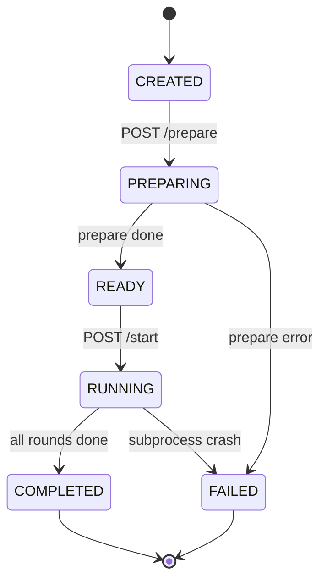

# Reference

Tra cứu nhanh: endpoints, env vars, file layout, database schemas. Không giải thích concept — dành cho [01_overview.md](01_overview.md) và các file stage.

## 1. API endpoints (qua Gateway port 5000)

### Campaign (Core :5001)

| Method | Path | Req body / query | Response |
|--------|------|------------------|----------|
| POST | `/api/campaign/upload` | `multipart/form-data: file` | `{campaign_id, name, type, market, ...}` |
| POST | `/api/campaign/parse` | `{text: str}` | `CampaignSpec` |
| GET | `/api/campaign/{id}` | — | `CampaignSpec` |
| GET | `/api/campaign/list` | — | `[{id, name, created_at}]` |

### Graph / KG (Simulation :5002)

| Method | Path | Query / body | Response |
|--------|------|--------------|----------|
| POST | `/api/graph/build` | `{campaign_id, group_id?}` | `{method, nodes_in_graph, edges_in_graph}` |
| POST | `/api/graph/ingest` | `{doc_path, group_id, source_description}` | `{chunks_added}` |
| GET | `/api/graph/search` | `?q=&group_id=&num_results=` | `[{entity, score}]` |
| GET | `/api/graph/entities` | `?group_id=&limit=` | `[{name, type, description}]` |
| GET | `/api/graph/edges` | `?group_id=&limit=` | `[{source, target, type}]` |
| GET | `/api/graph/stats` | `?group_id=` | `{entity_types{}, edge_types{}}` |
| GET | `/api/graph/list` | — | `[group_id]` |
| DELETE | `/api/graph/clear` | `?group_id=` | `{deleted}` |

### Simulation (Simulation :5002)

| Method | Path | Body / query | Response |
|--------|------|--------------|----------|
| POST | `/api/sim/prepare` | `{campaign_id, num_agents, num_rounds, group_id?, cognitive_toggles?, crisis_events?}` | `{sim_id, status: ready, ...}` |
| POST | `/api/sim/start` | `{sim_id, group_id?}` | `{status: running}` |
| GET | `/api/sim/status` | `?sim_id=` | `{status, current_round, ...}` |
| GET | `/api/sim/list` | — | `[SimState]` |
| GET | `/api/sim/{sim_id}/profiles` | — | `[AgentProfile]` |
| GET | `/api/sim/{sim_id}/config` | — | `simulation_config.json` |
| GET | `/api/sim/{sim_id}/actions` | — | `actions.jsonl` rows |
| GET | `/api/sim/{sim_id}/progress` | — | `{current_round, total_rounds, actions_count}` |
| GET | `/api/sim/{sim_id}/cognitive` | — | Cognitive snapshot các agents |
| GET | `/api/sim/{sim_id}/stream` | — | SSE events |
| POST | `/api/sim/{sim_id}/inject-crisis` | `{template, title, body, ...}` | `{injected_round}` |
| GET | `/api/sim/{sim_id}/crisis-log` | — | `[fired_crisis]` |

### Report (Core :5001)

| Method | Path | Body | Response |
|--------|------|------|----------|
| POST | `/api/report/generate` | `{sim_id}` | 202 `{report_id}` |
| GET | `/api/report/{sim_id}` | — | `full_report.md` |
| GET | `/api/report/{sim_id}/outline` | — | `outline.json` |
| GET | `/api/report/{sim_id}/section/{idx}` | — | `section_NN.md` |
| GET | `/api/report/{sim_id}/progress` | — | `{sections_completed, total}` |
| POST | `/api/report/{sim_id}/chat` | `{message, history[]}` | `{reply, tool_calls[]}` |

### Sentiment Analysis (Simulation :5002)

| Method | Path | Query | Response |
|--------|------|-------|----------|
| GET | `/api/analysis/simulations` | — | List sims analyzed |
| GET | `/api/analysis/cached` | `?sim_id=` | Cached results |
| POST | `/api/analysis/save` | `?sim_id=` + body | `{saved}` |
| GET | `/api/analysis/summary` | `?sim_id=&num_rounds=` | Summary aggregate |
| GET | `/api/analysis/sentiment` | `?sim_id=` | Positive/neutral/negative % |
| GET | `/api/analysis/per-round` | `?sim_id=` | Time-series |
| GET | `/api/analysis/score` | `?sim_id=&num_rounds=` | Composite score |

### Survey (Simulation :5002)

| Method | Path | Body / query | Response |
|--------|------|--------------|----------|
| GET | `/api/survey/default-questions` | — | Template questions |
| POST | `/api/survey/create` | `{sim_id, questions, num_agents, include_sim_context}` | `{survey_id}` |
| POST | `/api/survey/{survey_id}/conduct` | — | `{completed}` |
| GET | `/api/survey/{survey_id}/results` | — | Distribution JSON |
| GET | `/api/survey/{survey_id}/results/export` | — | CSV |
| GET | `/api/survey/latest` | `?sim_id=` | Latest survey |

### Interview (Simulation :5002)

| Method | Path | Body / query | Response |
|--------|------|--------------|----------|
| GET | `/api/interview/agents` | `?sim_id=` | `[{agent_id, name, mbti}]` |
| POST | `/api/interview/chat` | `{sim_id, agent_id, message, history[]}` | `{reply}` |
| GET | `/api/interview/history` | `?sim_id=&agent_id=` | Full history |
| GET | `/api/interview/profile` | `?sim_id=&agent_id=` | Cognitive snapshot |

### Health

| Method | Path | Response |
|--------|------|----------|
| GET | `/api/health` | `{status: ok\|degraded, services: {core, simulation}}` |

## 2. Environment variables

File: [.env.example](../.env.example)

| Var | Default | Dùng ở | Mô tả |
|-----|---------|--------|-------|
| `LLM_API_KEY` | — | Tất cả services gọi LLM | OpenAI-compatible API key |
| `LLM_BASE_URL` | `https://api.openai.com/v1` | Cùng trên | Endpoint OpenAI-compatible |
| `LLM_MODEL_NAME` | `gpt-4o-mini` | Cùng trên | Model id |
| `FALKORDB_HOST` | `localhost` | Core + Sim + graph_memory | FalkorDB host |
| `FALKORDB_PORT` | `6379` | Cùng trên | Port |
| `FALKORDB_BOLT_PORT` | `7687` | (optional) | Bolt protocol nếu dùng |
| `CORE_SERVICE_URL` | `http://localhost:5001` | Gateway | Route target |
| `SIM_SERVICE_URL` | `http://localhost:5002` | Gateway | Route target |
| `CORE_SERVICE_PORT` | `5001` | [apps/core/run.py](../apps/core/run.py) | Bind port |
| `GATEWAY_PORT` | `5000` | [apps/gateway/gateway.py](../apps/gateway/gateway.py) | Bind port |
| `FLASK_DEBUG` | `true` | Core | Flask debug |
| `MAX_UPLOAD_SIZE_MB` | `50` | Core | Upload limit |
| `UPLOAD_DIR` | `uploads` | Core | Upload save dir |
| `PARQUET_PROFILE_PATH` | `data/dataGenerator/profile.parquet` | ProfileGenerator | Parquet pool |
| `ENABLE_GRAPH_MEMORY` | `false` | apps/simulation/run_simulation.py | Bật FalkorDB agent memory |

## 3. File layout

```
EcoSim/
├── .env                                ← runtime env (gitignored)
├── .env.example                        ← template
├── .claude/                            ← Claude Code agent config
│   └── settings.json                   ← permissions allowlist
├── CLAUDE.md                           ← Claude Code guidance
├── README.md                           ← human quick-start
├── docker-compose.yml                  ← 5-service stack
├── start.ps1 / stop.ps1 / restart.ps1  ← Windows dev scripts
│
├── gateway/
│   ├── gateway.py                      ← reverse proxy (Flask)
│   ├── requirements.txt
│   └── Dockerfile
│
├── backend/                            ← Core Service
│   ├── run.py                          ← entry (Flask :5001)
│   ├── requirements.txt
│   ├── Dockerfile
│   ├── app/
│   │   ├── __init__.py                 ← app factory
│   │   ├── config.py                   ← env loader
│   │   ├── api/
│   │   │   ├── campaign.py             ← registered
│   │   │   ├── report.py               ← registered
│   │   │   ├── graph.py                ← legacy, not registered
│   │   │   ├── simulation.py           ← legacy, not registered
│   │   │   └── survey.py               ← legacy, not registered
│   │   ├── services/
│   │   │   ├── campaign_parser.py
│   │   │   ├── ontology_generator.py
│   │   │   ├── graph_builder.py
│   │   │   ├── graphiti_service.py
│   │   │   ├── profile_generator.py
│   │   │   ├── parquet_reader.py
│   │   │   ├── name_pool.py
│   │   │   ├── sim_config_generator.py
│   │   │   ├── crisis_injector.py
│   │   │   ├── sim_manager.py
│   │   │   ├── sim_runner.py
│   │   │   ├── agent_memory.py
│   │   │   ├── graph_memory_updater.py
│   │   │   ├── graph_query.py
│   │   │   ├── kg_retriever.py
│   │   │   ├── report_agent.py
│   │   │   └── survey_engine.py
│   │   ├── models/
│   │   │   ├── campaign.py
│   │   │   ├── simulation.py
│   │   │   ├── ontology.py
│   │   │   └── survey.py
│   │   └── utils/
│   │       ├── llm_client.py           ← ★ SINGLE LLM ENTRY
│   │       └── file_parser.py
│   ├── scripts/
│   │   └── run_simulation.py           ← (legacy copy; real runner ở oasis/)
│   └── tests/
│       ├── test_campaign_pipeline.py
│       └── test_profile_pipeline.py
│
├── oasis/                              ← Simulation Service (FastAPI :5002)
│   ├── sim_service.py                  ← uvicorn app
│   ├── api/
│   │   ├── simulation.py
│   │   ├── graph.py
│   │   ├── report.py                   ← /api/analysis/*
│   │   ├── survey.py
│   │   └── interview.py
│   ├── run_simulation.py               ← ★ SUBPROCESS ENTRY (60KB)
│   ├── agent_cognition.py              ← memory + MBTI + KeyBERT drift
│   ├── crisis_engine.py
│   ├── interest_feed.py                ← semantic matching + rule-based
│   ├── falkor_graph_memory.py
│   ├── campaign_knowledge.py
│   ├── sentiment_analyzer.py
│   ├── pyproject.toml + poetry.lock    ← OASIS upstream
│   ├── oasis/                          ← vendored upstream (don't touch)
│   ├── generator/, visualization/, test/, examples/, assets/, licenses/
│   │                                   ← upstream, don't touch
│   └── Dockerfile
│
├── frontend/                           ← Frontend — Next.js 16 + TS
│   ├── package.json                    ← Next 16, React 19, Tailwind 3, Zustand, react-query
│   ├── tailwind.config.ts              ← Linear-style theme (zinc + brand violet)
│   ├── next.config.ts                  ← rewrites /api/* → ${GATEWAY_UPSTREAM} (default :5000)
│   ├── tsconfig.json                   ← strict mode
│   ├── Dockerfile                      ← multi-stage Node 20 → standalone server
│   ├── .dockerignore
│   ├── app/                            ← App Router pages (campaign-centric IA)
│   ├── components/{ui,data,shell}/     ← primitives + shell layout
│   ├── lib/{api,queries,types}/        ← typed fetch + react-query hooks
│   ├── stores/{app,ui}-store.ts        ← Zustand
│   └── hooks/{use-hydration,use-sse}.ts
│
├── docs/                               ← file bạn đang đọc
│   ├── README.md
│   ├── 01_overview.md
│   ├── 02_architecture.md
│   ├── 03_ingestion_kg.md
│   ├── 04_agent_generation.md
│   ├── 05_simulation_loop.md
│   ├── 06_post_simulation.md
│   └── reference.md
│
└── data/                               ← gitignored
    ├── samples/                        ← parquet profile pool
    ├── dataGenerator/profile.parquet   ← 20M rows
    ├── uploads/                        ← campaign files + spec
    └── simulations/{sim_id}/
        ├── simulation_config.json
        ├── profiles.json
        ├── crisis_scenarios.json
        ├── pending_crisis.json
        ├── oasis_simulation.db          ← SQLite
        ├── actions.jsonl
        ├── progress.json
        ├── agent_tracking.txt
        ├── memory_stats.json
        ├── crisis_log.jsonl
        └── report/
            ├── meta.json
            ├── outline.json
            ├── section_NN.md
            ├── full_report.md
            └── agent_log.jsonl
```

## 4. Database schemas

### FalkorDB — `ecosim` database (campaign KG)

**Nodes** — labels = entity types từ ontology (dynamic per campaign):
```
(:Company {name, description, group_id})
(:Consumer {...})
(:Product {...})
... (xem §03)
```

**Edges** — types từ ontology:
```
[:COMPETES_WITH {source_chunk_id, description}]
[:PRODUCES {...}]
... (xem §03)
```

**Graphiti internal** (auto-created):
- `(:Episode {...})` — chunk episodes
- `(:EntityNode {...})` — deduplicated entities
- `(:Community {...})` — clustering
- Hybrid search index (BM25 + embedding vector)

### FalkorDB — `ecosim_agent_memory` database (optional)

```
(:Agent {agent_id, name, sim_id})
(:Post {post_id, content, author_id, round})
(:Topic {keyword})
(:Event {event_id, type, round})

[:AUTHORED] (Agent → Post)
[:ENGAGED_WITH {action: like|comment|repost, round}] (Agent → Post)
[:FOLLOWS {round}] (Agent → Agent)
[:MENTIONED {weight}] (Post → Topic)
[:AFFECTED_BY] (Agent → Event)
```

### SQLite — `data/simulations/{sim_id}/oasis_simulation.db`

```sql
CREATE TABLE user (user_id INT PRIMARY KEY, name, bio, ...);
CREATE TABLE post (post_id INT PRIMARY KEY, user_id INT, content TEXT, created_at TIMESTAMP);
CREATE TABLE comment (comment_id INT PRIMARY KEY, post_id INT, user_id INT, content TEXT, created_at TIMESTAMP);
CREATE TABLE like_table (user_id INT, post_id INT, created_at TIMESTAMP, PRIMARY KEY(user_id, post_id));
CREATE TABLE follow (follower_id INT, followee_id INT, created_at TIMESTAMP, PRIMARY KEY(follower_id, followee_id));
CREATE TABLE trace (user_id INT, action TEXT, info JSON, created_at TIMESTAMP);
```

### ChromaDB — in-process, in-memory collection

Collection: `posts_{sim_id}`

```
id         : post_id (string)
document   : post.content
metadata   : {user_id, round, author_mbti, popularity, comment_count, created_at}
embedding  : all-MiniLM-L6-v2 (384-dim)
```

## 5. State machine — SimStatus



Enum định nghĩa ở [apps/core/app/models/simulation.py](../apps/core/app/models/simulation.py) và mirror ở [apps/simulation/api/simulation.py:44-51](../apps/simulation/api/simulation.py#L44-L51).

## 6. Tests

[apps/core/tests/](../apps/core/tests/):

- `test_campaign_pipeline.py` — E2E: upload file → parse → 5 agent profiles
- `test_profile_pipeline.py` — ProfileGenerator + NamePool + persona synthesis

Run:
```bash
cd backend && python -m pytest tests/ -v
```

Coverage hiện tại khiêm tốn — chủ yếu integration smoke. Không có unit test cho `interest_feed`, `agent_cognition`, `crisis_engine`.

## 7. Scripts

### `start.ps1`

[start.ps1](../start.ps1) — spawn 5 terminal windows:
1. `docker compose up -d falkordb`
2. Core: `cd backend && python run.py` (port 5001)
3. Simulation: `cd oasis && uvicorn sim_service:app --port 5002`
4. Gateway: `cd gateway && python gateway.py` (port 5000)
5. Frontend: `cd apps/frontend && npm run dev` (port 5173, Next.js)

### `stop.ps1`

Gracefully stop processes + `docker compose down`.

### `restart.ps1`

`stop.ps1 && start.ps1`.

## 8. Docker compose services

[docker-compose.yml](../docker-compose.yml):

| Service | Image / Build | Port | Depends |
|---------|---------------|------|---------|
| `falkordb` | `falkordb/falkordb` | 6379 | — |
| `gateway` | `./gateway` | 5000 | core, simulation |
| `core` | `./backend` | 5001 | — |
| `simulation` | `./oasis` | 5002 | falkordb |
| `frontend` | `./apps/frontend` | 5173 | gateway *(Next.js standalone container, env `GATEWAY_UPSTREAM=http://gateway:5000`)* |

Volume: `falkordb_data` (persisted). `uploads/` và `data/` bind-mounted từ host vào `core`.
