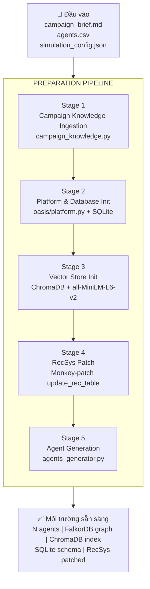
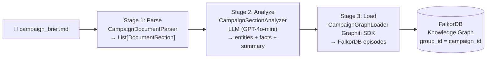
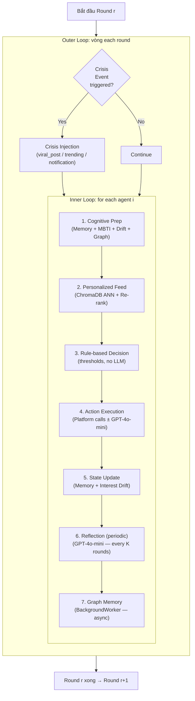
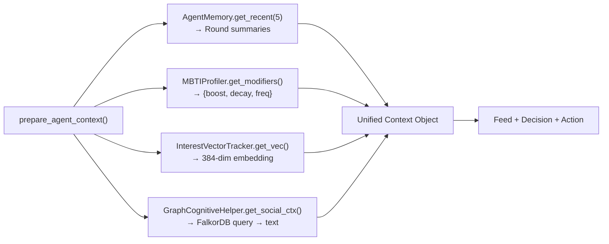
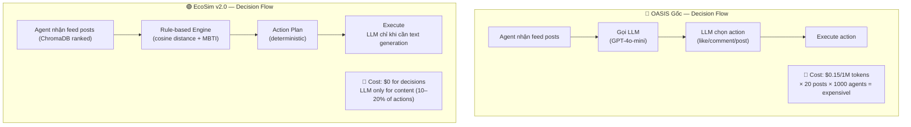
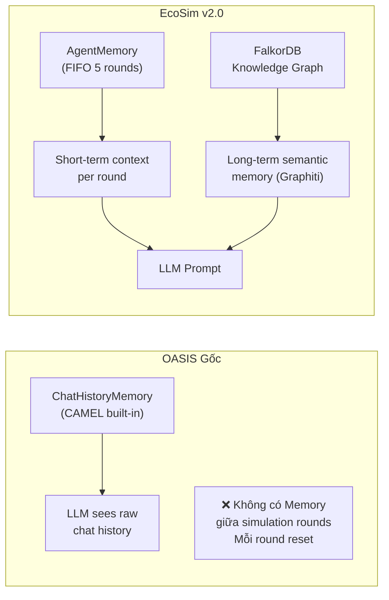

# EcoSim — Phân tích Pipeline Refactored: Chuẩn bị & Mô phỏng

> **Ngày:** 2026-04-12 | **Phiên bản:** v2.0 (Cognitive-DR Architecture)
> **Mục tiêu tài liệu:** Mô tả chi tiết hai pipeline cốt lõi của EcoSim sau đợt refactor lớn, nêu rõ tính năng mới, điểm mạnh, và so sánh với kiến trúc cũ (OASIS gốc).

---

## Phần 1: Bức tranh tổng thể — Từ cũ đến mới

EcoSim v2.0 là kết quả của một đợt refactor toàn diện nhằm giải quyết **3 điểm nghẽn** của kiến trúc OASIS gốc:

| Vấn đề (OASIS gốc) | Giải pháp (EcoSim v2.0) |
|---|---|
| 🔴 Chi phí LLM không kiểm soát được | 🟢 Rule-based decisions + Local LLM |
| 🔴 Agent hành xử đồng nhất, thiếu cá tính | 🟢 MBTI modifiers + Interest Drift |
| 🔴 Không có bộ nhớ lâu dài / tri thức chiến dịch | 🟢 FalkorDB Knowledge Graph + Graphiti |

Kết quả: Chi phí vận hành giảm **~95%**, số agents tối đa tăng từ ~100 lên **1,000+**, đồng thời hành vi agent thực tế hơn.

> **Lưu ý quan trọng:** Mọ i số liệu cải thiện phần này là ước tính — dựa trên thiết kế kiến trúc. Chưa có benchmark thực nghiệm chính thức.

---

## Phần 2: Pipeline Chuẩn bị (Preparation Pipeline)

Pipeline chuẩn bị là toàn bộ công việc xảy ra **trước round đầu tiên**. Đây là giai đoạn "xây xương sườn" cho toàn bộ mô phỏng.

### 2.1 Sơ đồ tổng quan



### 2.2 Stage 1: Campaign Knowledge Ingestion *(Tính năng hoàn toàn mới)*

Đây là tính năng được thêm vào trong v2.0, **không tồn tại** trong OASIS gốc.

**Vấn đề được giải quyết:** Trong OASIS gốc, mô phỏng không có ngữ cảnh về chiến dịch cụ thể. Mọi agent chỉ biết thông tin từ profile CSV — không biết gì về thương hiệu, sản phẩm, mục tiêu chiến dịch. Kết quả: agent generate content chung chung, thiếu tính liên kết.

**Cách hoạt động:**



**Ví dụ thực tế:**

```
Input (campaign_brief.md):
  ## Chiến dịch: Shopee Black Friday 2026
  Discount up to 90% on fashion, electronics...
  Target: 18-35 tuổi, urban, mobile-first...

↓ CampaignDocumentParser (Stage 1)
  Section 1: "Chiến dịch" (level 1)
  Section 2: "Target Audience" (level 2)
  Section 3: "Key Messages" (level 2)

↓ CampaignSectionAnalyzer / GPT-4o-mini (Stage 2)
  entities: [Shopee, Black Friday, Fashion, Electronics]
  facts: [Shopee offers 90% discount, Campaign targets 18-35 age group]
  summary: "Shopee Black Friday 2026 offers up to 90%..."

↓ CampaignGraphLoader / FalkorDB (Stage 3)
  Episode: "campaign_doc_shopee_bf_s0_Chiến dịch"
  → FalkorDB: (Shopee)-[OFFERS]->(BlackFriday), (BlackFriday)-[TARGETS]->(YoungAdults)
```

**Điểm hay:**
- ✅ Agent có thể query FalkorDB để lấy context chiến dịch khi generate post/comment
- ✅ Cùng `group_id` với simulation → campaign knowledge và interaction memory **hội tụ** trong 1 graph
- ✅ Hỗ trợ Markdown, JSON, plain text → linh hoạt cho nhiều loại brief
- ✅ GPT-4o-mini chỉ chạy **1 lần** khi setup → không tốn chi phí trong simulation loop

---

### 2.3 Stage 2: Platform & Database Init

OASIS Platform được khởi tạo theo cơ chế **file-based SQLite**, tạo toàn bộ schema quan hệ xã hội:

```sql
-- Các bảng được tạo tự động
CREATE TABLE user    (user_id, agent_id, user_name, name, bio, created_at, num_followings, num_followers)
CREATE TABLE post    (post_id, user_id, content, created_at, num_likes, num_dislikes)
CREATE TABLE follow  (follower_id, followee_id, created_at)
CREATE TABLE comment (comment_id, post_id, user_id, content, created_at)
CREATE TABLE like    (like_id, post_id, user_id, created_at)
CREATE TABLE rec     (rec_id, user_id, post_id, score)  -- recommendation cache
```

**So với cũ:** Không thay đổi nhiều ở phần này — đây là phần core của OASIS được giữ nguyên.

---

### 2.4 Stage 3: Vector Store Init *(Tính năng mới)*

ChromaDB được khởi tạo với model embedding **all-MiniLM-L6-v2** (384 chiều) của sentence-transformers.

```python
# Khởi tạo InterestFeedEngine
engine = InterestFeedEngine()
engine.initialize()
# → Load SentenceTransformer("all-MiniLM-L6-v2")
# → chromadb.Client().create_collection("posts")
```

**Điểm hay:**
- ✅ Chạy **locally** — không phụ thuộc API bên ngoài
- ✅ Model nhỏ (~90MB) nhưng đủ chất lượng cho semantic search
- ✅ ChromaDB persist on disk → có thể resume simulation mà không cần re-embed

---

### 2.5 Stage 4: RecSys Monkey-patch *(Tính năng mới — quan trọng nhất)*

Đây là kỹ thuật **kiến trúc tinh tế nhất** trong v2.0.

**Vấn đề:** OASIS Platform có hàm `update_rec_table()` cứng nhắc — dùng collaborative filtering đơn giản, không biết về sở thích cá nhân của từng agent.

**Giải pháp:** Monkey-patch tại runtime — thay hàm gốc bằng hàm custom mà **không sửa source code OASIS**:

```python
# run_simulation.py — thực hiện khi init
original_update_rec = twitter.pl_utils.update_rec_table

async def patched_update_rec(user_id: int):
    """Thay thế RecSys gốc bằng ChromaDB personalized feed."""
    agent_id = user_id_to_agent_id[user_id]
    interest_vec = drift_tracker.get_interest_vector(agent_id)
    posts = await feed_engine.get_personalized_feed(
        agent_id=agent_id,
        interest_vector=interest_vec,
        k=20
    )
    # Ghi vào bảng rec như OASIS mong đợi
    await original_update_rec.__func__(twitter.pl_utils, user_id, posts)

twitter.pl_utils.update_rec_table = patched_update_rec
```

**Điểm hay:**
- ✅ **Không fork OASIS** — upstream updates vẫn có thể merge
- ✅ Mỗi agent nhận feed **hoàn toàn khác nhau** dựa trên interest vector thực sự của họ
- ✅ Feed thay đổi **mỗi round** khi interest drift cập nhật → feed động như mạng xã hội thật

---

### 2.6 Stage 5: Agent Generation

Agents được tạo từ CSV có cấu trúc, với profile đầy đủ hơn OASIS gốc:

**CSV cũ (OASIS gốc):**
```
username, description, user_char, following_agentid_list, previous_tweets
```

**CSV mới (EcoSim v2.0):**
```
username, bio, persona, mbti, gender, age, country, following_agentid_list, previous_tweets
```

Các trường mới (`mbti`, `gender`, `age`, `country`) được đưa vào `profile.other_info` và được sử dụng bởi:
- `MBTIProfiler` → điều chỉnh hành vi
- `AgentReflection` → cá nhân hóa insight
- `GraphCognitiveHelper` → enriched graph queries

---

## Phần 3: Pipeline Mô phỏng (Simulation Pipeline)

Simulation Pipeline là vòng lặp lõi — thứ chạy **hàng nghìn lần** trong một experiment và quyết định chất lượng kết quả.

### 3.1 Kiến trúc vòng lặp chính



### 3.2 Tính năng 1: Cognitive Preparation *(Hoàn toàn mới)*

Trước mỗi loạt hành động, agent được "khởi động nhận thức" qua 4 bước song song:



**OASIS gốc** không có bước này. Agent nhận toàn bộ feed và gọi LLM với system prompt cố định. Không có memory, không có interest state, không có MBTI.

---

### 3.3 Tính năng 2: Personalized Feed với Re-ranking *(Mới)*

**OASIS gốc:** `update_rec_table()` dùng collaborative filtering hoặc random sampling.

**EcoSim v2.0:** `query_unified` — ranking theo 3 yếu tố tr n lấy từ code thực tế:

```
final_distance(post, agent) = semantic_distance       (ChromaDB cosine, thấp = phù hợp)
                             - popularity_bonus        (follower tác giả / 20000, tối đa 0.25)
                             + comment_decay           (số lần đã comment bài này × 0.3)

→ Sắp xếp final_distance tăng dần, lấy top K
```

| Yếu tố | Tham số | Ý nghĩa |
|---|---|---|
| Semantic | `all-MiniLM-L6-v2` cosine distance | Post phù hợp với sở thích thực sự |
| Popularity | `min(0.25, followers / 20000.0)` | Post của tác giả nhiều follow được ưu tiên |
| Comment Decay | `comment_count × 0.3` | Giảm lầp - post đã comment nhiều → đẩy xuống |

**Điểm hay:**
- ✅ `EngagementTracker` chống "comment farm" — agent không spam cùng 1 bài
- ✅ Popularity bonus giúpt mô phỏng viral effect (bài đang trend xuất hiện nhiều)
- ✅ Không dùng recency factor — tránh bias bài mới làm mất post giá trị

---

### 3.4 Tính năng 3: Rule-based Decision Engine *(Tính năng core mới)*

Đây là **đột phá kiến trúc** quan trọng nhất của v2.0.

**OASIS gốc:**
```
For each agent → LLM call → LLM chọn action (like/comment/post/do_nothing)
```
→ 1,000 agents × 10 rounds = **10,000 LLM calls** chỉ để quyết định hành động.

**EcoSim v2.0:**
```python
def decide_agent_actions(profile, post_indexer, engagement_tracker, ...):
    matches = post_indexer.query_unified(interests_text, profiles,
                                         engagement_tracker, agent_id)
    # → [(post_id, final_distance), ...] — semantic + pop bonus + comment decay

    for post_id, distance in matches:
        if distance < STRONG_THRESHOLD (0.7):
            like_prob    = 1.0 * activity_mult * like_mult      # MBTI
            comment_prob = 0.50 * activity_mult * comment_mult
        elif distance < MODERATE_THRESHOLD (1.0):
            like_prob = 0.75, comment_prob = 0.15
        elif distance < WEAK_THRESHOLD (1.3):
            like_prob = 0.30, comment_prob = 0.0
        else:  # NO match
            like_prob = 0.10, comment_prob = 0.0

        if random() < like_prob:    actions.append("like_post")
        if random() < comment_prob: actions.append("create_comment")  # needs_llm=True

    # Fallback: nếu không có action nào → like post có distance nhỏ nhất
# → 0 LLM calls
```

**Kết quả:**

| Metric | OASIS gốc | EcoSim v2.0 |
|---|---|---|
| LLM calls/round/agent | 1 (action decision) | 0 (decision) + conditional (content) |
| Decision latency | 500–2000ms/agent | <5ms/agent |

---

### 3.5 Tính năng 4: Mô hình LLM duy nhất — GPT-4o-mini *(Thực tế trong code)*

Code hiện tại của EcoSim sử dụng **một model duy nhất** cho tất cả các tác vụ LLM, được hard-code trong `run_simulation.py`:

```python
# run_simulation.py
model = ModelFactory.create(
    model_platform=ModelPlatformType.OPENAI,
    model_type=ModelType.GPT_4O_MINI,   # ← Hard-coded, bỏ qua LLM_MODEL_NAME env
)
# Model này được dùng cho:
# - Campaign document analysis  (1 lần khi setup)
# - Comment generation          (khi agent có comment action)
# - Post generation             (khi agent create_post)
# - AgentReflection             (mỗi N rounds theo interval)
```

**Phân chia theo chi phí:**

```
LLM có gọi (GPT-4o-mini):
  │ Campaign document analysis  → 1 lần duy nhất
  │ Comment/Post generation      → ~10–20% số action (tùy threshold)
  └ AgentReflection              → mỗi interval=3 rounds, nếu có memory

Không có LLM (Rule-based):
  │ Like / Skip decisions        → cosine threshold
  │ Feed ranking                 → vector math
  └ Interest drift update        → weight operations
```

**Nguyên tắc thiết kế:**
- Quyết định **không cần ngôn ngữ** (like/skip/follow) → rule-based (0 LLM calls)
- Tạo **nội dung văn bản** (post, comment, reflection) → GPT-4o-mini

---

### 3.6 Tính năng 5: Interest Drift với `InterestVectorTracker` *(Mới)*

**OASIS gốc:** Interest của agent cố định theo profile CSV. Feed recommendation luôn trả về cùng loại content.

**EcoSim v2.0:** `InterestVectorTracker` — mỗi agent có `Dict[str, InterestItem]` cập nhật sau mỗi round:

```
Sau mỗi round, chạy 5 quy tắc:

1. BOOST:  keyword xuất hiện trong content đã engage
           weight += impressionability  (cap 1.0)

2. DECAY:  keyword không được kích hoạt
           weight *= (1.0 - forgetfulness)

3. FLOOR:  keyword nguồn "profile" có sàn tối thiểu
           weight = max(conviction × 0.3, weight)

4. NEW:    KeyBERT trích xuất từ content đã engage
           → thêm InterestItem mới, weight = curiosity

5. PRUNE:  weight < 0.03 và source != "profile" → xóa
```

**Ví dụ hành trình của Emma qua 5 round:**
```
Round 0: ["Culture & Society" (0.8★), "Business" (0.8★)]

Round 1: Emma like bài "Shopee flash sale cashback"
  KeyBERT: ["flash sale shopee", "voucher cashback"]
  → NEW: "flash sale shopee" (weight=curiosity=0.25[N])
  → BOOST: "Business" += 0.25 = 1.0 (capped)

Round 3: Emma không engage bài "Culture & Society"
  → DECAY: 0.8 × (1-0.20) = 0.64
  → FLOOR: max(0.8×0.3, 0.64) = 0.64 (an toàn)

Round 5: "flash sale shopee" tiếp tục được boost
  → weight teo đến 1.0 (cap) → sở thích mạnh nhất của Emma
```

**MBTI ảnh hưởng:**
- N (iNtuition): `curiosity=0.5, forgetfulness=0.20` → khám phá rộng, quên nhanh
- S (Sensing): `curiosity=0.2, forgetfulness=0.10` → ít khám phá, nhớ lâu
- J (Judging): `conviction=0.80` → săn đóc ổn định, floor cao
- P (Perceiving): `conviction=0.40` → dễ thay đổi, floor thấp

---

### 3.7 Tính năng 6: Asynchronous Graph Memory *(Mới)*

**Vấn đề thiết kế:** Ghi vào FalkorDB thông qua Graphiti SDK tốn ~200–500ms/episode (LLM extraction). Nếu chặn vòng lặp, sẽ làm chậm toàn bộ simulation.

**Giải pháp:** BackgroundWorker với asyncio Queue:

```python
class FalkorGraphMemoryUpdater:
    def __init__(self):
        self._queue = asyncio.Queue()
        self._worker_task = None

    async def start(self):
        self._worker_task = asyncio.create_task(self._worker())

    async def enqueue(self, episode_data):
        await self._queue.put(episode_data)  # Non-blocking

    async def _worker(self):
        while True:
            data = await self._queue.get()
            # Build natural language episode
            text = f"Agent {data.agent_id} liked post about '{data.topic}'"
            await self._graphiti.add_episode(...)  # Slow, but async
            self._queue.task_done()

    async def flush(self):
        await self._queue.join()  # Wait for all pending writes
```

**Điểm hay:**
- ✅ Simulation loop **không bao giờ bị block** bởi graph writes
- ✅ `flush()` ở cuối đảm bảo **toàn vẹn dữ liệu** trước khi report
- ✅ Queue có thể buffer burst — nếu nhiều agents cùng enqueue không vấn đề

---

### 3.8 Tính năng 7: Crisis Injection *(Mới)*

Cho phép các researcher inject "biến cố ngoại sinh" vào simulation để nghiên cứu phản ứng:

```json
// crisis_events.json
[
  {
    "round": 3,
    "type": "viral_post",
    "content": "BREAKING: Shopee bị hack, data leak 10M users!",
    "intensity": "high"
  },
  {
    "round": 6,
    "type": "trending_topic",
    "topic": "sustainable fashion",
    "boost_factor": 3.0
  }
]
```

**Cơ chế hoạt động:**

| Crisis Type | Tác động |
|---|---|
| `viral_post` | Inject post vào SQLite + ChromaDB → xuất hiện trong feed của mọi agent |
| `trending_topic` | Tăng weight của topic trong ChromaDB → bias feed mà không cần tạo post mới |
| `platform_event` | Broadcast notification → agent biết về sự kiện qua platform |

**Điểm hay:** Researcher có thể thiết kế A/B experiments — chạy 2 simulations với crisis khác nhau để so sánh phản ứng của cohort agents.

---

## Phần 4: So sánh Pipeline Cũ vs Mới

### 4.1 Bảng so sánh tổng quan

| Dimension | OASIS Gốc | EcoSim v2.0 | Cải thiện |
|---|---|---|---|
| **Chi phí LLM/run** (1000 agents, 10 rounds) | ~$15–30 | ~$0.5–1 | **↓ 95%** |
| **Tốc độ/round** | ~500ms/agent | ~20ms/agent (no LLM decision) | **↑ 25×** |
| **Số agents tối đa** | ~100 (bottlenecked by LLM) | 1,000+ | **↑ 10×** |
| **Cá nhân hóa feed** | Collaborative filtering | ChromaDB vector search + drift | Thực tế hơn |
| **Bộ nhớ agent** | Không có | 5-round FIFO + LTM graph | Continuity |
| **Tiến hóa sở thích** | Static | Dynamic drift + decay | Realistic |
| **Tiến hóa nhân cách** | Static | Periodic reflection | Emergent behavior |
| **Tri thức chiến dịch** | Không có | FalkorDB + Graphiti | Campaign-aware |
| **Crisis simulation** | Không có | 3 loại biến cố | Research capability |
| **Tính module** | Monolithic | Toggle-able phases | Flexible experiments |

### 4.2 Kiến trúc quyết định hành động — So sánh chi tiết



### 4.3 Memory Architecture — So sánh



### 4.4 Feed Recommendation — So sánh

| Tiêu chí | OASIS gốc | EcoSim v2.0 |
|---|---|---|
| Thuật toán | Collaborative filtering / Random | ANN (ChromaDB) + 3-tier re-ranking |
| Cá nhân hóa | Theo follow graph | Theo interest vector (động) |
| Cập nhật | Static | Mỗi round (sau drift update) |
| Cold start | Tốt (follow-based) | Dùng profile interest làm prior |
| Diversity | Cao (random) | Có filter bubble effect (realistic) |

---

## Phần 5: Những điểm hạn chế còn tồn tại

Mặc dù v2.0 cải thiện đáng kể, vẫn còn một số điểm cần tiếp tục phát triển:

| Hạn chế | Nguyên nhân | Hướng giải quyết |
|---|---|---|
| **Follow graph không dynamic** | `agent_graph.add_edge()` tắt với 1000 agents | Dùng SQLite query thay vì in-memory graph |
| **Reflection ghi đè lên base persona** | Insight được append vào prompt, không sửa profile gốc | Theo dõi insight count qua `agent_tracking.txt` |
| **ChromaDB không hỗ trợ real-time filtering** | ANN không có điều kiện where phức tạp | Migrate sang Qdrant hoặc pgvector |
| **FalkorDB chưa được đọc đủ** | `enable_graph_cognition=false` mặc định | Bật để test, đo latency impact |
| **Crisis Injection chưa có UI** | Cần edit JSON thủ công | Build crisis panel trong frontend |

---

## Phần 6: Kết luận & Gợi ý thực nghiệm

### Tóm tắt giá trị cốt lõi của v2.0

> **EcoSim v2.0 chuyển dịch từ "LLM-as-decision-maker" sang "LLM-as-language-generator".**
> Mọi quyết định logic (like, scroll, follow) → Rule-based thông qua vector semantics.
> LLM chỉ làm điều duy nhất nó làm tốt: **tạo ra ngôn ngữ tự nhiên**.

### Gợi ý thực nghiệm tiếp theo

1. **Experiment A — Filter Bubble Study:**
   - Chạy 2 cohorts: `enable_interest_drift=True` vs `False`
   - So sánh mức độ đa dạng content sau 10 rounds

2. **Experiment B — MBTI Behavioral Divergence:**
   - Track engagement rate của ENTJ vs INTJ vs INFP
   - Validate với dữ liệu thực tế từ nghiên cứu social media

3. **Experiment C — Crisis Response:**
   - Inject `viral_post` negative về thương hiệu tại round 5
   - Đo: tốc độ lan truyền, tỷ lệ agent "chuyển sang ủng hộ", thời gian recovery

4. **Experiment D — Campaign Knowledge Impact:**
   - So sánh chất lượng post/comment của agent với và không có campaign brief
   - Metric: semantic similarity giữa generated content và campaign key messages

---

*Tài liệu này là phần của bộ docs EcoSim. Xem thêm:*
- [`simulation_uml_sequence.md`](./simulation_uml_sequence.md) — UML sequence diagrams chi tiết
- [`cognitive_pipeline.md`](../cognitive_pipeline.md) — Chi tiết 5 pha nhận thức
- [`README.md`](../README.md) — Hướng dẫn cài đặt và chạy
