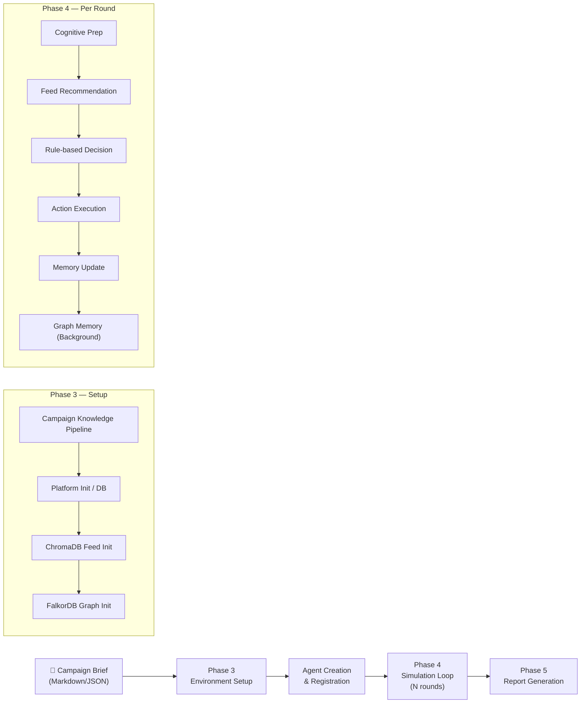
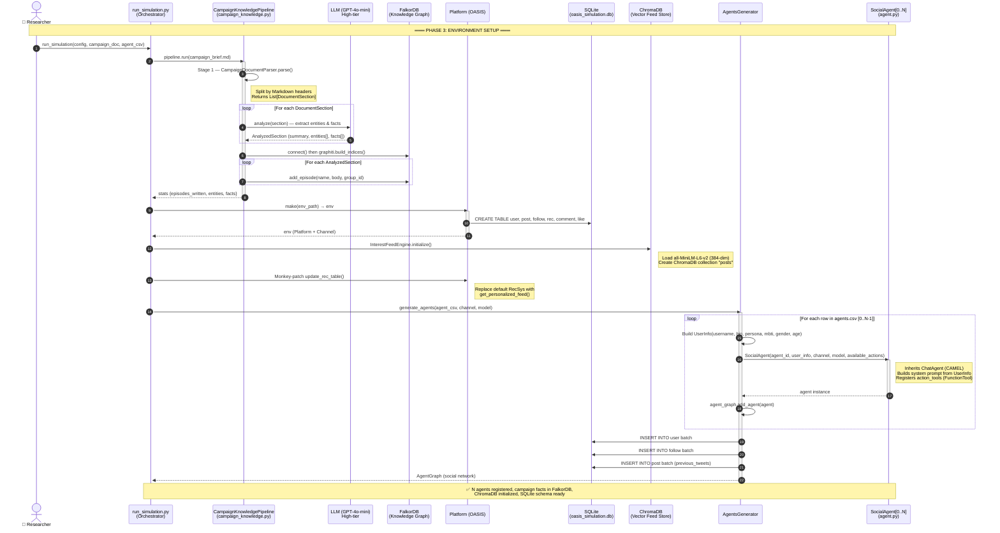
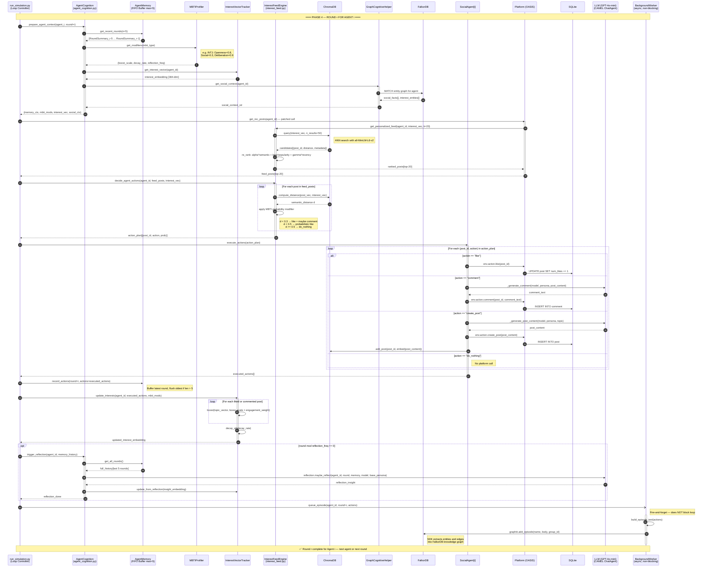
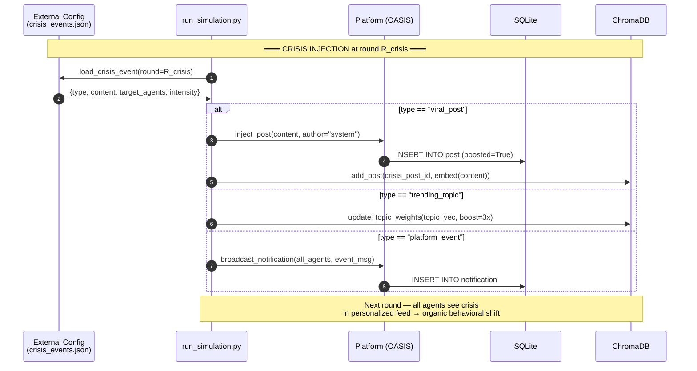
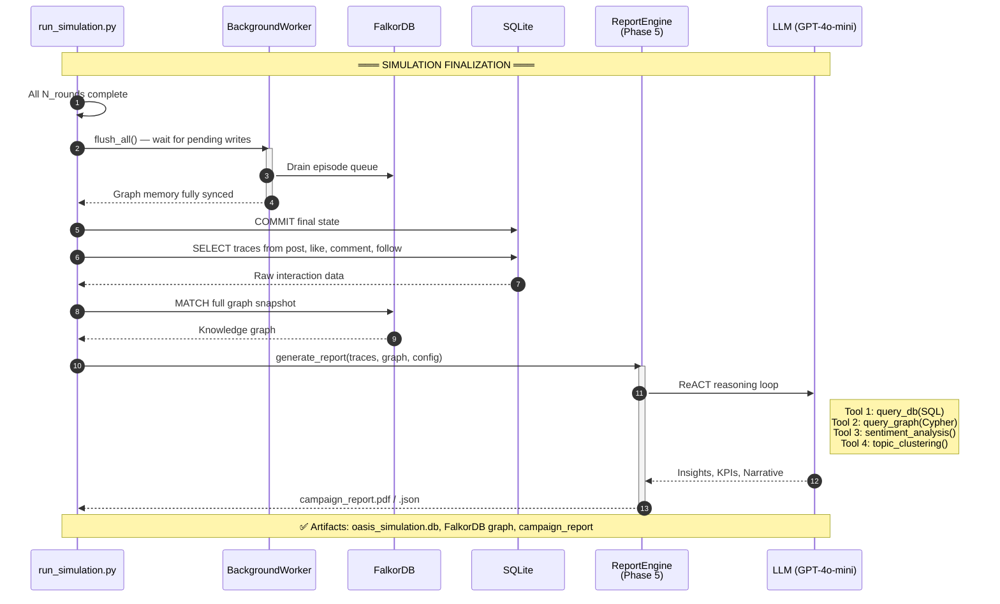
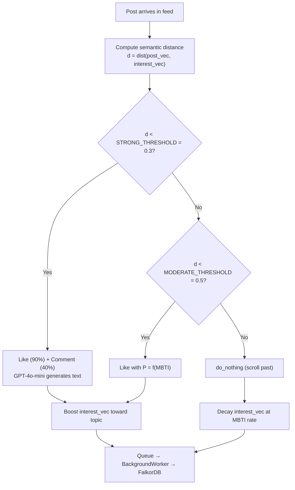

# EcoSim — UML Sequence Diagram: Agent Lifecycle & Simulation Flow

> **Phạm vi:** Từ lúc khởi tạo môi trường (*Phase 3*) → vòng lặp mô phỏng (*Phase 4*) → kết thúc.
> **Kiến trúc trọng tâm:** Hybrid Edge-LLM — Rule-based + Vector Search thay thế LLM cho mọi quyết định hành động; LLM chỉ dùng cho content creation & reflection.

---

## 1. Tổng quan luồng (Overview)

---

## 2. Sơ đồ UML Sequence: Phase 3 — Khởi tạo môi trường & Agent

---

## 3. Sơ đồ UML Sequence: Phase 4 — Vòng lặp mô phỏng (1 Agent, 1 Round)

---

## 4. Sơ đồ UML Sequence: Crisis Injection

---

## 5. Sơ đồ UML Sequence: Kết thúc → Phase 5 Report

---

## 6. Bản đồ thành phần (Component Map)

| Layer | Component | Vai trò | Công nghệ |
|---|---|---|---|
| **Orchestration** | `run_simulation.py` | Điều phối toàn bộ pipeline | Python asyncio |
| **Agent Runtime** | `SocialAgent` (agent.py) | Thực thể AI nhân vật | CAMEL `ChatAgent` |
| **Cognitive** | `AgentMemory` | Bộ nhớ ngắn hạn (5 rounds) | FIFO Buffer (in-memory) |
| **Cognitive** | `MBTIProfiler` | Điều chỉnh hành vi theo kiểu nhân cách | Lookup Table |
| **Cognitive** | `InterestVectorTracker` | Theo dõi sự thay đổi sở thích | Numpy vector ops |
| **Cognitive** | `AgentReflection` | Phản chiếu định kỳ → tiến hóa nhân cách | LLM (GPT-4o-mini) |
| **Recommendation** | `InterestFeedEngine` | Gợi ý nội dung cá nhân hóa | ChromaDB + all-MiniLM-L6-v2 |
| **Decision** | `decide_agent_actions()` | Quyết định hành động không cần LLM | Rule-based + thresholds |
| **Platform** | `Platform` (OASIS) | Mạng xã hội ảo | SQLite + OASIS framework |
| **Long-term Memory** | `GraphCognitiveHelper` | Truy vấn tri thức xã hội | FalkorDB + Graphiti SDK |
| **Long-term Memory** | `BackgroundWorker` | Ghi log vào graph (async) | asyncio Queue + Graphiti |
| **Knowledge Ingestion** | `CampaignKnowledgePipeline` | Nạp tài liệu chiến dịch vào graph | LLM (GPT-4o-mini) + FalkorDB |
| **LLM** | GPT-4o-mini | Tất cả tác vụ: campaign analysis, post gen, comment gen, reflection, report | OpenAI API (duy nhất) |

---

## 7. Luồng quyết định Rule-based

---

## 8. Ghi chú thiết kế quan trọng

> **Tại sao không dùng LLM cho mọi hành động?**
> 1,000 agents × 10 rounds × 20 posts = 200,000 decisions/run.
> GPT-4o-mini ≈ $0.15/1M token → chi phí không khả thi.
> Giải pháp: Rule-based + ChromaDB → **$0 cost** cho quyết định.
> LLM chỉ dùng khi cần sáng tạo ngôn ngữ (comment, reflection).

> **FalkorDB vs Neo4j:** FalkorDB tương thích Cypher nhưng chạy in-process qua Redis protocol, không cần JVM.
> Graphiti SDK tự động build entity relationship từ natural language episodes.

> **Thứ tự thực thi per-agent per-round:**
> 1. Cognitive Prep (Memory + MBTI + Drift + Graph Context)
> 2. Feed Recommendation (ChromaDB ANN + Re-ranking)
> 3. Rule-based Decision (threshold comparison)
> 4. Action Execution (Platform call ± LLM)
> 5. Memory Update (FIFO buffer)
> 6. Interest Drift Update (vector ops)
> 7. Reflection (every K rounds, via LLM)
> 8. Graph Memory write (background, non-blocking)
